# EventFlow Management System — Business Flow

**Document Path:** `docs/BUSINESS_FLOW.md`  
**Product:** EventFlow Management System  
**Document Type:** Business Workflow Specification  
**Authoring Role:** Senior Business Analyst  
**Authoritative Product Source:** `docs/PRD.md`  
**Architecture Reference:** `docs/SYSTEM_DESIGN.md`  
**Document Version:** 1.0  
**Status:** Draft for Business Rule Finalization  

---

# 1. Document Purpose

This document defines the major end-to-end business workflows for EventFlow Management System.

It describes:

- what triggers each workflow,
- who performs it,
- required preconditions,
- normal business flow,
- alternative flow,
- error flow,
- business rules,
- expected database-state changes,
- notifications,
- audit events,
- final business state.

This document does **not** define implementation code.

The workflows are designed to remain consistent with:

1. `docs/PRD.md` as the authoritative product requirement.
2. `docs/SYSTEM_DESIGN.md` as the system architecture reference.

---

# 2. Scope and Source-Derived Clarifications

## 2.1 Core Business Lifecycle

The EventFlow MVP business lifecycle is:

```text
Organization
    ↓
Create Event
    ↓
Configure Event
    ↓
Publish Event
    ↓
Open Registration
    ↓
Receive Attendee Registration
    ↓
Issue Ticket / QR
    ↓
Manage Attendees
    ↓
Run Check-In
    ↓
Monitor Attendance
    ↓
Generate Reports
    ↓
Complete Event
    ↓
Archive Event
```

## 2.2 Workflows Explicitly In Scope

The PRD and System Design support the following major business workflows:

- Authentication
- Organization/member administration
- Event creation
- Event configuration
- Event publication
- Venue management
- Agenda management
- Registration configuration
- Ticket type/capacity configuration
- Public attendee registration
- Ticket issuance
- Attendee management
- Event cancellation
- Check-in
- Notification delivery
- Reporting/export
- File upload
- Audit logging
- Event completion/archive
- Administrative settings

## 2.3 User Account Registration Clarification

The PRD does not explicitly require public self-service account sign-up for organizer users.

It requires:

- login,
- password reset,
- user profile,
- organization member add/invite.

Therefore, this document treats organizer-user onboarding as:

> **Organization invitation / authorized account provisioning**

rather than inventing an unrestricted public sign-up workflow.

If public organizer self-registration is later required, it must be added to the PRD.

## 2.4 Approval Process Clarification

The MVP does not define a separate multi-step approval module.

The closest business approval gate is:

> **Event publication authorization**

An Event Manager/Admin/Owner who has publish permission may move a publish-ready event from Draft to Published.

There is no separate "submitted for approval" status in the authoritative PRD.

## 2.5 Payment Clarification

Online payment is explicitly outside mandatory MVP scope.

The MVP may store an informational ticket price, but does not process:

- payment authorization,
- settlement,
- refund,
- chargeback,
- payout.

Payment flow is documented later as **Not Applicable to MVP**.

## 2.6 Inventory Clarification

Traditional physical inventory movement is not applicable.

EventFlow does maintain **ticket/event capacity**, which behaves like availability rather than warehouse inventory.

Capacity changes are driven by successful registration and, if the derived cancellation rule is enabled, registration cancellation.

---

# 3. Business Actors

| Actor | Description | Primary Responsibilities |
|---|---|---|
| Owner | Highest organization authority | Organization governance, members, events, reports |
| Admin | Organization administrator | Organization/event administration |
| Event Manager | Operational event owner | Configure, publish, manage, operate event |
| Staff | Limited operational user | Attendee lookup and check-in |
| Viewer | Read-only management user | Dashboard and reports |
| Public Attendee | Event participant | Browse, register, access ticket |
| System | Automated product behavior | Validation, state enforcement, notifications, scheduled actions |
| Email Provider | External delivery channel | Delivers transactional email |

---

# 4. Authoritative and Derived Status Models

# 4.1 Event Status Model

The PRD explicitly defines these event statuses:

- `Draft`
- `Published`
- `Ongoing`
- `Completed`
- `Cancelled`
- `Archived`

To make the business workflow executable, the following transition model is defined.

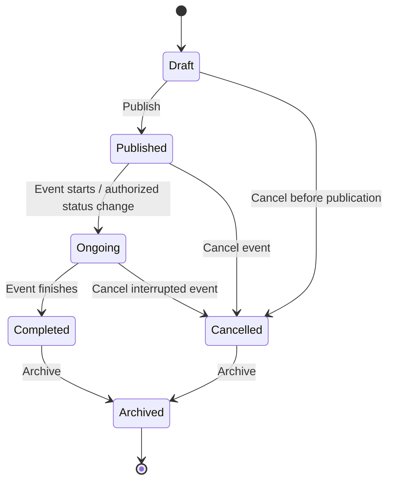

## 4.1.1 Valid Event Status Transitions

| Current Status | Allowed Next Status | Business Meaning |
|---|---|---|
| Draft | Published | Event becomes publicly accessible |
| Draft | Cancelled | Planned event is abandoned before publication |
| Published | Ongoing | Event execution begins |
| Published | Cancelled | Published event is cancelled |
| Ongoing | Completed | Event execution finishes normally |
| Ongoing | Cancelled | Active event is terminated |
| Completed | Archived | Historical event removed from active views |
| Cancelled | Archived | Cancelled event removed from active views |

## 4.1.2 Invalid MVP Transitions

Unless the PRD is changed, the following are not supported:

- Archived → Draft
- Archived → Published
- Completed → Ongoing
- Cancelled → Published
- Cancelled → Ongoing

Reopening or restoring an event is a future product decision.

## 4.1.3 Status Transition Rules

**EBR-001** Every event starts in `Draft`.

**EBR-002** Only a publish-ready Draft event may move to `Published`.

**EBR-003** A `Cancelled` event shall not accept new public registrations.

**EBR-004** A `Completed` event remains available for reporting.

**EBR-005** `Archived` events are excluded from default active event views.

**EBR-006** Material event-status changes shall be audited.

---

# 4.2 Registration Status Model

The PRD requires registration status but does not enumerate all allowed values.

It explicitly refers to a **confirmed registration** and requires authorized users to change supported registration statuses.

To avoid hiding this gap, the following minimal model is a **derived business rule** for the MVP:

- `Confirmed`
- `Cancelled`

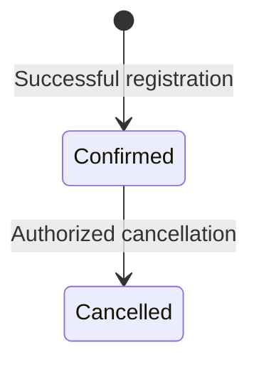

This model must remain flagged as a product-derived rule until explicitly adopted into the PRD.

## 4.2.1 Derived Registration Rules

**DBR-REG-001** A successful public registration enters `Confirmed`.

**DBR-REG-002** A `Cancelled` registration is not eligible for check-in.

**DBR-REG-003** A registration-cancellation action must be authorized and audited.

**DBR-REG-004** If cancellation releases capacity, capacity availability must be recalculated consistently.

**DBR-REG-005** The MVP does not support reverting `Cancelled` to `Confirmed` unless product requirements are updated.

If product stakeholders do not want registration cancellation in MVP, the `Cancelled` state and Workflow 11 below should be removed and FR-ATT-006 should be clarified.

---

# 4.3 Check-In State Model

Check-in status is derived from attendance records:

- `Not Checked In`
- `Checked In`

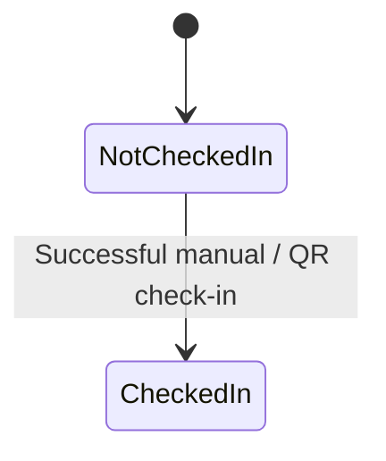

If check-in reversal is later enabled, it must be explicitly defined because the PRD only states that reversal should be audited **if supported**.

---

# 4.4 Registration Availability State

Registration availability is not a persisted business status by requirement; it is derived from:

- event status,
- registration enabled flag,
- registration start time,
- registration end time,
- event capacity,
- ticket type capacity,
- ticket availability window.

Result:

```text
OPEN
or
CLOSED
```

---

# 5. Workflow 1 — Organizer User Onboarding / Organization Invitation

> This workflow replaces unrestricted public organizer sign-up because the PRD only requires authorized add/invite behavior.

## 5.1 Trigger

An Owner or Admin needs to give another person access to the organization.

## 5.2 Actor

Primary:

- Owner
- Admin

Secondary:

- Invited User
- System

## 5.3 Preconditions

1. The acting user is authenticated.
2. The acting user belongs to the organization.
3. The acting user is authorized to manage members.
4. The organization is active.
5. The intended role is supported by the product.

## 5.4 Main Flow

1. Owner/Admin opens organization member management.
2. Owner/Admin selects **Add Member** or **Invite Member**.
3. Owner/Admin enters the person's email.
4. Owner/Admin selects an allowed role.
5. System validates email and role.
6. System checks whether a matching user already exists.
7. If the user exists:
   - system creates organization membership if none exists.
8. If the user does not exist and invitation is supported:
   - system creates an invitation record or equivalent pending onboarding state.
   - system sends an invitation email.
9. New member accepts invitation where acceptance is required.
10. User receives organization access according to assigned role.

## 5.5 Alternative Flow

### Existing User

The user already has an EventFlow account.

System links the existing account to the organization rather than creating a duplicate user.

### Direct Add

If the product chooses direct member creation rather than invitation acceptance, membership becomes active immediately after authorized creation.

## 5.6 Error Flow

- Invalid email → reject input.
- Unsupported role → reject input.
- User already belongs to organization → do not create duplicate membership.
- Actor lacks permission → deny action.
- Invitation email fails → membership/invitation business state remains valid; failure is logged and may be retried.
- Attempt would create invalid organization ownership state → reject.

## 5.7 Business Rules

- Every organization must retain at least one Owner.
- Membership is organization-scoped.
- Knowledge of an organization URL does not grant membership.
- Member role determines available actions.
- Duplicate meaningful membership is not allowed.

## 5.8 Database State Changes

Possible records:

- User: created only if account provisioning flow requires it.
- Organization Membership: created.
- Invitation: created/updated if invitation workflow is implemented.
- Role: stored/associated with membership.

No event data changes.

## 5.9 Notifications

Potential:

- Organization invitation email.
- Invitation reminder in future versions.

Email failure must not create unauthorized access or corrupt membership state.

## 5.10 Audit Events

Required/appropriate:

- `organization.member.invited`
- `organization.member.added`
- `organization.member.role_assigned`

PRD explicitly requires audit for role changes and member removal; invitation/addition is recommended for operational traceability.

## 5.11 Final State

Either:

- user has active organization membership, or
- a valid pending invitation exists.

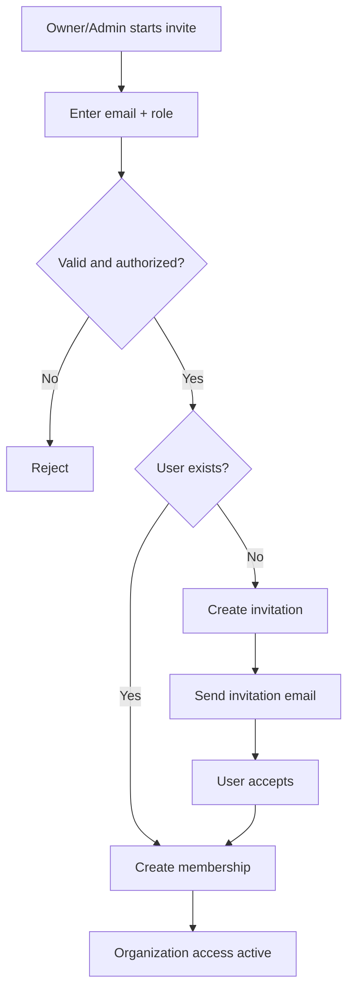

---

# 6. Workflow 2 — Authentication

## 6.1 Trigger

A registered organizer-side user attempts to access the authenticated EventFlow application.

## 6.2 Actor

- Owner
- Admin
- Event Manager
- Staff
- Viewer

## 6.3 Preconditions

1. A user account exists.
2. User has valid credentials.
3. Account is permitted to authenticate.

## 6.4 Main Flow

1. User opens login page.
2. User enters email and password.
3. System validates input.
4. System verifies credentials.
5. System creates/regenerates authenticated session.
6. System determines accessible organization context.
7. User is redirected to authorized application area.

## 6.5 Alternative Flow

### Forgot Password

1. User requests password reset.
2. System accepts email input.
3. System issues a time-limited reset token.
4. Reset email is sent.
5. User follows reset flow.
6. User sets a new valid password.
7. Used/expired reset token becomes invalid.

## 6.6 Error Flow

- Invalid credentials → generic authentication error.
- Invalid reset token → reset denied.
- Expired reset token → reset denied.
- Session expired → require login again.
- Authenticated user has no organization access → show controlled onboarding/no-access state.

## 6.7 Business Rules

- Passwords are never displayed after submission.
- Login failure must not expose sensitive account details.
- Authentication does not automatically imply organization authorization.
- Organization access still requires membership.

## 6.8 Database State Changes

Login:

- session record/state created or regenerated.

Password reset:

- reset token created.
- password hash updated after successful reset.
- used token invalidated.

## 6.9 Notifications

- Password reset email.

## 6.10 Audit Events

Security logging may capture authentication anomalies.

Business audit logging of every login is not required by the PRD.

## 6.11 Final State

User has a valid authenticated session and may proceed to organization-level authorization.

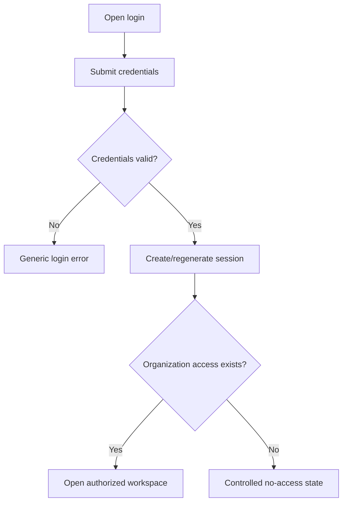

---

# 7. Workflow 3 — Organization Administration

## 7.1 Trigger

Owner/Admin needs to manage organization profile, settings, members, or roles.

## 7.2 Actor

- Owner
- Admin

Read-only involvement:

- Viewer for permitted basic information.

## 7.3 Preconditions

1. User is authenticated.
2. User has organization membership.
3. User has permission for requested administrative action.

## 7.4 Main Flow

1. User opens organization settings.
2. System displays only permitted settings.
3. User changes:
   - organization name,
   - basic branding,
   - timezone,
   - locale where enabled,
   - member roles where applicable.
4. System validates input.
5. System validates ownership invariant if role changes occur.
6. System saves changes.
7. System writes required audit record.
8. Updated configuration becomes active.

## 7.5 Alternative Flow

An Admin may manage permitted settings but cannot perform Owner-restricted actions.

## 7.6 Error Flow

- Staff/Event Manager attempts restricted setting → deny.
- Last Owner is removed/demoted → reject.
- Invalid timezone/locale → reject.
- Unauthorized organization identifier → deny.

## 7.7 Business Rules

- Every active organization must have at least one Owner.
- Organization settings are isolated from other organizations.
- Role permissions follow the PRD permission matrix.
- Removing membership revokes future access.

## 7.8 Database State Changes

Depending on action:

- organization fields updated,
- settings updated,
- membership role updated,
- membership removed.

## 7.9 Notifications

Optional:

- member role change notification.
- member removal notification.

Not required as an MVP notification by the PRD.

## 7.10 Audit Events

Required:

- `organization.settings.changed`
- `organization.member.role_changed`
- `organization.member.removed`

## 7.11 Final State

Organization configuration and/or membership state reflects authorized changes while ownership invariant remains valid.

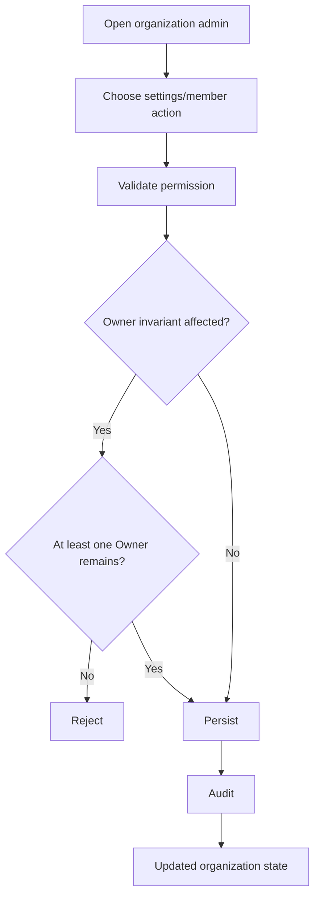

---

# 8. Workflow 4 — Create and Configure Event

## 8.1 Trigger

An authorized organizer wants to create a new event.

## 8.2 Actor

- Owner
- Admin
- Event Manager

## 8.3 Preconditions

1. User is authenticated.
2. User has valid organization membership.
3. User has permission to create events.

## 8.4 Main Flow

1. User selects **Create Event**.
2. User enters required initial event information.
3. System validates data.
4. System creates event under current organization.
5. Initial status is `Draft`.
6. User may configure:
   - description,
   - banner,
   - dates/times,
   - contact,
   - event mode,
   - venue,
   - capacity,
   - registration dates,
   - public slug,
   - agenda,
   - ticket types,
   - registration fields.
7. User saves updates.
8. System records material changes as required.

## 8.5 Alternative Flow

User creates the event with only minimum initial data and completes configuration later while status remains Draft.

## 8.6 Error Flow

- Required create fields invalid → no event created.
- Unauthorized user → deny action.
- Organization context invalid → deny.
- Public slug conflicts → reject or require another unique slug.
- File upload fails → event may still save other valid non-file information if product action allows independent save.

## 8.7 Business Rules

- Every event belongs to exactly one organization.
- Draft event is not publicly discoverable.
- Draft event does not accept public registrations.
- Event remains Draft until publish-readiness rules are satisfied.

## 8.8 Database State Changes

Create:

- event record inserted with `Draft`.

Configuration:

- event updated,
- venue associated/updated,
- agenda items inserted/updated,
- ticket types inserted/updated,
- registration fields inserted/updated,
- file reference added where applicable.

## 8.9 Notifications

None required for normal event draft creation.

## 8.10 Audit Events

Required:

- `event.created`
- `event.updated` for material updates.

## 8.11 Final State

A valid organization-owned event exists in `Draft`, ready for further configuration or publication.

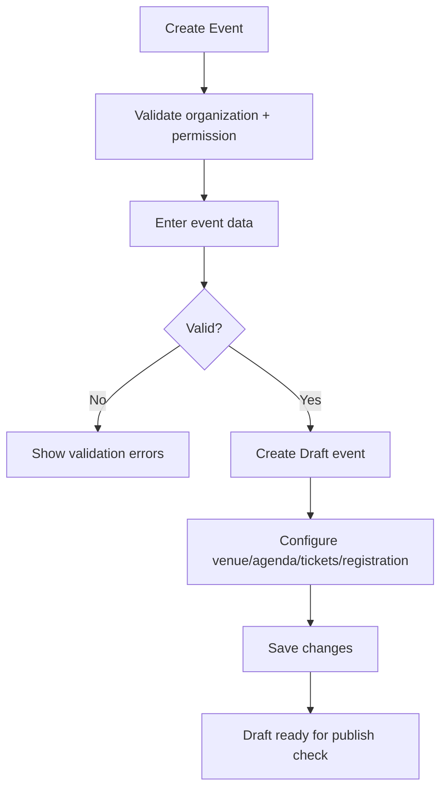

---

# 9. Workflow 5 — Venue and Agenda Management

## 9.1 Trigger

Event Manager configures operational event information.

## 9.2 Actor

- Owner
- Admin
- Event Manager

Read-only:

- Staff
- Viewer
- Public Attendee for public-visible content.

## 9.3 Preconditions

1. Event exists.
2. User is authorized for event.
3. Event is not in a state where editing has been disallowed by product rules.

## 9.4 Main Flow

### Venue

1. User selects event mode:
   - online,
   - offline,
   - hybrid.
2. User enters venue name/address/notes where applicable.
3. User chooses public visibility.
4. System validates and stores venue data.

### Agenda

1. User adds agenda item.
2. User enters title and start time.
3. User optionally enters end time, location, speaker text, description.
4. System validates.
5. Agenda item is saved.
6. System displays items chronologically by default.
7. User may reorder where allowed.

## 9.5 Alternative Flow

- Online-only event may not require physical address.
- Hybrid event may contain both physical and online information where supported.
- Event may be published with minimal agenda if publish rules do not require agenda.

## 9.6 Error Flow

- Missing required agenda title/start time → reject agenda item.
- Unauthorized edit → deny.
- Invalid date/time → reject.
- Event does not belong to user's organization → deny.

## 9.7 Business Rules

- Venue visibility is configurable.
- Agenda default order is chronological.
- Public users see only content configured for public display.
- Internal notes shall never leak into public registration.

## 9.8 Database State Changes

- venue record insert/update.
- event venue association update.
- agenda item insert/update/delete/reorder metadata.

## 9.9 Notifications

No automatic notification required by MVP when venue/agenda changes.

Future product versions may notify registered attendees.

## 9.10 Audit Events

Event updates may create `event.updated`.

Detailed per-agenda audit is optional unless considered a material event change.

## 9.11 Final State

Event has valid venue and/or agenda configuration available to authorized users and public page according to visibility settings.

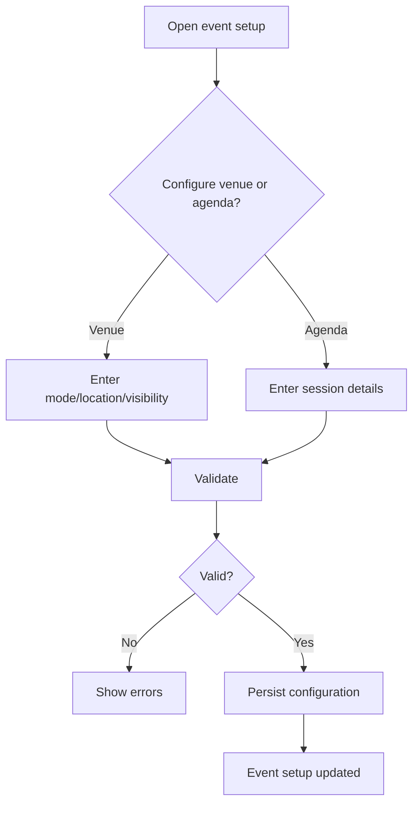

---

# 10. Workflow 6 — Event Publication / Approval Gate

## 10.1 Trigger

An authorized user decides a Draft event is ready for public registration.

## 10.2 Actor

- Owner
- Admin
- Event Manager with publish permission.

## 10.3 Preconditions

1. Event exists in `Draft`.
2. Actor is authenticated and authorized.
3. Required publication fields are present:
   - name,
   - start date/time,
   - end date/time,
   - organizer,
   - valid status context.
4. Any other configured publish-readiness rules pass.

## 10.4 Main Flow

1. Actor selects **Publish**.
2. System verifies authorization.
3. System evaluates publish readiness.
4. System verifies public slug/URL.
5. System changes status:
   - `Draft → Published`.
6. Public event page becomes accessible.
7. Registration becomes available only if:
   - registration is enabled,
   - current time is within registration window,
   - capacity remains.
8. System records audit event.
9. Relevant cache is invalidated.

## 10.5 Alternative Flow

Event may be Published while registration is currently scheduled for a later start.

Public page is accessible, but registration action remains closed until the configured start.

## 10.6 Error Flow

- Missing publish fields → remain Draft.
- User lacks publish permission → deny.
- Invalid event dates → reject.
- Public URL conflict → reject publication until corrected.
- Registration configuration incomplete → depending on product rule, event may publish with registration disabled; registration itself must not open incorrectly.

## 10.7 Business Rules

- Draft events are not publicly discoverable.
- Publication is an authorization gate, not a separate multi-step approval workflow.
- Publishing is auditable.
- Publication does not override registration time or capacity rules.

## 10.8 Database State Changes

- event status updated `Draft → Published`.
- publish timestamp may be recorded if included in final database design.
- audit entry created.

## 10.9 Notifications

No mandatory publication notification is required by the PRD.

## 10.10 Audit Events

Required:

- `event.published`

## 10.11 Final State

Event is `Published` and publicly accessible.

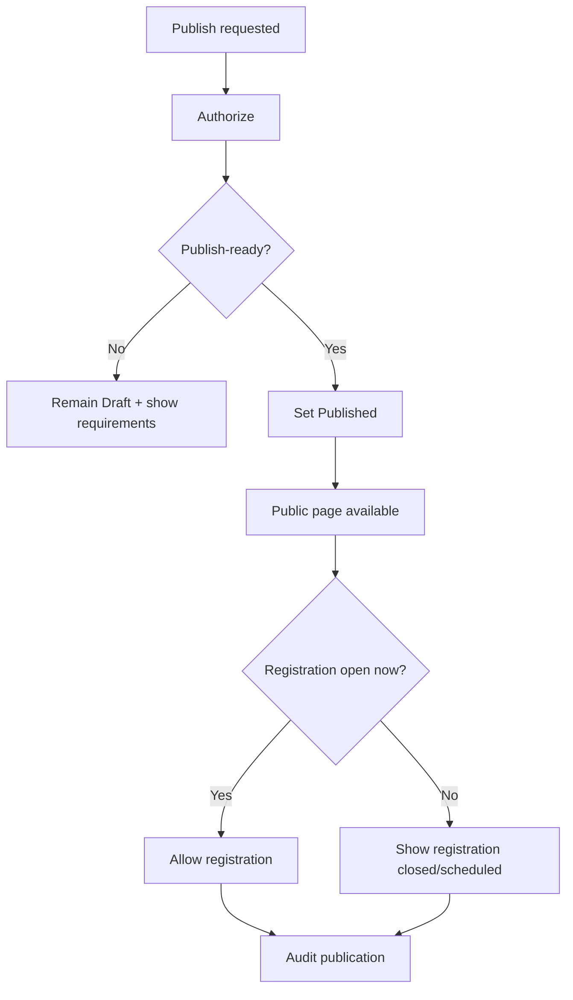

---

# 11. Workflow 7 — Registration and Ticket Type Configuration

## 11.1 Trigger

Organizer prepares a published or draft event to accept registrations.

## 11.2 Actor

- Owner
- Admin
- Event Manager

## 11.3 Preconditions

1. Event exists.
2. Actor has management permission.

## 11.4 Main Flow

1. User enables registration.
2. User configures registration start/end date.
3. User configures default fields:
   - name,
   - email,
   - phone requirement,
   - organization requirement.
4. User optionally creates custom fields.
5. User creates one or more ticket types.
6. For each ticket type, user configures:
   - name,
   - optional informational price,
   - capacity,
   - description,
   - availability period.
7. System validates all settings.
8. Configuration is saved.
9. Registration availability is derived dynamically.

## 11.5 Alternative Flow

### Free Event

Ticket price is zero or absent.

### Informational Price

Price may be displayed, but no online payment is processed.

### No Ticket-Type Complexity

A single default ticket/registration category may be used.

## 11.6 Error Flow

- Ticket capacity invalid → reject.
- Availability end before start → reject.
- Registration end before start → reject.
- Unsupported custom field type → reject.
- Required custom field misconfigured → reject invalid definition.

## 11.7 Business Rules

- Registration only succeeds while registration is open.
- Ticket type cannot exceed configured capacity.
- Ticket availability period must be respected.
- Custom required fields must be answered.
- Price does not imply payment processing in MVP.

## 11.8 Database State Changes

- event registration settings updated.
- registration-field definitions inserted/updated.
- ticket types inserted/updated.

No attendee registration is created.

## 11.9 Notifications

None required.

## 11.10 Audit Events

Configuration may be included under:

- `event.updated`
- critical ticket state/config changes if defined as auditable.

## 11.11 Final State

Event has a valid registration configuration and zero or more available ticket types.

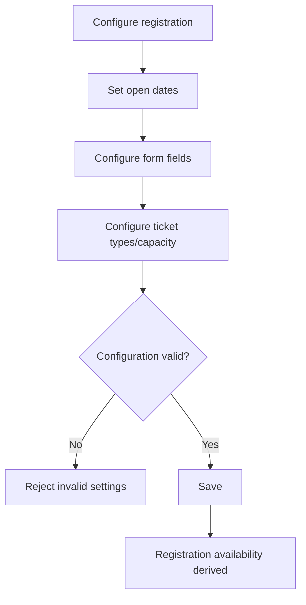

---

# 12. Workflow 8 — Public Attendee Registration (Main Transaction)

## 12.1 Trigger

A public attendee selects **Register** on a published event.

## 12.2 Actor

Primary:

- Public Attendee

Automated:

- System

## 12.3 Preconditions

1. Event is `Published` or otherwise explicitly valid for registration according to future rules.
2. Registration is enabled.
3. Current time is within registration period.
4. Selected ticket type is currently available.
5. Capacity remains.
6. Required public form fields are available.

## 12.4 Main Flow

1. Attendee opens public event page.
2. System displays event information and registration availability.
3. Attendee selects ticket/registration type if required.
4. Attendee enters:
   - name,
   - email,
   - any required default fields,
   - required custom fields.
5. Attendee submits registration.
6. System validates form data.
7. System rechecks event status and registration window.
8. System rechecks ticket/event capacity transaction-safely.
9. System creates registration with unique identifier.
10. Derived MVP status becomes `Confirmed`.
11. System stores custom answers.
12. If ticket is required:
    - unique ticket is created,
    - QR token/identifier is created.
13. Transaction commits.
14. System displays confirmation.
15. Confirmation/ticket notification is queued after commit.
16. Dashboard/report aggregates are invalidated or refreshed.

## 12.5 Alternative Flow

### Registration Is Scheduled but Not Open

Public event page remains visible; attendee sees registration-not-open status.

### Registration Is Closed

Public event page remains visible; registration submission is unavailable.

### Free Event

Registration succeeds with no payment flow.

### Informational-Price Ticket

Ticket price is displayed but EventFlow does not perform payment processing in MVP.

## 12.6 Error Flow

- Event is Draft → registration unavailable.
- Event is Cancelled → registration unavailable.
- Registration period closed → reject.
- Ticket unavailable → reject.
- Capacity exhausted between page load and submit → reject at final transaction check.
- Required field missing → reject.
- Invalid custom field response → reject.
- Ticket identifier generation conflict → transaction fails/retries safely.
- Email delivery fails after commit → registration remains successful.

## 12.7 Business Rules

- Successful registration shall never exceed event/ticket capacity.
- Registration identifier is unique.
- Ticket identifier is unique.
- Public form does not expose internal notes.
- Email failure does not invalidate registration.
- Critical registration write must be atomic.
- Successful registration counts toward attendance denominator according to report rules.

## 12.8 Database State Changes

Within authoritative transaction:

- registration inserted.
- custom registration answers inserted.
- ticket inserted when required.
- ticket/capacity relationship updated as required by final database model.

After commit:

- notification job may be recorded/queued.
- cache may be invalidated.

## 12.9 Notifications

Required:

- registration confirmation email.
- ticket access/information when ticketing applies.

## 12.10 Audit Events

Public self-registration does not have to produce an administrative audit entry under PRD minimum list, but operational event records and system logs provide traceability.

Manual status changes later are auditable.

## 12.11 Final State

A unique `Confirmed` registration exists and, where applicable, has a unique ticket/QR.

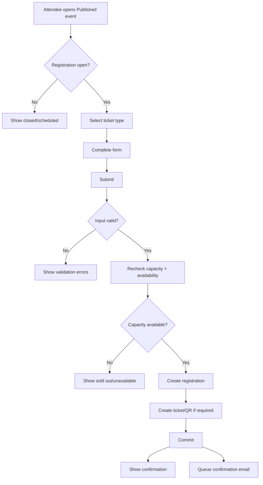

---

# 13. Workflow 9 — Ticket Issuance and Ticket Access

## 13.1 Trigger

A successful confirmed registration requires a ticket.

## 13.2 Actor

- System
- Public Attendee
- Authorized event administrator

## 13.3 Preconditions

1. Registration exists.
2. Registration is confirmed.
3. Ticket is required by the event flow.
4. No ticket already exists for the registration if one-ticket-per-registration applies.

## 13.4 Main Flow

1. System generates unique unpredictable ticket identifier/token.
2. System associates ticket with registration.
3. System creates QR representation.
4. Ticket becomes accessible through secure registration confirmation.
5. Attendee may open/view ticket.
6. Authorized organizer may view ticket from attendee registration details.

## 13.5 Alternative Flow

Attendee receives a secure link rather than a downloadable attachment.

## 13.6 Error Flow

- Registration invalid/cancelled → do not issue new valid ticket.
- Identifier collision → reject duplicate and regenerate safely.
- Unauthorized user attempts another attendee's ticket → deny.
- QR rendering fails → ticket business record remains; operator may retry rendering/delivery.

## 13.7 Business Rules

- Ticket belongs to exactly one registration.
- Ticket public identifier is unique.
- Ticket public access cannot rely solely on sequential DB ID.
- Ticket does not expose administrative-only information.

## 13.8 Database State Changes

- ticket inserted.
- unique identifier/token persisted.
- ticket-registration relationship persisted.

## 13.9 Notifications

- registration confirmation/ticket-access email.

## 13.10 Audit Events

Critical ticket state changes may be audited.

## 13.11 Final State

Registration has one valid ticket reference usable for event check-in.

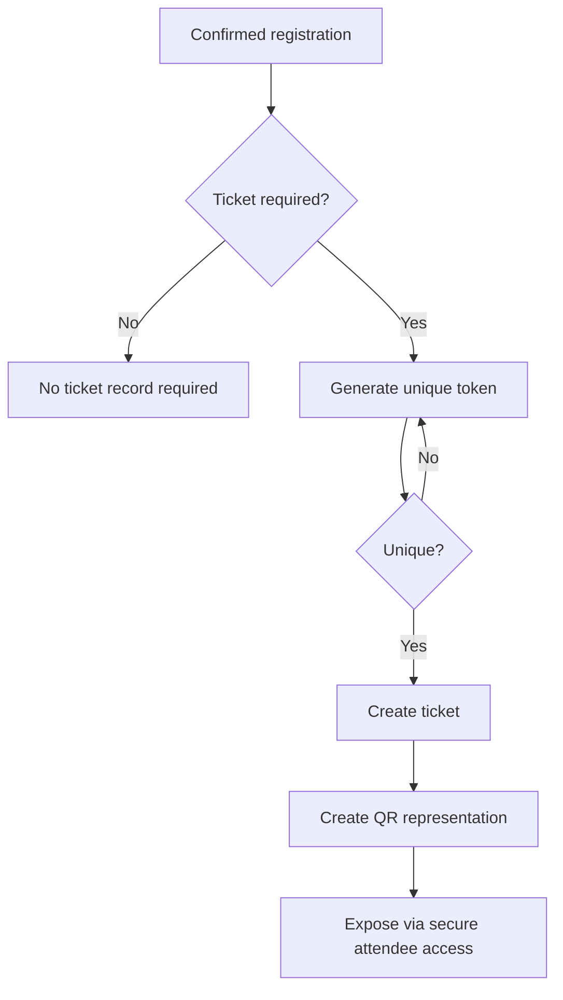

---

# 14. Workflow 10 — Attendee Management

## 14.1 Trigger

Organizer needs to inspect, search, filter, or update attendee registration records.

## 14.2 Actor

- Owner
- Admin
- Event Manager
- Staff with limited permitted actions
- Viewer read-only

## 14.3 Preconditions

1. User is authenticated.
2. User has organization/event access.
3. Event exists.

## 14.4 Main Flow

1. User opens attendee list.
2. System loads organization/event-scoped records.
3. User searches by:
   - name,
   - email,
   - registration identifier,
   - ticket identifier where permitted.
4. User filters by:
   - registration status,
   - ticket type,
   - check-in status,
   - registration date.
5. User opens attendee details.
6. System displays only permitted fields.
7. Authorized role may perform allowed status action.

## 14.5 Alternative Flow

User exports the current filtered attendee set through reporting/export workflow.

## 14.6 Error Flow

- No matching result → display no-result state.
- User lacks event access → deny.
- Staff attempts prohibited edit → deny.
- Another organization's identifier entered → no unauthorized record returned.

## 14.7 Business Rules

- Search/filter never bypasses authorization.
- Internal-only fields are not visible publicly.
- Status changes require role permission.
- Status changes are auditable.

## 14.8 Database State Changes

Read/search:

- none.

Authorized status update:

- registration status updated.
- audit entry inserted.

## 14.9 Notifications

No automatic attendee-management notification required unless a status-change notification is later approved.

## 14.10 Audit Events

Required:

- `registration.status_changed` for manual status changes.

## 14.11 Final State

Attendee data is viewed or validly updated within authorized event scope.

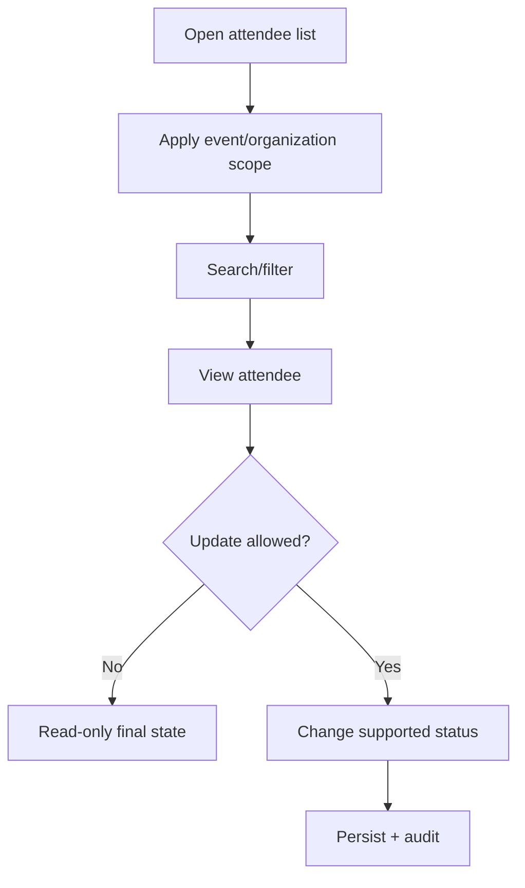

---

# 15. Workflow 11 — Registration Cancellation (Derived MVP Rule)

> The PRD requires registration status changes but does not explicitly name cancellation. This workflow is derived to make the minimum `Confirmed → Cancelled` model operable.

## 15.1 Trigger

An authorized organizer needs to invalidate a confirmed attendee registration.

## 15.2 Actor

- Owner
- Admin
- Event Manager
- Staff only if explicitly permitted by final permission design.

Public attendee self-cancellation is **not** defined by the PRD.

## 15.3 Preconditions

1. Registration exists.
2. Actor has event access.
3. Actor has permission to change registration status.
4. Registration is currently `Confirmed`.

## 15.4 Main Flow

1. Actor opens attendee registration.
2. Actor chooses **Cancel Registration**.
3. System asks for explicit confirmation.
4. System validates current status.
5. System changes:
   - `Confirmed → Cancelled`.
6. Associated ticket becomes ineligible for check-in.
7. If capacity-release policy is enabled, available capacity is recalculated.
8. System records audit event.
9. Relevant dashboard/report cache is invalidated.

## 15.5 Alternative Flow

If business stakeholders decide cancelled registration must continue consuming capacity, step 7 is omitted. This must be explicitly decided before implementation.

## 15.6 Error Flow

- Registration already Cancelled → no duplicate state change.
- Registration already checked in → cancellation policy is not defined by PRD; system should reject unless product rules explicitly allow it.
- User lacks permission → deny.
- Concurrent state change → system revalidates latest state before commit.

## 15.7 Business Rules

- Cancellation is explicit and confirmed.
- Cancelled registration is not check-in eligible.
- Manual registration status changes are audited.
- Capacity release policy must be consistent.

## 15.8 Database State Changes

- registration status `Confirmed → Cancelled`.
- optional capacity availability changes are derived rather than manually edited.
- audit record inserted.

## 15.9 Notifications

Not required by current PRD.

Optional future:

- attendee cancellation notice.

## 15.10 Audit Events

Required:

- `registration.status_changed`
- summary should indicate previous and new status.

## 15.11 Final State

Registration is `Cancelled` and cannot produce a successful check-in.

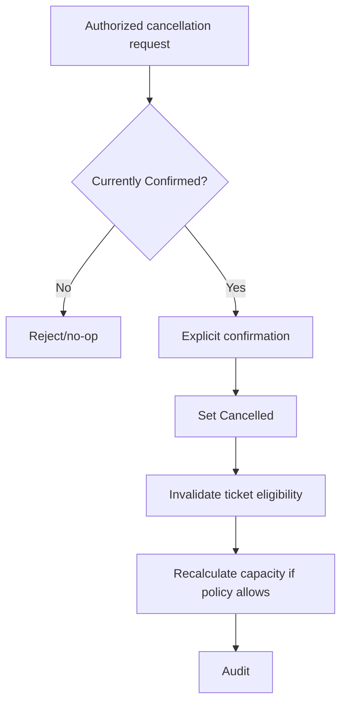

---

# 16. Workflow 12 — Event Cancellation

## 16.1 Trigger

Authorized organizer decides an event will not proceed or must stop.

## 16.2 Actor

- Owner
- Admin
- Event Manager with cancel permission.

## 16.3 Preconditions

1. Event exists.
2. Event is in a cancellable state:
   - Draft,
   - Published,
   - Ongoing.
3. Actor has permission.

## 16.4 Main Flow

1. Actor opens event.
2. Actor selects **Cancel Event**.
3. System displays destructive-impact warning.
4. Actor confirms.
5. System revalidates current event status.
6. System changes:
   - `Draft → Cancelled`, or
   - `Published → Cancelled`, or
   - `Ongoing → Cancelled`.
7. New public registrations immediately become unavailable.
8. Public page, if retained, clearly reflects cancellation state.
9. System records audit event.
10. Relevant dashboard/public cache is invalidated.

## 16.5 Alternative Flow

If event is still Draft, there may be no registered attendees to notify.

## 16.6 Error Flow

- Completed event cancellation attempted → reject under current transition model.
- Archived event cancellation attempted → reject.
- Actor lacks permission → deny.
- Concurrent event status already changed → re-evaluate and show latest state.

## 16.7 Business Rules

- Cancelled events do not accept new public registration.
- Cancellation is audited.
- Cancellation does not silently delete historical registrations.
- Existing attendee data remains available subject to retention policy.
- Refund behavior is not applicable because payment is out of MVP.

## 16.8 Database State Changes

- event status → `Cancelled`.
- cancellation timestamp/reason may be added if approved in database design; not required by PRD.
- audit record inserted.

No automatic deletion of:

- registrations,
- tickets,
- agenda,
- reports.

## 16.9 Notifications

Current PRD defines event update/reminder capability generally but does not explicitly require automated cancellation email.

Recommended future/business clarification:

- notify confirmed attendees when a Published/Ongoing event is cancelled.

If implemented, delivery must occur after event-state commit.

## 16.10 Audit Events

Required:

- `event.cancelled`

## 16.11 Final State

Event is `Cancelled`, remains historically reportable, and accepts no new registration.

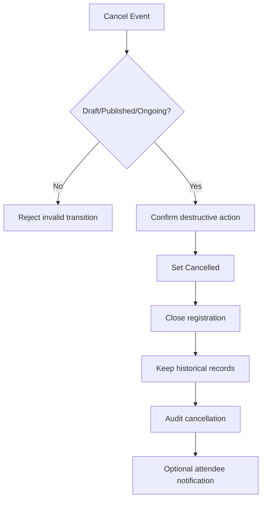

---

# 17. Workflow 13 — Event Start / Ongoing Status

## 17.1 Trigger

A published event begins.

## 17.2 Actor

- Owner
- Admin
- Event Manager
- System in future if automated status transition is approved.

## 17.3 Preconditions

1. Event status is `Published`.
2. Event is valid to begin.
3. Actor is authorized when change is manual.

## 17.4 Main Flow

1. Authorized actor opens event.
2. Actor selects **Start Event** or changes status to Ongoing.
3. System validates current state.
4. System changes:
   - `Published → Ongoing`.
5. Check-in remains available according to event operational settings.
6. Audit event is written.

## 17.5 Alternative Flow

Future scheduler may automatically transition based on configured start time. This is not required by the PRD.

## 17.6 Error Flow

- Draft event → cannot move directly to Ongoing.
- Cancelled event → cannot start.
- Completed/Archived event → cannot start.
- Unauthorized actor → deny.

## 17.7 Business Rules

- Ongoing is only reached from Published in MVP.
- Status change is auditable.
- Ongoing event is operationally active.

## 17.8 Database State Changes

- event status `Published → Ongoing`.
- audit entry inserted.

## 17.9 Notifications

None required.

## 17.10 Audit Events

Recommended/required as material status transition:

- `event.started`
- or generic `event.status_changed`.

## 17.11 Final State

Event is `Ongoing`.

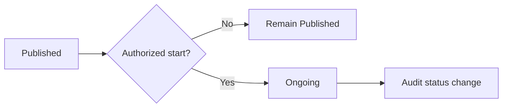

---

# 18. Workflow 14 — Attendee Check-In (Manual and QR)

## 18.1 Trigger

An attendee arrives and event staff needs to record attendance.

## 18.2 Actor

- Staff
- Event Manager
- Admin
- Owner

## 18.3 Preconditions

1. Operator is authenticated.
2. Operator has event check-in permission.
3. Event is accessible to operator.
4. Attendee registration exists.
5. Registration/ticket is eligible.
6. Attendee has not already been successfully checked in.

## 18.4 Main Flow — QR

1. Operator opens event check-in screen.
2. Browser obtains camera access where supported.
3. Operator scans QR.
4. System resolves unique ticket reference.
5. System verifies:
   - ticket exists,
   - ticket belongs to current event,
   - registration is eligible,
   - registration is not cancelled,
   - no prior successful check-in exists.
6. System creates one check-in atomically.
7. System records:
   - attendee,
   - event,
   - check-in time,
   - operator.
8. System returns immediate success.
9. Dashboard attendance totals are invalidated/refreshed.
10. Audit record is created.

## 18.5 Alternative Flow — Manual

1. Operator searches attendee by name/email/registration identifier.
2. Operator selects matching attendee.
3. System performs the same eligibility checks.
4. Operator confirms manual check-in.
5. System creates check-in.

## 18.6 Error Flow

### Duplicate

- Existing check-in found.
- No second attendance record is silently created.
- Operator sees previous check-in state/time.

### Invalid QR

- No matching valid ticket.
- No check-in record created.

### Wrong Event

- Ticket belongs to another event.
- Check-in denied.

### Cancelled Registration

- Check-in denied.

### Unauthorized Staff

- Access denied.

### Camera Unavailable

- Operator uses manual search fallback.

## 18.7 Business Rules

- One successful attendance per defined registration/check-in invariant.
- QR and manual check-in use the same business validation.
- Duplicate check-in is detected.
- Invalid QR never creates attendance.
- Check-in write is atomic.
- Check-in result should meet PRD response-time requirement.

## 18.8 Database State Changes

Successful check-in:

- check-in record inserted.
- attendance derived state becomes `Checked In`.
- audit record inserted.

Duplicate/invalid:

- no new check-in row.

## 18.9 Notifications

No attendee email is required for check-in.

## 18.10 Audit Events

Required:

- `checkin.manual`
- `checkin.qr`

If reversal is ever supported:

- `checkin.reversed`.

## 18.11 Final State

Attendee is `Checked In`, or operator receives a controlled invalid/duplicate state without corrupting attendance.

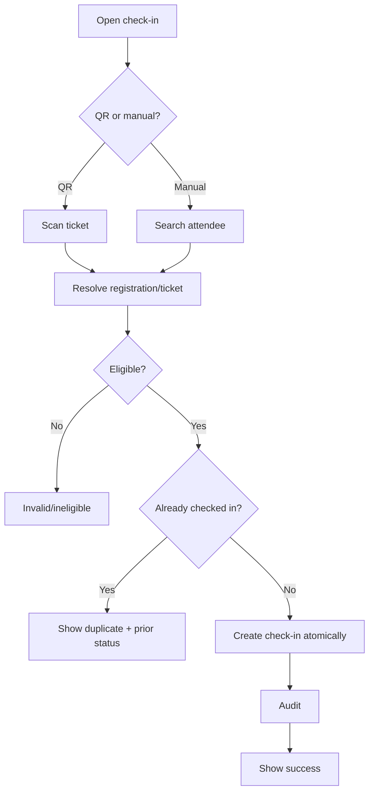

---

# 19. Workflow 15 — Notification Delivery

## 19.1 Trigger

A committed business action requires user communication.

Examples:

- password reset,
- registration confirmation,
- ticket availability,
- organization invitation,
- configured event reminder.

## 19.2 Actor

- System
- Queue Worker
- Email Provider

## 19.3 Preconditions

1. Underlying business state has successfully committed where applicable.
2. Recipient information exists.
3. Notification type is enabled/applicable.

## 19.4 Main Flow

1. Business workflow completes its authoritative state change.
2. System creates/dispatches notification job.
3. Queue stores pending work.
4. Worker processes job.
5. Email content is generated.
6. Email provider receives request.
7. Delivery succeeds.
8. Delivery/troubleshooting state may be recorded where supported.

## 19.5 Alternative Flow

If queueing is disabled in a non-production environment, mail may be processed synchronously according to environment configuration, but business rules remain the same.

## 19.6 Error Flow

- Mail provider unavailable → job fails and may retry.
- Invalid recipient address → delivery fails and is logged.
- Queue worker unavailable → notification remains pending.
- Notification failure does not reverse registration/event state.

## 19.7 Business Rules

- Critical state commits before external email delivery.
- No internal administrative notes are exposed.
- Ticket email references only intended attendee ticket.
- Retry must not create harmful business duplicates.

## 19.8 Database State Changes

Possible:

- queued job record created,
- failed job record created,
- notification delivery state recorded if supported.

Core event/registration state does not roll back due to email failure.

## 19.9 Notifications

This workflow is the notification itself.

## 19.10 Audit Events

Notification delivery is primarily technical logging.

Business audit entry is not required for every email unless future compliance requirements demand it.

## 19.11 Final State

Notification is:

- delivered,
- pending retry,
- or failed and observable.

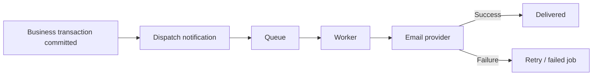

---

# 20. Workflow 16 — Event Reminder Scheduling

## 20.1 Trigger

Configured reminder becomes due.

## 20.2 Actor

- System Scheduler
- Queue Worker

## 20.3 Preconditions

1. Reminder feature is enabled.
2. Event exists and is eligible.
3. Reminder timing is due.
4. Recipient population is valid.
5. Reminder has not already been sent for the same configured occurrence.

## 20.4 Main Flow

1. VPS cron invokes scheduler.
2. Scheduler identifies due reminder.
3. System resolves eligible confirmed registrations.
4. System dispatches notification jobs.
5. Workers send emails.
6. Reminder execution is marked/recorded sufficiently to prevent unintended repeat.

## 20.5 Alternative Flow

If no attendees are eligible, no delivery is dispatched.

## 20.6 Error Flow

- Email delivery fails → retry.
- Event cancelled before reminder → reminder should not be sent unless cancellation-specific communication exists.
- Scheduler runs twice → idempotency prevents duplicate intended reminder occurrence.

## 20.7 Business Rules

- Scheduled work uses event/organization timezone consistently.
- Reminder jobs must be idempotent.
- Cancellation state overrides normal event reminder.

## 20.8 Database State Changes

Possible:

- reminder execution state.
- queue jobs.
- failed job state.

No attendee registration mutation.

## 20.9 Notifications

- event reminder email.

## 20.10 Audit Events

Not required by PRD.

Operational logging should record reminder execution/failure.

## 20.11 Final State

Eligible attendees receive one intended reminder per configured occurrence, or failed deliveries remain observable/retryable.

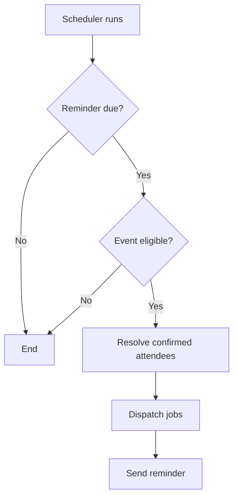

---

# 21. Workflow 17 — Reporting and Dashboard

## 21.1 Trigger

Authorized user needs event performance information.

## 21.2 Actor

- Owner
- Admin
- Event Manager
- Viewer
- Staff with limited permitted reporting.

## 21.3 Preconditions

1. User is authenticated.
2. User has organization/event access.
3. Requested report belongs to accessible event.

## 21.4 Main Flow

1. User opens organization or event dashboard.
2. System applies organization/event authorization scope.
3. System calculates or retrieves:
   - event status,
   - registration totals,
   - confirmed registrations,
   - ticket-type totals,
   - checked-in total,
   - attendance percentage.
4. User opens detailed report.
5. User optionally applies filters.
6. System queries authoritative operational records.
7. Report is displayed.
8. If requested, user exports permitted data.

## 21.5 Alternative Flow

No eligible attendees:

- attendance percentage displays `0%` or `Not available`, not an error.

## 21.6 Error Flow

- Unauthorized event → deny.
- No records → show empty report, not technical error.
- Export fails → show user-readable error without changing data.
- Cached dashboard inconsistent → authoritative report data takes precedence and cache should be refreshed.

## 21.7 Business Rules

- Reports use system records as authoritative source.
- Dashboard totals and report totals must reconcile for same filters.
- Attendance percentage uses eligible confirmed attendees as denominator.
- Reports do not mutate operational state.
- User only sees permitted fields.

## 21.8 Database State Changes

Normal report/dashboard view:

- none.

Optional:

- cache read/write.

No business data mutation.

## 21.9 Notifications

None required.

Future scheduled reports are out of MVP.

## 21.10 Audit Events

Report viewing is not required to be audited in MVP.

Sensitive export audit may be added later.

## 21.11 Final State

User receives accurate authorized dashboard/report information.

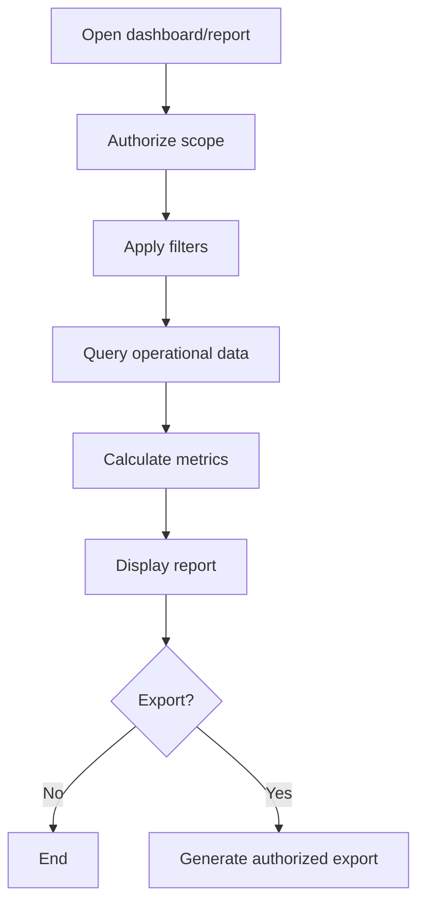

---

# 22. Workflow 18 — Data Export

## 22.1 Trigger

Authorized user requests attendee, registration, or attendance export.

## 22.2 Actor

- Owner
- Admin
- Event Manager
- other roles only as permitted by the permission matrix.

## 22.3 Preconditions

1. User is authenticated.
2. User has access to event.
3. User has export permission.
4. Export dataset is valid.

## 22.4 Main Flow

1. User selects export from attendee/report screen.
2. User chooses full or currently filtered export where supported.
3. System re-applies authorization.
4. System applies current filters if requested.
5. System excludes unauthorized/sensitive fields.
6. System generates CSV.
7. User receives downloadable file.

## 22.5 Alternative Flow

For future large datasets, system may queue export generation and notify user when ready.

## 22.6 Error Flow

- Unauthorized export → deny.
- No matching records → generate valid empty/header-only export or show no-data state according to UI specification.
- Generation error → show controlled error.
- Data changes during export → result reflects a consistent query execution window; no business mutation occurs.

## 22.7 Business Rules

- Export must never bypass organization/event access.
- Export contains only authorized fields.
- Export timestamps use documented timezone.
- Current filters must be respected when filtered export is chosen.

## 22.8 Database State Changes

None to core business records.

Potential temporary export/file record in future implementation.

## 22.9 Notifications

None for synchronous MVP CSV export.

## 22.10 Audit Events

Not required by PRD; may be introduced for compliance-sensitive deployments.

## 22.11 Final State

Authorized user receives a readable CSV representing permitted event data.

```mermaid
flowchart LR
    A[Request export] --> B[Authorize]
    B --> C[Apply event + filters]
    C --> D[Select permitted fields]
    D --> E[Generate CSV]
    E --> F[Download]
```

---

# 23. Workflow 19 — File Upload / Branding Asset Management

## 23.1 Trigger

Authorized user uploads an organization logo, event banner, or supported event image.

## 23.2 Actor

- Owner
- Admin
- Event Manager where permitted.

## 23.3 Preconditions

1. User is authenticated.
2. User is authorized for owning organization/event.
3. File upload feature is available.
4. File conforms to supported type/size requirements.

## 23.4 Main Flow

1. User chooses file.
2. System validates:
   - file type,
   - size,
   - owning organization/event.
3. System stores file.
4. System records file reference/metadata.
5. If replacing active asset:
   - new reference becomes active.
6. Event/public display uses updated asset.

## 23.5 Alternative Flow

Existing asset remains if user cancels upload before completion.

## 23.6 Error Flow

- Unsupported file type → reject.
- Oversized file → reject.
- Storage unavailable → reject with user-readable error.
- Unauthorized ownership → deny.
- Replacement fails → existing valid asset should remain active where possible.

## 23.7 Business Rules

- Files belong to organization/event context.
- Private files are not exposed through predictable application navigation.
- Replacement must not leave duplicate active banner references.
- Upload failure does not corrupt other event data.

## 23.8 Database State Changes

- file metadata/reference inserted/updated.
- event/organization active asset reference updated.

## 23.9 Notifications

None.

## 23.10 Audit Events

Organization branding setting changes may be audited under `organization.settings.changed`.

Event banner changes may be included under `event.updated`.

## 23.11 Final State

Valid asset is associated with authorized organization/event.

```mermaid
flowchart TD
    A[Choose file] --> B[Validate type/size/access]
    B --> C{Valid?}
    C -- No --> X[Reject]
    C -- Yes --> D[Store file]
    D --> E[Save metadata/reference]
    E --> F[Activate new asset]
```

---

# 24. Workflow 20 — Event Completion

## 24.1 Trigger

An Ongoing event has finished normally.

## 24.2 Actor

- Owner
- Admin
- Event Manager.

## 24.3 Preconditions

1. Event is `Ongoing`.
2. Actor is authorized.
3. Event is not Cancelled.

## 24.4 Main Flow

1. Actor opens event.
2. Actor selects **Complete Event**.
3. System verifies current status.
4. Event changes:
   - `Ongoing → Completed`.
5. System preserves:
   - registrations,
   - tickets,
   - attendance,
   - agenda,
   - reports.
6. Completed event remains reportable.
7. Audit event is recorded.

## 24.5 Alternative Flow

If future automation is approved, scheduler may complete event after end time. Not required now.

## 24.6 Error Flow

- Published event has not entered Ongoing → direct completion is not allowed under current transition model.
- Cancelled event → cannot complete.
- Archived event → cannot complete.
- Unauthorized actor → deny.

## 24.7 Business Rules

- Completed events remain available for reporting.
- Completion is a material status transition and must be auditable.
- Completing an event does not delete attendee history.

## 24.8 Database State Changes

- event status `Ongoing → Completed`.
- audit entry inserted.

## 24.9 Notifications

No mandatory completion notification in MVP.

## 24.10 Audit Events

- `event.completed`
- or `event.status_changed`.

## 24.11 Final State

Event is `Completed` and remains visible to authorized users for reporting.

```mermaid
flowchart LR
    A[Ongoing] --> B{Complete authorized?}
    B -- No --> X[Remain Ongoing]
    B -- Yes --> C[Completed]
    C --> D[Preserve reporting data]
    D --> E[Audit]
```

---

# 25. Workflow 21 — Event Archive

## 25.1 Trigger

Authorized user wants to remove a Completed or Cancelled event from default active views while preserving historical access.

## 25.2 Actor

- Owner
- Admin
- Event Manager with limited archive permission where allowed.

## 25.3 Preconditions

1. Event status is:
   - `Completed`, or
   - `Cancelled`.
2. Actor is authorized.

## 25.4 Main Flow

1. Actor selects **Archive**.
2. System explains that archive is not destructive deletion.
3. Actor confirms.
4. System changes:
   - `Completed → Archived`, or
   - `Cancelled → Archived`.
5. Event is removed from default active-event listings.
6. Event remains accessible to authorized users through archived/historical views.
7. Reports remain available.
8. Audit entry is created.

## 25.5 Alternative Flow

User leaves event in Completed/Cancelled for ongoing reporting without archiving.

## 25.6 Error Flow

- Draft → Archived attempted → reject.
- Published/Ongoing → Archived attempted → reject.
- Unauthorized actor → deny.

## 25.7 Business Rules

- Archived is a historical state.
- Archived event does not return to active status in MVP.
- Historical data remains subject to data-retention policy.

## 25.8 Database State Changes

- event status → `Archived`.
- audit record inserted.

## 25.9 Notifications

None.

## 25.10 Audit Events

Required:

- `event.archived`

## 25.11 Final State

Event is `Archived` and excluded from default active views.

```mermaid
flowchart TD
    A{Completed or Cancelled?}
    A -- No --> X[Archive denied]
    A -- Yes --> B[Confirm archive]
    B --> C[Set Archived]
    C --> D[Hide from active lists]
    D --> E[Preserve reports/history]
    E --> F[Audit]
```

---

# 26. Workflow 22 — Activity Audit Recording

## 26.1 Trigger

A business action defined as auditable succeeds.

## 26.2 Actor

- System
- Acting authenticated user is recorded as actor.

## 26.3 Preconditions

1. Audited business action succeeded.
2. Organization/entity context is known.

## 26.4 Main Flow

1. Business action succeeds.
2. System creates activity record.
3. Activity records:
   - action type,
   - timestamp,
   - actor,
   - organization,
   - entity type,
   - entity identifier,
   - human-readable summary where supported.
4. Record becomes visible only to authorized audit viewers.

## 26.5 Alternative Flow

For automated actions, actor may be represented as System where the final schema supports it.

## 26.6 Error Flow

Audit write strategy must not silently misrepresent a failed business action as successful.

For critical audited workflows, audit persistence should be transactionally aligned where practical.

## 26.7 Business Rules

- Normal users cannot edit audit entries.
- Audit history remains attributable even if actor later loses membership.
- Audit access is organization scoped.
- Newest entries display first by default.

## 26.8 Database State Changes

- activity log inserted.

## 26.9 Notifications

None.

## 26.10 Audit Events

This workflow creates the audit event itself.

Minimum PRD events include:

- event created,
- event updated,
- event published,
- event cancelled,
- event archived,
- organization settings changed,
- member role changed,
- member removed,
- registration status changed manually,
- manual check-in,
- QR check-in,
- reversal if supported,
- critical ticket/attendee state change.

## 26.11 Final State

Immutable business activity history contains a traceable record of the successful material action.

```mermaid
flowchart LR
    A[Auditable action succeeds] --> B[Capture actor/context/entity]
    B --> C[Create activity record]
    C --> D[Authorized audit history]
```

---

# 27. Workflow 23 — Administration: Member Role Change and Removal

## 27.1 Trigger

Owner/Admin changes a member's role or removes the member.

## 27.2 Actor

- Owner
- Admin, within allowed privilege.

## 27.3 Preconditions

1. Actor authenticated.
2. Actor has member-management permission.
3. Target membership exists.
4. Organization ownership invariant will remain valid.

## 27.4 Main Flow — Role Change

1. Actor opens member record.
2. Actor selects new supported role.
3. System validates permission.
4. System calculates resulting Owner count.
5. If valid, membership role changes.
6. Future permission checks use new role.
7. Audit entry is created.

## 27.5 Main Flow — Removal

1. Actor selects remove member.
2. System requests confirmation.
3. System checks ownership invariant.
4. Membership is removed/deactivated.
5. User loses future organization access.
6. Historical audit actor references remain.
7. Audit entry is created.

## 27.6 Alternative Flow

If target is last Owner, actor must first assign/transfer Owner role to another valid member.

## 27.7 Error Flow

- Removing last Owner → reject.
- Admin attempts forbidden Owner-level action → deny.
- Membership already removed → no duplicate removal.
- Wrong organization → deny.

## 27.8 Business Rules

- Active organization always has at least one Owner.
- Membership removal revokes future access.
- Historical audit identity remains.
- Role changes are auditable.

## 27.9 Database State Changes

- membership role updated, or
- membership removed/deactivated.
- audit entry inserted.

## 27.10 Notifications

Optional:

- role changed.
- membership removed.

Not mandatory in PRD.

## 27.11 Audit Events

Required:

- `organization.member.role_changed`
- `organization.member.removed`

## 27.12 Final State

Membership has new valid role or no longer grants organization access.

```mermaid
flowchart TD
    A[Manage member] --> B{Role change or removal?}
    B --> C[Check permissions]
    C --> D{Last Owner affected?}
    D -- Yes --> X[Reject until another Owner exists]
    D -- No --> E[Persist membership change]
    E --> F[Revoke/update future access]
    F --> G[Audit]
```

---

# 28. Workflow 24 — Search and Filtering

## 28.1 Trigger

Authorized user needs to locate events or attendees.

## 28.2 Actor

- Owner
- Admin
- Event Manager
- Staff
- Viewer according to role scope.

## 28.3 Preconditions

1. User authenticated.
2. User has valid organization/event access.

## 28.4 Main Flow

1. User enters search/filter criteria.
2. System applies authorization scope first.
3. System applies supported search:
   - event name/status/date,
   - attendee name/email/registration identifier,
   - ticket identifier where permitted.
4. System applies filters.
5. Results are paginated/displayed.
6. User may clear filters.

## 28.5 Alternative Flow

No criteria → default list state.

## 28.6 Error Flow

- No results → clear no-results state.
- Unauthorized identifier → no data leakage.
- Invalid filter → controlled validation behavior.

## 28.7 Business Rules

- Search cannot escape organization scope.
- Filtering does not mutate records.
- Clearing filters restores default list.
- Attendee search performance must meet PRD target under defined load.

## 28.8 Database State Changes

None.

## 28.9 Notifications

None.

## 28.10 Audit Events

None required.

## 28.11 Final State

Authorized user sees filtered/search result set only from permitted data.

```mermaid
flowchart LR
    A[Enter search/filter] --> B[Apply organization/event scope]
    B --> C[Apply criteria]
    C --> D{Matches?}
    D -- No --> E[No-results state]
    D -- Yes --> F[Display paginated results]
```

---

# 29. Workflow 25 — System Settings / Localization

## 29.1 Trigger

Authorized organization administrator updates product-level organization preferences.

## 29.2 Actor

- Owner
- Admin

## 29.3 Preconditions

1. Actor authenticated.
2. Actor authorized.
3. Supported setting exists.

## 29.4 Main Flow

1. Actor opens settings.
2. Actor changes supported values:
   - organization name,
   - branding,
   - timezone,
   - locale where enabled.
3. System validates setting.
4. System saves setting.
5. Subsequent date/time presentation uses configured timezone.
6. Audit record is created for restricted organization-setting changes.

## 29.5 Alternative Flow

If only one language is enabled, locale control may not be exposed while system remains localization-ready.

## 29.6 Error Flow

- Unsupported locale/timezone → reject.
- Staff attempts change → deny.
- Invalid branding file → reject file portion.

## 29.7 Business Rules

- Date/time business calculations use configured event/organization timezone consistently.
- Currency values identify currency.
- Restricted settings changes are auditable.

## 29.8 Database State Changes

- organization/settings records updated.
- optional file metadata updated.

## 29.9 Notifications

None.

## 29.10 Audit Events

Required:

- `organization.settings.changed`

## 29.11 Final State

Organization preferences are valid and active.

```mermaid
flowchart TD
    A[Open settings] --> B[Modify supported values]
    B --> C{Valid + authorized?}
    C -- No --> X[Reject]
    C -- Yes --> D[Persist settings]
    D --> E[Audit]
    E --> F[New settings active]
```

---

# 30. Payment Workflow — Not Applicable to MVP

## 30.1 Business Decision

Online payment is explicitly outside the mandatory MVP scope.

EventFlow MVP may contain:

- ticket type name,
- optional price,
- currency context.

It shall not contain a full payment transaction workflow.

## 30.2 Not Included

The following business states are not defined in MVP:

- payment pending,
- payment authorized,
- payment paid,
- payment failed,
- payment refunded,
- chargeback,
- settlement,
- vendor payout.

## 30.3 Consequence

A successful attendee registration is not dependent on payment-gateway confirmation in the current MVP.

If paid ticket commerce is later introduced, a dedicated versioned business flow document update is required before implementation.

```mermaid
flowchart LR
    A[Ticket Type]
    A --> B[Optional informational price]
    B --> C[Registration]
    C --> D[Confirmed]
    X[Online Payment Gateway] -. Out of MVP .-> C
```

---

# 31. Approval Workflow — No Separate Approval Module in MVP

## 31.1 Business Decision

No explicit:

- approval request,
- reviewer queue,
- approved/rejected status,
- approval comments,

are defined by the PRD.

The operational gate is event publication.

## 31.2 Effective Approval Equivalent

```text
Draft
→ Publish-readiness validation
→ Authorized Publish action
→ Published
```

If organizations later need creator/reviewer separation, new event statuses or an independent approval state must be added to the PRD.

---

# 32. Inventory Movement Workflow — Not Applicable

EventFlow is not an inventory-management system.

No physical stock movement exists.

Ticket capacity is a controlled availability limit.

## 32.1 Capacity Availability Flow

```mermaid
flowchart LR
    Config[Configured Ticket Capacity]
    Reg[Successful Confirmed Registration]
    Used[Consumed Capacity]
    Remaining[Remaining Availability]

    Config --> Remaining
    Reg --> Used
    Used --> Remaining
```

Capacity must be computed/managed atomically enough to prevent registrations exceeding configured limits.

If derived registration cancellation releases capacity:

```text
Confirmed registration
→ Cancelled
→ capacity becomes available again
```

This release rule must be finalized before implementation.

---

# 33. End-to-End Primary Business Flow

```mermaid
flowchart TD
    Org[Organization]
    Create[Create Event]
    Draft[Draft]
    Configure[Configure Venue / Agenda / Registration / Tickets]
    Ready{Publish-ready?}
    Published[Published]
    Open{Registration open + capacity?}
    Registration[Confirmed Registration]
    Ticket[Ticket + QR]
    Ongoing[Ongoing]
    CheckIn[Check-In]
    Attendance[Attendance]
    Completed[Completed]
    Reports[Reports / Export]
    Archived[Archived]
    Cancelled[Cancelled]

    Org --> Create
    Create --> Draft
    Draft --> Configure
    Configure --> Ready
    Ready -- No --> Configure
    Ready -- Yes --> Published

    Published --> Open
    Open -- Yes --> Registration
    Registration --> Ticket

    Published --> Ongoing
    Ongoing --> CheckIn
    Ticket --> CheckIn
    CheckIn --> Attendance
    Ongoing --> Completed
    Completed --> Reports
    Completed --> Archived

    Draft --> Cancelled
    Published --> Cancelled
    Ongoing --> Cancelled
    Cancelled --> Reports
    Cancelled --> Archived
```

---

# 34. Business Rule Catalogue

## 34.1 Organization Rules

**BF-BR-001** Every event belongs to exactly one organization.

**BF-BR-002** Every active organization has at least one Owner.

**BF-BR-003** Only valid organization members may access private organization data.

**BF-BR-004** Removing membership revokes future organization access.

**BF-BR-005** Historical audit identity remains attributable after membership removal.

## 34.2 Event Rules

**BF-BR-006** New events start in Draft.

**BF-BR-007** Draft events are not public.

**BF-BR-008** Draft events do not accept public registration.

**BF-BR-009** Only publish-ready Draft events move to Published.

**BF-BR-010** Cancelled events accept no new public registrations.

**BF-BR-011** Completed and Cancelled events remain historically reportable unless retention/deletion policy says otherwise.

**BF-BR-012** Archived events are excluded from normal active listings.

**BF-BR-013** Material event status transitions are audited.

## 34.3 Registration Rules

**BF-BR-014** Registration only succeeds while registration is open.

**BF-BR-015** Registration is denied when capacity is exhausted.

**BF-BR-016** Registration capacity may not be exceeded.

**BF-BR-017** Required fields must be valid before successful registration.

**BF-BR-018** Successful registration receives a unique registration identifier.

**BF-BR-019** Successful ticket-enabled registration receives a unique ticket identifier.

**BF-BR-020** Notification failure does not invalidate successful registration.

## 34.4 Ticket Rules

**BF-BR-021** Every ticket belongs to one registration.

**BF-BR-022** Ticket public identifier is unique.

**BF-BR-023** Public ticket access must not expose unauthorized attendee information.

## 34.5 Check-In Rules

**BF-BR-024** Successful check-in is tied to one eligible attendee registration.

**BF-BR-025** Duplicate check-in is detected.

**BF-BR-026** Invalid QR creates no attendance.

**BF-BR-027** Manual and QR check-in enforce the same eligibility rules.

**BF-BR-028** Check-in records operator and time.

## 34.6 Report Rules

**BF-BR-029** System records are the authoritative reporting source.

**BF-BR-030** Dashboard and report totals reconcile for equivalent filters.

**BF-BR-031** Reports respect role and organization scope.

**BF-BR-032** Export includes only permitted fields.

## 34.7 Notification Rules

**BF-BR-033** Notification delivery happens after authoritative business commit where applicable.

**BF-BR-034** Email failure does not roll back registration.

**BF-BR-035** Notification content does not expose private internal notes.

## 34.8 Audit Rules

**BF-BR-036** Normal users cannot edit audit entries.

**BF-BR-037** Audit records identify actor, time, organization, action, and related entity.

---

# 35. Status Transition Validation Matrix

## 35.1 Event

| From | To | Valid? | Notes |
|---|---|---:|---|
| New | Draft | Yes | Initial creation |
| Draft | Published | Yes | Requires publish readiness |
| Draft | Cancelled | Yes | Cancellation before publication |
| Draft | Ongoing | No | Must publish first |
| Draft | Completed | No | Invalid lifecycle |
| Draft | Archived | No | Invalid lifecycle |
| Published | Ongoing | Yes | Event begins |
| Published | Cancelled | Yes | Event cancelled |
| Published | Draft | No | Unpublish not defined |
| Published | Completed | No | Current model requires Ongoing |
| Published | Archived | No | Must complete/cancel first |
| Ongoing | Completed | Yes | Normal finish |
| Ongoing | Cancelled | Yes | Interrupted event |
| Ongoing | Published | No | Backward transition not defined |
| Completed | Archived | Yes | Historical archive |
| Completed | Ongoing | No | Reopen not defined |
| Completed | Cancelled | No | Cancellation after completion not defined |
| Cancelled | Archived | Yes | Historical archive |
| Cancelled | Published | No | Reopen not defined |
| Archived | Any Active State | No | Restore not defined |

## 35.2 Registration — Derived

| From | To | Valid? | Notes |
|---|---|---:|---|
| New successful registration | Confirmed | Yes | Derived from PRD confirmed-registration wording |
| Confirmed | Cancelled | Proposed Yes | Derived minimum status-change workflow |
| Cancelled | Confirmed | No | Reinstatement not defined |

## 35.3 Check-In

| From | To | Valid? | Notes |
|---|---|---:|---|
| Not Checked In | Checked In | Yes | Manual or QR |
| Checked In | Checked In | No new record | Duplicate warning |
| Checked In | Not Checked In | TBD | Only if reversal feature is explicitly supported |

---

# 36. Database State Change Summary

| Workflow | Primary State Change |
|---|---|
| User invitation | Membership/invitation created |
| Authentication | Session/reset-token state |
| Organization administration | Organization/settings/membership updated |
| Create event | Event inserted as Draft |
| Event configuration | Event-related configuration updated |
| Publish | Draft → Published |
| Registration config | Registration/ticket definitions updated |
| Attendee registration | Registration + answers + ticket inserted |
| Ticket issuance | Ticket linked to registration |
| Attendee management | Read or authorized registration-status update |
| Registration cancellation | Confirmed → Cancelled, derived |
| Event cancellation | Draft/Published/Ongoing → Cancelled |
| Event start | Published → Ongoing |
| Check-in | Check-in record inserted |
| Notification | Queue/delivery state only |
| Reporting | No core business mutation |
| Export | No core business mutation |
| File upload | File metadata/reference updated |
| Event complete | Ongoing → Completed |
| Archive | Completed/Cancelled → Archived |
| Audit | Activity log inserted |

---

# 37. Notification Matrix

| Business Event | Recipient | MVP Requirement |
|---|---|---|
| Password reset requested | User | Required |
| Organization invitation | Invited user | Required if invitation model used |
| Registration confirmed | Attendee | Required |
| Ticket issued/access available | Attendee | Required where ticketing enabled |
| Event reminder | Confirmed attendees | Supported if enabled |
| Event cancelled | Confirmed attendees | Recommended clarification; not explicit mandatory PRD notification |
| Registration cancelled | Attendee | Future/optional |
| Check-in success | Attendee | Not required |
| Event completed | Attendee | Not required |

---

# 38. Audit Event Matrix

| Event | Minimum Required? | Actor |
|---|---:|---|
| Event created | Yes | Authorized organizer |
| Event updated | Yes | Authorized organizer |
| Event published | Yes | Authorized organizer |
| Event cancelled | Yes | Authorized organizer |
| Event archived | Yes | Authorized organizer |
| Organization settings changed | Yes | Owner/Admin |
| Member role changed | Yes | Owner/Admin |
| Member removed | Yes | Owner/Admin |
| Registration status changed manually | Yes | Authorized organizer |
| Manual check-in | Yes | Check-in operator |
| QR check-in | Yes | Check-in operator |
| Check-in reversal | Yes if supported | Authorized operator |
| Critical ticket state changed | Yes | Authorized actor/system as applicable |
| Report viewed | No | — |
| Export generated | No in MVP | — |
| Notification sent | No business audit required | System |

---

# 39. Business Exception Catalogue

The UI and business layer shall expose controlled states for at least:

| Exception | Business Response |
|---|---|
| Event not found | Controlled not-found state |
| Organization access denied | Controlled access-denied state |
| Draft event public access | Not publicly available |
| Cancelled event registration | Registration disabled |
| Registration not started | Show scheduled/not-open state |
| Registration ended | Show closed state |
| Ticket sold out | Registration unavailable for ticket type |
| Invalid registration form | Field-level validation |
| Invalid QR | No check-in; show invalid |
| Duplicate QR | No second attendance; show prior check-in |
| Cancelled registration check-in | Deny check-in |
| File invalid type | Reject upload |
| File too large | Reject upload |
| Email failure | Preserve committed business state; retry/log |
| Last Owner removal | Reject action |
| Invalid status transition | Reject and keep current state |

---

# 40. Cross-Module Business Flow Principles

## 40.1 Single Source of Truth

EventFlow database records are the authoritative source for:

- event state,
- registration state,
- ticket state,
- attendance,
- report totals.

Email, cache, and exported files are secondary representations.

## 40.2 Authorization Before Mutation

Every protected business mutation follows:

```text
Authenticate
→ Resolve organization
→ Authorize role/resource
→ Validate input
→ Validate current business state
→ Mutate
→ Audit
→ Notify asynchronously if needed
```

## 40.3 Transaction-Safe Critical Operations

The following require atomic business behavior:

- successful attendee registration and capacity allocation,
- ticket issuance as part of registration,
- attendee check-in,
- ownership-preserving role changes.

## 40.4 Historical Preservation

Normal lifecycle changes shall not silently delete:

- registrations,
- attendance,
- historical audit records.

## 40.5 External Failure Isolation

Email-provider failure shall not reverse:

- event creation,
- publication,
- registration,
- ticket creation,
- check-in.

---

# 41. Product Clarifications Required Before Final Implementation

The PRD and System Design are sufficient to define the primary EventFlow workflow, but the following details remain deliberately visible rather than silently invented.

## 41.1 Registration Status Values

PRD requires a registration status and allows manual changes, but does not enumerate the full set.

This document proposes:

- Confirmed
- Cancelled

for the minimum MVP model.

Product owner should confirm this before database/UI finalization.

## 41.2 Registration Cancellation Capacity

If a registration becomes Cancelled, should its ticket capacity:

- become available again, or
- remain consumed?

Recommendation for normal event registration:

> Release capacity if the attendee has not checked in.

But this is a product decision and should be added to the PRD before implementation.

## 41.3 Cancellation Notification

The PRD does not explicitly mandate emailing existing attendees when an event is cancelled.

Commercially, this is strongly useful, but it should be formally approved before being treated as mandatory acceptance scope.

## 41.4 Event Auto-Status

The PRD defines Ongoing and Completed but does not state whether these transitions are:

- manual,
- automatic by date/time,
- or both.

This document uses manual authorized transition for the MVP and leaves scheduler automation as a future option.

## 41.5 Check-In Reversal

The PRD says reversal should be audited **if reversal is supported**, but does not require the feature.

This document therefore does not define reversal as an MVP workflow.

## 41.6 Public Organizer Sign-Up

Not defined by PRD.

Current business flow uses invitation/authorized provisioning.

---

# 42. Final Business Flow Summary

The EventFlow commercial MVP centers on this sequence:

```text
OWNER / ADMIN
    ↓
Create Organization / Manage Team
    ↓
EVENT MANAGER
    ↓
Create Draft Event
    ↓
Configure Venue + Agenda
    ↓
Configure Registration + Ticket Types
    ↓
Publish Event
    ↓
PUBLIC ATTENDEE
    ↓
Register
    ↓
Confirmed Registration
    ↓
Ticket + QR
    ↓
EVENT DAY
    ↓
Staff Check-In
    ↓
Attendance
    ↓
EVENT MANAGER
    ↓
Complete Event
    ↓
Report + Export
    ↓
Archive
```

The business architecture intentionally excludes mandatory payment, inventory, multi-stage approval, and unrelated enterprise workflows from MVP.

The critical commercial workflow remains:

> **Create Event → Publish → Register → Ticket → Check-In → Attendance → Report**

---

**End of Document**
