# EventFlow Management System — System Design

**Document Path:** `docs/SYSTEM_DESIGN.md`  
**Product:** EventFlow Management System  
**Document Type:** System Architecture / System Design  
**Authoring Role:** Senior Laravel Software Architect  
**Authoritative Product Source:** `docs/PRD.md`  
**Authoritative Technical Requirements Source:** `docs/SRS.md`  
**Architecture Style:** Modular Monolith  
**Deployment Target:** VPS  
**Document Version:** 1.0  
**Status:** Draft for Implementation Planning  

---

## Document Authority and Design Constraints

This document translates the requirements in `docs/PRD.md` and `docs/SRS.md` into an implementable system architecture.

The following rules govern this design:

1. `docs/PRD.md` is authoritative for product behavior and scope.
2. `docs/SRS.md` is authoritative for technical requirements and constraints.
3. This document defines architecture and component responsibilities; it does not override product requirements.
4. Laravel conventions shall be preferred over custom frameworks and unnecessary abstractions.
5. The initial product shall use a **modular monolith**, not microservices.
6. Eloquent shall remain the default persistence abstraction.
7. A repository-per-model pattern shall not be introduced without a demonstrated need.
8. MySQL shall remain the authoritative transactional data store.
9. Organization isolation shall be enforced server-side for every protected resource.
10. Registration capacity and check-in shall use transaction-safe workflows.
11. Email, queues, cache, and other secondary infrastructure shall not become authoritative for critical business state.
12. The system shall remain suitable for:
    - self-hosted deployment,
    - commercial source-code distribution,
    - repeated installations,
    - later SaaS packaging.

---

## Verified Technology Status

The SRS records that no initialized Laravel project configuration was available when the environment was inspected. Therefore actual installed versions remain:

- Laravel: **TBD — Requires Environment Verification**
- PHP: **TBD — Requires Environment Verification**
- MySQL: **TBD — Requires Environment Verification**
- Livewire: **TBD — Requires Environment Verification**
- Alpine.js: **TBD — Requires Environment Verification**
- Tailwind CSS: **TBD — Requires Environment Verification**
- Queue/cache/session drivers: **TBD — Requires Environment Verification**

Requested target stack from the SRS:

- Laravel 13.x
- PHP 8.4.x
- MySQL 8.4.x LTS
- Blade
- Livewire
- Alpine.js
- Tailwind CSS
- VPS deployment

Exact package versions shall be locked only after project initialization and verification of `composer.json`, `composer.lock`, `package.json`, and the frontend lockfile.

---

# 1. Architecture Overview

## 1.1 Architectural Style

EventFlow shall use a **modular monolith architecture**.

All primary product capabilities are deployed as one Laravel application and use one primary MySQL database, while business responsibilities are separated into clear logical modules.

```text
                       EventFlow
                           │
                Laravel Modular Monolith
                           │
       ┌───────────────────┼────────────────────┐
       │                   │                    │
 Presentation        Application Layer      Infrastructure
 Blade / Livewire    Actions / Services     MySQL / Queue
 Alpine / Tailwind   Policies / Queries     Mail / Files
       │                   │                    │
       └───────────────────┴────────────────────┘
                           │
                    Core Domain Modules
                           │
          Organization → Event → Registration
                         → Ticket → Check-In
                         → Report
```

## 1.2 Why Modular Monolith

The MVP has strong transactional relationships among:

- organizations,
- events,
- ticket capacity,
- registrations,
- tickets,
- check-ins,
- reports.

Separating these into distributed services would introduce unnecessary:

- network boundaries,
- distributed transactions,
- event consistency problems,
- operational overhead,
- observability complexity,
- deployment complexity.

The modular monolith allows the product to preserve transaction safety while maintaining enough internal separation for future growth.

## 1.3 Layering Model

The recommended layering is:

```text
Presentation Layer
    │
    ▼
Authorization + Validation
    │
    ▼
Application Actions / Services
    │
    ▼
Domain Models / Business Rules
    │
    ▼
Eloquent / Query Layer
    │
    ▼
MySQL
```

Secondary effects branch after business success:

```text
Committed Business Change
       │
       ├── Audit Log
       ├── Domain/Application Event
       ├── Queued Notification
       ├── Cache Invalidation
       └── Metrics / Logging
```

## 1.4 Core Architectural Goals

The architecture shall optimize for:

- correctness,
- simple deployment,
- maintainability,
- testability,
- data isolation,
- predictable upgrades,
- commercial reuse.

It shall not optimize prematurely for hyperscale.

---

# 2. System Context Diagram using Mermaid

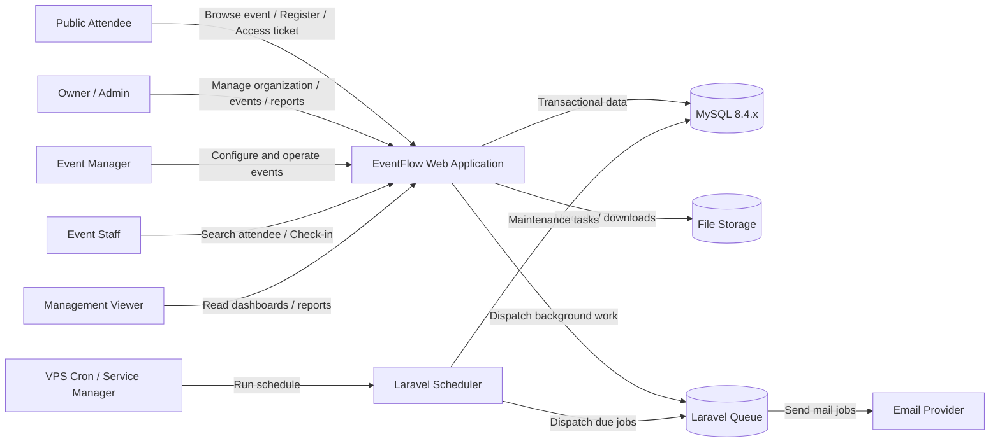

## 2.1 External Dependencies

The MVP shall only require external services where product behavior requires them.

Required or expected external dependency:

- email delivery transport.

Optional infrastructure:

- remote object storage,
- Redis,
- external monitoring,
- third-party backup storage.

Not required in MVP:

- payment gateway,
- WhatsApp API,
- public API consumer integrations,
- webhook platform,
- search engine,
- streaming service.

---

# 3. Application Architecture

## 3.1 Logical Architecture

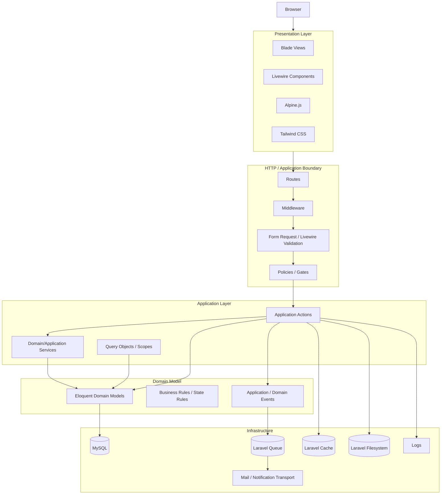

## 3.2 Presentation Responsibilities

Blade shall provide server-rendered layouts and pages.

Livewire shall handle interactive workflows such as:

- event forms,
- attendee lists,
- filters,
- dashboards,
- check-in operator UI,
- settings.

Alpine.js shall be used for lightweight client-only behavior such as:

- toggles,
- disclosure panels,
- modal UI behavior,
- small browser state,
- camera/scanner UI coordination where appropriate.

Tailwind CSS shall provide UI styling.

Business rules shall not live exclusively in browser-side JavaScript.

## 3.3 HTTP Boundary

Responsibilities:

- route resolution,
- authentication middleware,
- organization context resolution,
- validation,
- authorization,
- request throttling,
- CSRF protection.

## 3.4 Application Layer

The application layer coordinates use cases.

Recommended action/service responsibilities include:

- CreateEvent
- UpdateEvent
- PublishEvent
- CancelEvent
- ArchiveEvent
- RegisterAttendee
- IssueTicket
- ChangeRegistrationStatus
- CheckInAttendee
- ChangeMemberRole
- RemoveMember
- GenerateAttendeeExport
- GenerateAttendanceReport

These names represent architectural responsibilities, not required implementation class names.

## 3.5 Persistence Layer

Eloquent models and Laravel query builder shall be the default persistence mechanism.

Dedicated query objects or query services may be used for:

- dashboards,
- reports,
- advanced filtering,
- exports.

No generic repository abstraction is required by default.

---

# 4. Module Architecture

## 4.1 Module Groups

The application shall be divided conceptually into two groups.

### Core Platform

- Identity
- Organizations
- Memberships / Roles
- Settings
- Files
- Notifications
- Activity Logging

### Event Domain

- Events
- Venues
- Agenda
- Registration
- Registration Fields
- Attendees
- Ticket Types
- Tickets
- Check-In
- Reporting

## 4.2 Module Dependency Diagram

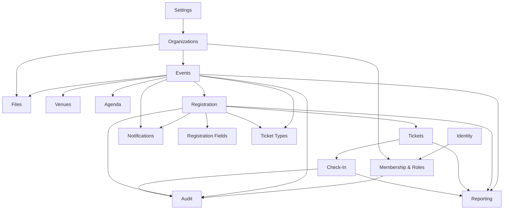

## 4.3 Dependency Rule

Core modules shall not depend on event-specific workflows unless the dependency is generic.

For example:

- `Organizations` may exist without `Check-In`.
- `Files` shall not know event registration logic.
- `Notifications` shall accept notification payload/context rather than own registration rules.
- `Reporting` may depend on event-domain data but shall not mutate operational event state.

---

# 5. Domain Boundaries

## 5.1 Identity Boundary

Owns:

- user identity,
- authentication state,
- password reset,
- profile.

Does not own:

- organization permission,
- event permission.

## 5.2 Organization Boundary

Owns:

- organization,
- membership,
- role,
- organization-level settings.

Primary invariant:

> A protected organization resource is accessible only through valid membership and authorization.

## 5.3 Event Boundary

Owns:

- event lifecycle,
- event status,
- publish readiness,
- public event visibility,
- venue association,
- agenda association.

Primary invariant:

> Only publish-ready events may become publicly registerable.

## 5.4 Registration Boundary

Owns:

- registration availability,
- registration form configuration,
- custom field answers,
- attendee registration status,
- capacity participation.

Primary invariant:

> A successful registration must satisfy status, time-window, and capacity rules atomically.

## 5.5 Ticketing Boundary

Owns:

- ticket types,
- ticket identity,
- public ticket token,
- QR representation.

Primary invariant:

> Each issued ticket has a unique unpredictable public identifier and belongs to one registration.

## 5.6 Check-In Boundary

Owns:

- attendance validation,
- check-in timestamp,
- check-in operator,
- duplicate detection.

Primary invariant:

> One eligible ticket/registration may not silently create multiple attendance records.

## 5.7 Reporting Boundary

Owns:

- read-oriented summaries,
- dashboard aggregates,
- exports.

Primary invariant:

> Reports must reconcile with authoritative operational records.

## 5.8 Notification Boundary

Owns:

- delivery orchestration,
- template selection,
- queueable notification work.

Does not own:

- whether a registration is valid,
- whether a ticket should exist,
- whether an event is publishable.

## 5.9 Audit Boundary

Owns immutable business activity records for defined material actions.

Audit persistence is separate from ordinary technical logs.

---

# 6. Data Flow

## 6.1 Primary Event Lifecycle

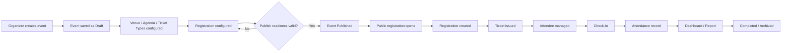

## 6.2 Registration Data Flow

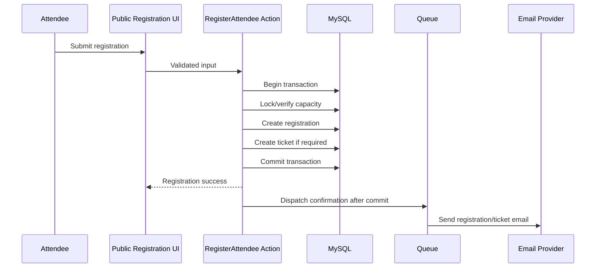

## 6.3 Check-In Data Flow

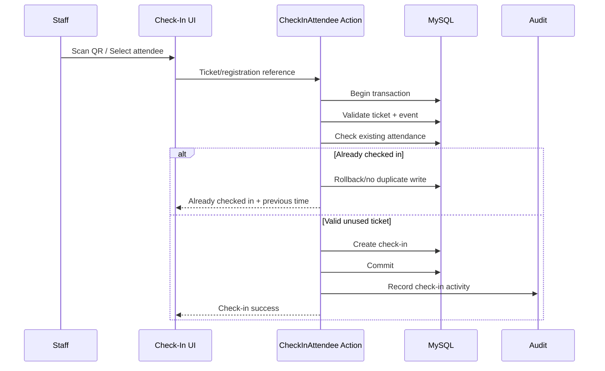

---

# 7. Request Lifecycle

## 7.1 Authenticated Request

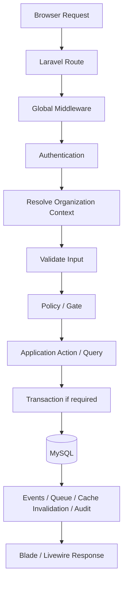

## 7.2 Public Request

Public routes shall:

1. resolve only publicly accessible event resources,
2. validate event status,
3. apply registration-open rules,
4. rate-limit abuse-prone actions,
5. never expose internal notes or unauthorized fields.

## 7.3 Read vs Write

Read paths may use:

- Eloquent scopes,
- query objects,
- cache where safe.

Write paths shall use:

- validation,
- authorization,
- action/service,
- transaction where required,
- audit where required.

---

# 8. Authentication Flow

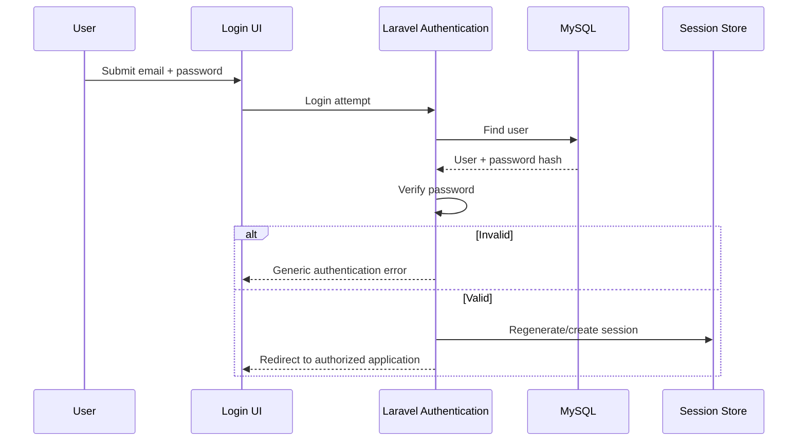

## 8.1 Authentication Rules

- Session-based authentication is primary for the web application.
- Passwords are one-way hashed.
- Login is rate-limited.
- Session ID is regenerated after authentication.
- Logout invalidates the session.
- Password-reset tokens expire and cannot be reused.

## 8.2 Public Attendee Access

Attendees do not require accounts in MVP.

Ticket/confirmation access shall use a secure mechanism such as:

- signed URL,
- high-entropy access token,
- non-guessable ticket reference.

Sequential internal IDs shall not serve as sole public authorization.

---

# 9. Authorization Flow

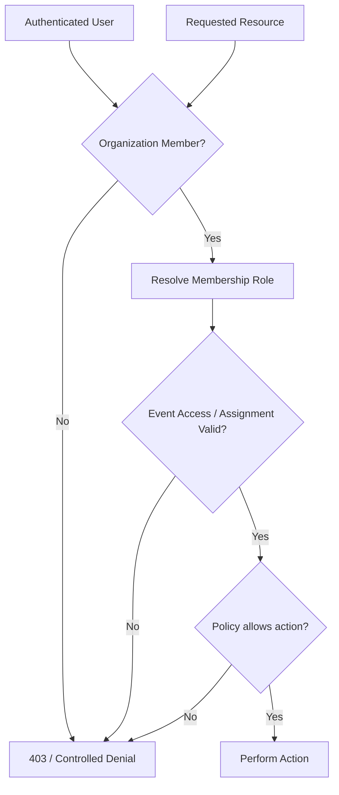

## 9.1 Enforcement Rules

Authorization shall exist on the server for every protected action.

Authorization shall not rely on:

- hidden buttons,
- client-side checks,
- URL secrecy.

## 9.2 Query Scoping

Protected list/search/report/export queries shall be organization scoped before data is returned.

## 9.3 Role Architecture

Roles remain those defined by PRD:

- Owner
- Admin
- Event Manager
- Staff
- Viewer

Attendee is not required to be an authenticated role.

## 9.4 Ownership Invariant

Role changes/removals shall not leave an active organization without at least one Owner.

---

# 10. Business Logic Flow

## 10.1 Business Logic Placement

The system shall use:

- policies for permission,
- validation classes/components for input shape,
- actions/services for multi-step business workflows,
- Eloquent models for relationships and small domain behavior,
- transactions for critical writes,
- query objects/scopes for complex reads.

## 10.2 Publish Event Flow

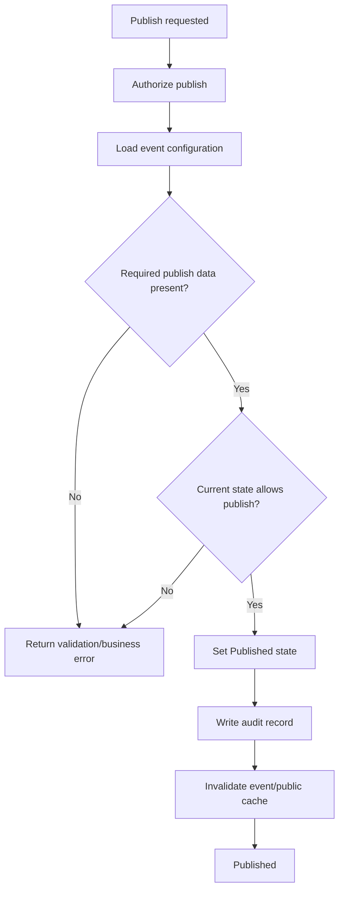

## 10.3 Registration Flow

Registration shall:

1. validate user input,
2. resolve event,
3. verify event is Published,
4. verify registration is enabled and within time window,
5. verify ticket type availability,
6. safely reserve capacity,
7. create registration,
8. persist custom answers,
9. issue ticket if required,
10. commit,
11. dispatch confirmation after commit,
12. invalidate relevant dashboard/report cache.

## 10.4 Check-In Flow

Check-in shall:

1. authorize operator,
2. resolve event,
3. resolve ticket/registration,
4. verify resource belongs to event,
5. verify eligibility,
6. detect prior check-in,
7. create one check-in atomically,
8. audit action,
9. invalidate attendance aggregates,
10. return operator-friendly status.

---

# 11. Notification Flow

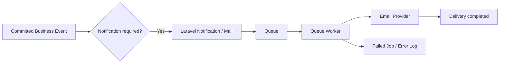

## 11.1 Notification Events

MVP notification candidates:

- registration confirmation,
- ticket availability,
- password reset,
- organization invitation if implemented,
- event reminder if enabled.

## 11.2 Transaction Rule

Notification work shall occur after the authoritative database transaction commits.

Email failure shall never invalidate an already successful registration.

## 11.3 Provider Abstraction

Business logic shall not depend on one specific email vendor.

Laravel mail/notification configuration shall select the transport.

---

# 12. File Storage Flow

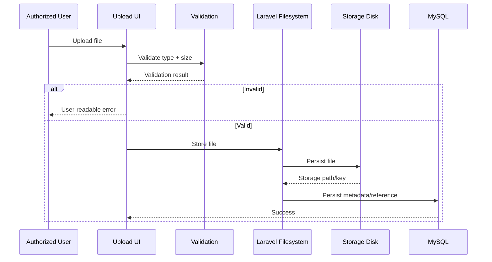

## 12.1 Supported MVP File Types

Examples:

- organization logo,
- event banner,
- event supporting image.

## 12.2 Storage Strategy

Initial VPS:

- local persistent Laravel storage is acceptable.

Future SaaS:

- S3-compatible object storage may replace local storage through Laravel Filesystem abstraction.

## 12.3 Public vs Private Files

Public branding assets may be publicly retrievable.

Private files, if introduced, shall require:

- authorized application delivery, or
- signed temporary access.

---

# 13. Reporting Flow

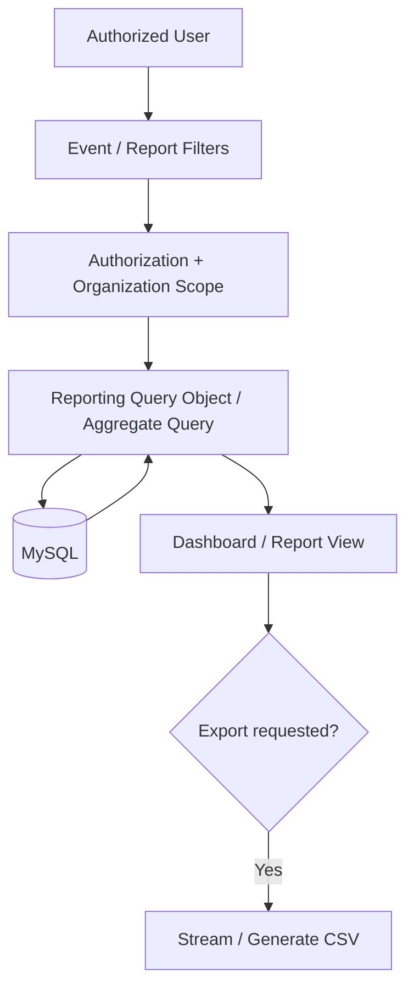

## 13.1 Reporting Principles

- Operational MySQL data is authoritative.
- No separate data warehouse is required in MVP.
- Dashboard and report metric definitions must be consistent.
- Reports shall not mutate event state.
- Large row sets shall be paginated or streamed.

## 13.2 Required MVP Reports

- event summary,
- registration report,
- ticket type report,
- attendance report.

## 13.3 Reconciliation

A report total must reconcile with the equivalent filtered operational records.

---

# 14. Background Job Flow

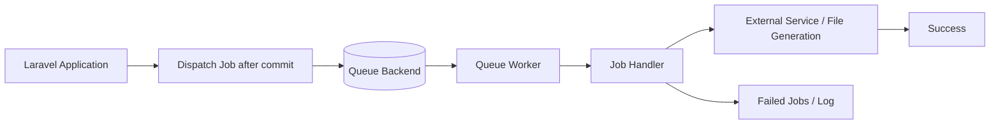

## 14.1 MVP Queue Backend

The SRS recommends Laravel database queue for a simple single-VPS MVP.

Actual driver remains:

**TBD — Requires Environment Verification**

## 14.2 Suitable Background Work

- email delivery,
- reminder delivery,
- large exports if necessary,
- future image processing,
- future long-running report generation.

## 14.3 Job Design Rules

Jobs shall:

- be retry-safe or idempotent,
- avoid duplicated business side effects,
- use bounded retry policies,
- expose failures,
- not assume uncommitted database state.

---

# 15. Scheduled Task Architecture

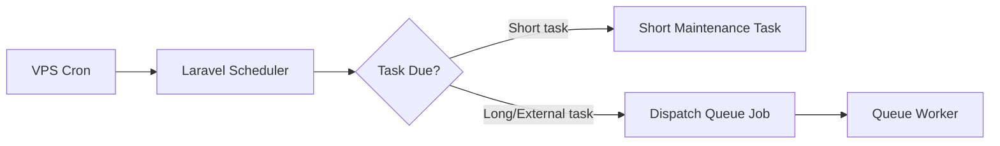

## 15.1 Scheduler Uses

Potential scheduled work:

- event reminders,
- registration period maintenance where needed,
- automatic event-state maintenance if later approved,
- expired temporary-data cleanup,
- application maintenance,
- backup orchestration if implemented through Laravel.

## 15.2 Scheduling Rules

- one VPS cron entry should invoke Laravel Scheduler,
- time calculations must respect configured event/organization timezone,
- long-running tasks should dispatch jobs,
- repeated scheduler invocation must not duplicate business outcomes.

---

# 16. Integration Architecture

## 16.1 MVP Integration Boundary

Required:

- email transport.

Optional:

- remote file storage,
- external backup destination.

Deferred:

- payments,
- WhatsApp,
- SMS,
- public API,
- inbound/outbound webhooks,
- CRM,
- calendars,
- streaming.

## 16.2 Integration Adapter Principle

External integrations shall be isolated behind Laravel/native application abstractions where possible.

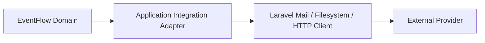

The domain shall decide **what business outcome is required**.

Adapters shall decide **how an external provider is called**.

## 16.3 Failure Boundary

External-provider failure shall not corrupt committed core business data.

---

# 17. Database Architecture

## 17.1 Database Style

One primary relational MySQL database shall serve the MVP.

Logical tenancy shall be based on organization ownership/scope, not separate databases.

## 17.2 Conceptual Data Model

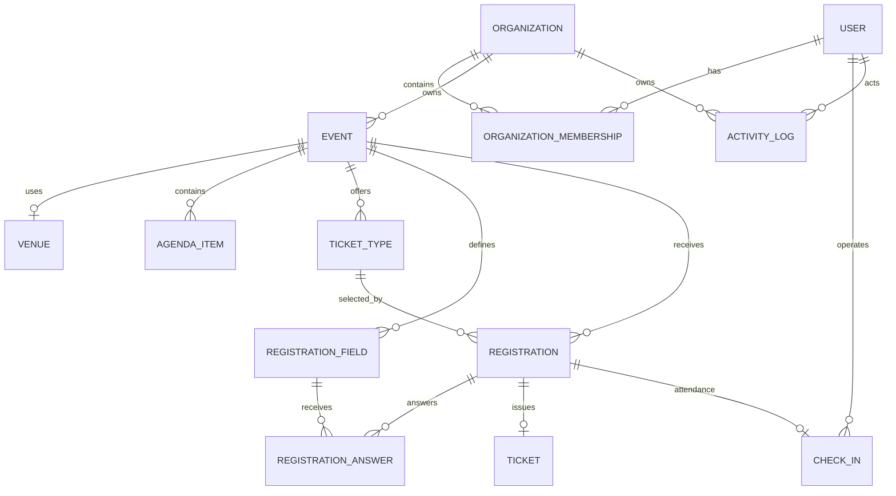

This diagram is conceptual. Exact tables, keys, deletion rules, and field definitions belong in `docs/DATABASE.md`.

## 17.3 Organization Scoping

The organization relationship shall be reachable directly or transitively for every protected event-domain record.

Where high-frequency authorization/filtering requires it, explicit organization scope may be denormalized only with documented consistency rules.

## 17.4 Transactional Invariants

Database-level mechanisms shall reinforce:

- unique ticket public identifiers,
- unique meaningful organization membership,
- foreign-key integrity,
- one active attendance record per defined check-in invariant,
- safe capacity handling.

## 17.5 Index Strategy

Indexes shall support actual query patterns:

- organization-scoped event lists,
- event status,
- event public slug,
- event registration lists,
- attendee email lookup,
- registration identifier lookup,
- ticket token lookup,
- check-in lookup,
- date-range filtering.

## 17.6 Time Handling

Authoritative timestamps should be stored consistently, preferably UTC.

Presentation and event business rules shall convert using explicit organization/event timezone.

## 17.7 Monetary Values

If ticket price exists before online payment:

- fixed-precision decimal,
- explicit currency,
- no floating-point monetary storage.

---

# 18. Cache Architecture

## 18.1 Role of Cache

Cache is an optimization, never the source of truth.

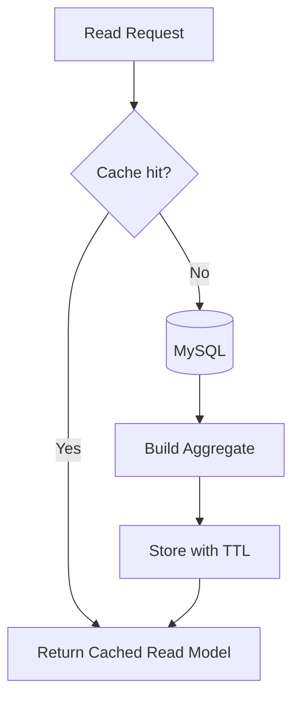

## 18.2 Suitable Cached Data

- organization dashboard aggregate,
- event dashboard aggregate,
- relatively static public event data,
- reference/configuration values.

## 18.3 Never Trust Cache for Critical Decisions

Do not use cached values as authority for:

- remaining ticket capacity,
- authorization,
- ticket validity,
- current check-in state,
- registration eligibility.

## 18.4 Invalidation

Relevant mutations shall:

- delete associated cache keys, or
- rely on a deliberately short documented TTL.

Cache keys shall include organization/event scope where relevant.

## 18.5 Backend

For MVP:

- file or database cache is acceptable.

Redis remains optional until performance/scaling justifies it.

---

# 19. Queue Architecture

## 19.1 Queue Topology

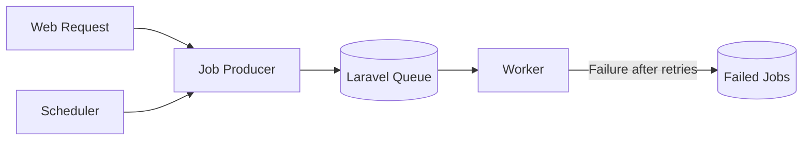

## 19.2 Queue Responsibilities

Queue shall isolate slow/non-critical work from user-facing requests.

## 19.3 Queue Separation

Initially one queue may be sufficient.

Later, workload may be separated conceptually into:

- `default`,
- `notifications`,
- `exports`.

Only introduce queue separation when operationally useful.

## 19.4 Worker Management

On VPS, workers shall be supervised by:

- systemd,
- Supervisor,
- or equivalent process manager.

Workers must restart after deployment when required to load new code.

---

# 20. Logging Architecture

## 20.1 Two Distinct Logging Systems

EventFlow shall distinguish:

### Technical Logs

Purpose:

- diagnosis,
- failures,
- infrastructure operation.

Examples:

- exception,
- failed queue job,
- mail error,
- scheduler error.

### Activity/Audit Logs

Purpose:

- business accountability.

Examples:

- event published,
- role changed,
- attendee checked in.

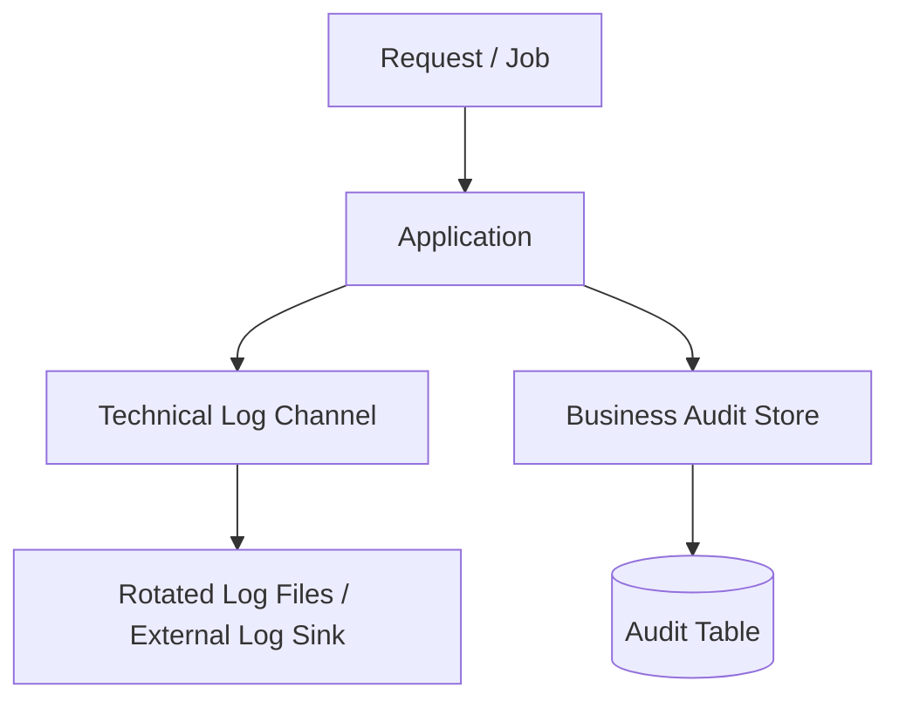

## 20.2 Context

Technical logs should include safe contextual identifiers when useful:

- user ID,
- organization ID,
- event ID,
- request/correlation ID if introduced.

## 20.3 Sensitive Data

Never intentionally log:

- passwords,
- app keys,
- reset tokens,
- session cookies,
- full private ticket access secrets.

## 20.4 Rotation

Production logs shall be rotated so a busy application cannot indefinitely consume disk space.

---

# 21. Error Handling Architecture

## 21.1 Error Categories

```mermaid
flowchart TD
    Error[Operation Error]
    Validation{Validation?}
    Auth{Authentication?}
    Authz{Authorization?}
    Conflict{Business Conflict?}
    External{External Failure?}
    Unexpected[Unexpected Exception]

    Error --> Validation
    Validation -- Yes --> E422[User-readable validation response]
    Validation -- No --> Auth
    Auth -- Yes --> E401[Authentication flow]
    Auth -- No --> Authz
    Authz -- Yes --> E403[Controlled access denied]
    Authz -- No --> Conflict
    Conflict -- Yes --> E409[Business-state message]
    Conflict -- No --> External
    External -- Yes --> Safe[Log + safe recoverable response]
    External -- No --> Unexpected
    Unexpected --> E500[Log + generic production error]
```

HTTP status choices may vary by Blade/Livewire flow; the architectural requirement is clear category separation and safe handling.

## 21.2 Business Conflicts

Examples:

- registration closed,
- event cancelled,
- capacity exhausted,
- invalid ticket,
- already checked in,
- publish requirements incomplete.

These are expected states, not generic server failures.

## 21.3 Production Safety

Production responses shall never expose:

- stack traces,
- raw SQL,
- environment secrets,
- internal file paths where avoidable.

## 21.4 Rollback

Exceptions inside critical transaction scopes shall cause transaction rollback.

---

# 22. Backup Architecture

## 22.1 Backup Scope

```mermaid
flowchart LR
    DB[(MySQL)]
    Files[(Persistent Uploads)]
    Config[Recovery Documentation / Non-secret Config]
    Backup[Backup Process]
    Offsite[(Offsite Backup Storage)]
    Restore[Restore Procedure]

    DB --> Backup
    Files --> Backup
    Config --> Backup
    Backup --> Offsite
    Offsite --> Restore
```

## 22.2 Minimum Production Design

Recommended baseline from SRS:

- daily database backup,
- daily upload backup or snapshot,
- at least 7 daily restore points,
- at least 4 weekly restore points,
- at least one copy outside the primary VPS.

## 22.3 Backup Independence

A VPS snapshot alone should not be the only backup strategy if the snapshot is controlled by the same failure domain.

## 22.4 Restore Validation

Before commercial launch:

- document restore procedure,
- execute restore test,
- confirm database and uploaded-file integrity.

## 22.5 Upgrade Backup

Before risky framework/schema upgrades:

- backup database,
- backup persistent files,
- record deployed application version.

---

# 23. Security Boundaries

## 23.1 Security Zones

```mermaid
flowchart TB
    Internet[Internet / Untrusted]
    Public[Public Routes]
    Auth[Authenticated Routes]
    Org[Organization Boundary]
    Event[Event Boundary]
    Business[Authorized Application Actions]
    DB[(Database)]
    PrivateFiles[(Private Files)]
    External[External Mail Provider]

    Internet --> Public
    Internet --> Auth
    Auth --> Org
    Org --> Event
    Event --> Business
    Business --> DB
    Business --> PrivateFiles
    Business --> External
```

## 23.2 Boundary 1 — Public Input

Controls:

- server validation,
- CSRF where applicable,
- rate limiting,
- output escaping,
- no administrative fields.

## 23.3 Boundary 2 — Authenticated Session

Controls:

- secure session cookie,
- session regeneration,
- logout invalidation,
- password security.

## 23.4 Boundary 3 — Organization Isolation

Controls:

- membership check,
- policy check,
- organization-scoped queries.

This is the primary multi-customer data isolation boundary.

## 23.5 Boundary 4 — Event Authorization

Controls:

- event assignment where applicable,
- role capability,
- event ownership/scope.

## 23.6 Boundary 5 — Ticket Public Access

Controls:

- unpredictable token,
- no raw sequential authorization,
- limited data disclosure.

## 23.7 Boundary 6 — Files

Controls:

- MIME/type validation,
- size validation,
- private/public distinction,
- authorized delivery or signed access.

## 23.8 Boundary 7 — External Provider

Controls:

- secrets stored in environment,
- timeout handling,
- safe error logging,
- no dependency on external provider for transaction commit.

## 23.9 Application Security Controls

Laravel-native protections shall be preferred for:

- CSRF,
- password hashing,
- session management,
- authorization,
- validation,
- output escaping,
- rate limiting.

---

# 24. Deployment Architecture

## 24.1 Initial Single-VPS Deployment

```mermaid
flowchart TB
    Internet[Internet]
    TLS[HTTPS / TLS]
    Nginx[Nginx or Verified Web Server]
    PHP[PHP-FPM]
    Laravel[Laravel EventFlow]
    MySQL[(MySQL)]
    Storage[(Persistent Storage)]
    Queue[Queue Worker]
    Cron[Cron / Laravel Scheduler]
    Backup[Backup Process]
    Mail[Email Provider]

    Internet --> TLS
    TLS --> Nginx
    Nginx --> PHP
    PHP --> Laravel
    Laravel --> MySQL
    Laravel --> Storage
    Laravel --> Queue
    Laravel --> Mail
    Cron --> Laravel
    Backup --> MySQL
    Backup --> Storage
```

## 24.2 Recommended VPS Services

- web server,
- PHP-FPM,
- MySQL,
- queue worker,
- cron scheduler,
- TLS certificate management,
- log rotation,
- backup process.

## 24.3 Deployment Unit

One Laravel application artifact shall be deployed.

Do not deploy each logical module separately.

## 24.4 Persistent vs Release Data

Persistent:

- `.env`/secret configuration,
- database,
- uploads,
- selected logs if local,
- backup state.

Replaceable per release:

- application code,
- vendor dependencies installed from lockfile,
- compiled frontend assets.

## 24.5 Release Process

```text
Pre-deployment validation
→ Backup if change is risky
→ Deploy code
→ Install locked dependencies
→ Run migrations
→ Build/deploy frontend assets
→ Refresh application caches
→ Restart workers
→ Run smoke checks
```

## 24.6 Zero Downtime

Not required for MVP.

Schema changes shall nevertheless avoid unnecessary destructive deployment coupling.

---

# 25. Scalability Strategy

## 25.1 Principle

Scale by evidence, not speculation.

## 25.2 Stage 1 — Single VPS

```text
Web + PHP
MySQL
Local persistent storage
Database session
Database queue
File/database cache
```

Appropriate for early commercial deployments.

## 25.3 Stage 2 — Stronger Single Node / Split Database

When CPU/memory/IO becomes limiting:

- increase VPS resources,
- tune PHP-FPM,
- tune MySQL,
- optimize indexes/queries,
- optionally move MySQL to a dedicated server.

## 25.4 Stage 3 — Shared Infrastructure

If multiple application nodes are required:

```mermaid
flowchart TB
    LB[Load Balancer]
    App1[Laravel Node 1]
    App2[Laravel Node 2]
    DB[(Shared MySQL)]
    Redis[(Redis Sessions / Cache / Queue)]
    Obj[(Shared Object Storage)]

    LB --> App1
    LB --> App2
    App1 --> DB
    App2 --> DB
    App1 --> Redis
    App2 --> Redis
    App1 --> Obj
    App2 --> Obj
```

## 25.5 Scale Triggers

Introduce new infrastructure only when metrics demonstrate:

- request latency problems,
- queue backlog,
- cache pressure,
- database resource saturation,
- local storage distribution problem,
- need for high availability.

## 25.6 Search Scaling

MySQL search remains default.

A specialized search engine is introduced only when:

- query behavior requires relevance/fuzzy search beyond MySQL,
- measured performance cannot meet requirements with indexes/query optimization.

## 25.7 Data Volume Design Targets

Architecture shall support SRS targets including:

- 10,000 attendees per event,
- 100 events in organization dashboard scenario,
- 100,000 historical registrations in benchmark scenario.

---

# 26. Future SaaS/Multi-Tenant Considerations

## 26.1 Current Tenant Model

For MVP:

> Organization is the logical tenant boundary.

All customers may share:

- one application,
- one database,
- one schema.

Data isolation is enforced through organization relationships and policies.

## 26.2 SaaS-Ready Principles Now

Implement now:

- organization-scoped records,
- organization membership roles,
- organization settings,
- organization-aware audit logs,
- organization-aware cache keys,
- organization-aware file paths/metadata.

Do not implement now:

- database-per-tenant,
- schema-per-tenant,
- automatic tenant provisioning clusters,
- tenant-specific queues,
- tenant billing engine,
- tenant metering infrastructure.

## 26.3 Future SaaS Architecture

```mermaid
flowchart TB
    SaaS[EventFlow SaaS]
    TenantResolver[Tenant / Organization Resolver]
    App[Shared Laravel Application]
    DB[(Shared MySQL)]
    Billing[Future Billing]
    Limits[Future Plan / Usage Limits]
    Branding[Future White Label]
    Domains[Future Custom Domains]

    SaaS --> TenantResolver
    TenantResolver --> App
    App --> DB
    App --> Billing
    App --> Limits
    App --> Branding
    Branding --> Domains
```

## 26.4 Data Isolation Evolution

Shared-database tenancy remains sufficient until validated requirements demand stronger physical isolation.

If enterprise contracts later require dedicated databases, that shall be treated as a distinct architecture evolution rather than designed prematurely into MVP.

## 26.5 SaaS Feature Candidates

Future:

- plans,
- subscriptions,
- trial periods,
- usage limits,
- plan-based features,
- SaaS administration,
- tenant billing,
- custom domain,
- advanced branding.

---

# 27. Architecture Decisions

This section records explicit architecture decisions in ADR-style form.

## ADR-001 — Use Modular Monolith

**Decision:** Use one Laravel deployable application with logical module boundaries.

**Reason:**

- MVP business workflows are tightly transactional.
- Deployment target is VPS.
- Product prioritizes maintainability and commercial distribution.
- No strong justification exists for microservices.

**Consequence:**

- simpler operations,
- atomic transactions remain straightforward,
- internal module discipline must be maintained.

---

## ADR-002 — Use Laravel-Native Web Stack

**Decision:** Use Blade + Livewire + Alpine.js + Tailwind CSS as specified.

**Reason:**

- matches requested stack,
- avoids separate SPA/API architecture,
- supports fast commercial development,
- reduces frontend deployment complexity.

**Consequence:**

- browser application is server-centric,
- public API is not required for internal UI.

---

## ADR-003 — Eloquent as Default Data Access

**Decision:** Do not create repository interfaces for every model.

**Reason:**

- Eloquent already serves as persistence abstraction,
- one MySQL database is authoritative,
- generic repositories would add indirection without product value.

**Consequence:**

- Eloquent remains visible in application/domain-adjacent code,
- dedicated query objects may be introduced for complex reads.

---

## ADR-004 — Application Actions for Critical Workflows

**Decision:** Use dedicated action/service boundaries for important multi-step workflows.

Examples:

- Publish Event
- Register Attendee
- Check In Attendee

**Reason:**

- workflows span multiple models,
- require transaction handling,
- require independent tests,
- may be invoked from multiple UI/async contexts later.

---

## ADR-005 — Database Transactions for Registration and Check-In

**Decision:** Registration capacity and check-in are transaction-critical.

**Reason:**

- prevents partial registration,
- prevents capacity race conditions,
- prevents duplicate attendance.

**Consequence:**

- transactions must remain short,
- external email calls occur after commit.

---

## ADR-006 — Organization as Logical Tenant Boundary

**Decision:** Use shared database with organization scoping.

**Reason:**

- satisfies current product scope,
- supports self-hosted and future SaaS,
- avoids premature tenant infrastructure.

**Consequence:**

- authorization/query scoping is security-critical,
- dedicated tenant databases are deferred.

---

## ADR-007 — Session-Based Authentication

**Decision:** Use Laravel-compatible session authentication for the web product.

**Reason:**

- primary interface is Blade/Livewire,
- no public API required,
- simplest Laravel-native model.

**Consequence:**

- future API auth can be added independently.

---

## ADR-008 — Database Queue for MVP

**Decision:** Recommend Laravel database queue on initial single VPS.

**Reason:**

- avoids mandatory Redis,
- sufficient for early notification/background load,
- easy commercial deployment.

**Consequence:**

- queue performance must be monitored,
- Redis can replace it when justified.

---

## ADR-009 — MySQL Search First

**Decision:** Use MySQL queries/indexes for event and attendee search.

**Reason:**

- search requirements are structured,
- target scale is moderate,
- avoids external search infrastructure.

**Consequence:**

- specialized search engine is deferred until needed.

---

## ADR-010 — Cache Only Read Models

**Decision:** Cache may optimize dashboards/public reads but not transactional decisions.

**Reason:**

- ticket capacity and check-in require current authoritative state.

**Consequence:**

- cache invalidation remains simpler and lower-risk.

---

## ADR-011 — Laravel Filesystem Abstraction

**Decision:** File storage shall use Laravel Filesystem.

**Reason:**

- local VPS storage is simple,
- S3-compatible migration remains possible.

---

## ADR-012 — Separate Audit Logs from Technical Logs

**Decision:** Business audit history and diagnostic logging are separate concerns.

**Reason:**

- different retention,
- different users,
- different integrity requirements.

---

## ADR-013 — No Public API in MVP

**Decision:** Do not introduce API-first architecture for the Blade/Livewire application.

**Reason:**

- no approved public integration requirement,
- would duplicate transport and authentication complexity.

---

## ADR-014 — No Webhook Infrastructure in MVP

**Decision:** Webhooks are deferred.

**Reason:**

- no current integration requires them,
- retry/signature/idempotency infrastructure would add unnecessary scope.

---

## ADR-015 — Deployment Optimized for Conventional VPS

**Decision:** Initial architecture shall run on a conventional Linux VPS.

**Reason:**

- matches product deployment requirement,
- suitable for source-code customers,
- minimizes infrastructure knowledge required.

---

# 28. Architecture Trade-Offs

## 28.1 Modular Monolith vs Microservices

### Selected: Modular Monolith

Advantages:

- simpler transactions,
- one deployment,
- lower infrastructure cost,
- easier debugging,
- easier source-code sale.

Trade-off:

- poor internal discipline could create module coupling.

Mitigation:

- clear domain boundaries,
- application actions,
- module dependency rules.

---

## 28.2 Blade/Livewire vs SPA

### Selected: Blade + Livewire

Advantages:

- fewer systems to maintain,
- no separate API needed,
- Laravel-centric development,
- simpler authentication,
- simpler deployment.

Trade-off:

- extremely complex client-side experiences may be less natural than a full SPA.

MVP does not require such experiences.

---

## 28.3 Eloquent vs Repository Pattern

### Selected: Eloquent Directly + Selective Query Objects

Advantages:

- less boilerplate,
- standard Laravel conventions,
- lower onboarding cost.

Trade-off:

- persistence concerns may be more visible in application code.

This is acceptable because the system has one primary relational datastore.

---

## 28.4 Database Queue vs Redis

### Selected Initially: Database Queue

Advantages:

- no extra service,
- simpler VPS setup,
- Laravel-native.

Trade-off:

- less efficient under heavy queue throughput.

Migration path:

- switch to Redis when actual workload requires it.

---

## 28.5 Local Storage vs Object Storage

### Selected Initially: Local Persistent Storage

Advantages:

- minimal configuration,
- suitable for self-hosted single VPS.

Trade-off:

- harder to share across multiple web nodes.

Migration path:

- Laravel Filesystem enables later S3-compatible storage.

---

## 28.6 Shared Database Tenancy vs Database-per-Tenant

### Selected: Shared Database + Organization Scope

Advantages:

- simpler operations,
- simple reporting,
- simpler migrations,
- lower cost.

Trade-off:

- application authorization becomes a critical data-isolation control.

Mitigation:

- organization-scoped queries,
- policies,
- authorization tests,
- explicit tenant-context architecture.

---

## 28.7 MySQL Search vs Dedicated Search Engine

### Selected: MySQL

Advantages:

- no additional infrastructure,
- strong fit for structured filters and identifier lookup,
- adequate for initial scale.

Trade-off:

- advanced fuzzy/full-text relevance may be limited.

No MVP requirement currently justifies dedicated search.

---

## 28.8 Synchronous vs Queued Email

### Selected: Queued/Queueable Email

Advantages:

- registration response is not blocked by mail provider,
- delivery can retry.

Trade-off:

- requires worker operation and queue observability.

The reliability benefit is worth the small operational cost.

---

## 28.9 Real-Time Dashboard vs Short-Lived Cache/Polling

### Selected: Normal server queries with optional short cache

Advantages:

- simpler architecture,
- no WebSocket dependency,
- adequate for management dashboards.

Trade-off:

- not every metric is pushed instantly.

Check-in operator result itself remains synchronous and immediate.

---

## 28.10 Generic Permission Builder vs Fixed Roles

### Selected: Fixed MVP Roles

Advantages:

- understandable,
- testable,
- simpler UI,
- lower security risk.

Trade-off:

- less customer-specific customization.

Dynamic permission design can be reconsidered only after commercial demand validates it.

---

# Implementation-Oriented Component Map

The following map is advisory and preserves Laravel conventions without forcing a package-per-module structure.

```text
app/
├── Models/
│   ├── User
│   ├── Organization
│   ├── OrganizationMembership
│   ├── Event
│   ├── Venue
│   ├── AgendaItem
│   ├── TicketType
│   ├── Registration
│   ├── RegistrationField
│   ├── RegistrationAnswer
│   ├── Ticket
│   ├── CheckIn
│   └── ActivityLog
│
├── Actions/
│   ├── Organizations/
│   ├── Events/
│   ├── Registrations/
│   ├── Tickets/
│   └── CheckIns/
│
├── Policies/
│   ├── OrganizationPolicy
│   ├── EventPolicy
│   ├── RegistrationPolicy
│   └── ReportPolicy
│
├── Queries/
│   ├── Dashboard/
│   ├── Attendees/
│   └── Reports/
│
├── Livewire/
│   ├── Organizations/
│   ├── Events/
│   ├── Registrations/
│   ├── Attendees/
│   ├── CheckIn/
│   └── Reports/
│
├── Jobs/
├── Notifications/
├── Mail/
└── Support/
```

This is a responsibility map, not a requirement to create every directory or class before it is needed.

---

# Critical End-to-End Architecture Paths

## Path A — Organizer Creates and Publishes an Event

```text
Authenticated Browser
→ Event Form
→ Validation
→ EventPolicy
→ Create/Update Event Action
→ MySQL
→ Publish Action
→ Publish Readiness Rules
→ Transaction
→ Audit
→ Cache Invalidation
→ Public Event Page
```

## Path B — Attendee Registers

```text
Public Event Page
→ Registration Form
→ Validation
→ Registration Availability Rules
→ RegisterAttendee Action
→ MySQL Transaction
→ Capacity Lock/Atomic Check
→ Registration
→ Ticket
→ Commit
→ Queue Confirmation
→ Email
```

## Path C — Staff Checks In Attendee

```text
Authenticated Staff
→ Event Check-In Screen
→ EventPolicy
→ QR / Manual Lookup
→ CheckInAttendee Action
→ MySQL Transaction
→ Duplicate Check
→ Create Check-In
→ Commit
→ Audit
→ Dashboard Cache Invalidation
→ Success Result
```

## Path D — Manager Generates Report

```text
Authenticated Manager
→ Report Filters
→ Report Authorization
→ Organization/Event-Scoped Query
→ MySQL Aggregate/Rows
→ Report View
→ Optional Streamed CSV
```

---

# Architecture Quality Gates

Before EventFlow architecture is considered ready for commercial MVP, the implementation shall demonstrate:

1. Organization A cannot access Organization B private resources.
2. Two concurrent requests cannot oversell the final available ticket capacity.
3. Two concurrent check-in attempts cannot create silent duplicate attendance.
4. Email provider failure does not roll back registration.
5. Attendee search meets the SRS target with representative data.
6. Dashboard/report totals reconcile.
7. Public ticket references are not predictable sequential identifiers.
8. Private files cannot be accessed by unrelated organizations.
9. Audit entries exist for required material actions.
10. Production error output does not expose internal stack traces or secrets.
11. Queue workers recover correctly after restart.
12. Database and uploaded files can be restored from backup.
13. Deployment can be completed from locked dependencies and documented environment configuration.
14. The application can run on a conventional VPS without mandatory Redis, Kubernetes, external search, or microservices.

---

# Final Architecture Summary

EventFlow shall begin as a **Laravel modular monolith** centered on a small set of strong domain invariants.

```mermaid
flowchart TB
    UI[Blade + Livewire + Alpine + Tailwind]

    subgraph App["Laravel Modular Monolith"]
        Auth[Identity / Authorization]
        Org[Organizations]
        Events[Events]
        Reg[Registration]
        Ticket[Ticketing]
        CI[Check-In]
        Report[Reporting]
        Notify[Notifications]
        Audit[Audit]
    end

    DB[(MySQL)]
    Queue[(Database Queue Initially)]
    Files[(Persistent Files)]
    Email[Email Provider]

    UI --> Auth
    Auth --> Org
    Org --> Events
    Events --> Reg
    Reg --> Ticket
    Ticket --> CI
    Events --> Report
    Reg --> Report
    CI --> Report

    App --> DB
    Reg --> Queue
    Queue --> Notify
    Notify --> Email
    Events --> Files

    Org --> Audit
    Events --> Audit
    Reg --> Audit
    CI --> Audit
```

The core design priorities are:

> **Simple deployment, strong organization isolation, transaction-safe registration, transaction-safe check-in, clear Laravel conventions, and a controlled path toward future SaaS growth.**

Microservices, advanced tenant infrastructure, Redis, external search engines, public APIs, and webhook systems remain intentionally deferred until a validated technical or commercial requirement justifies them.

---

**End of Document**
