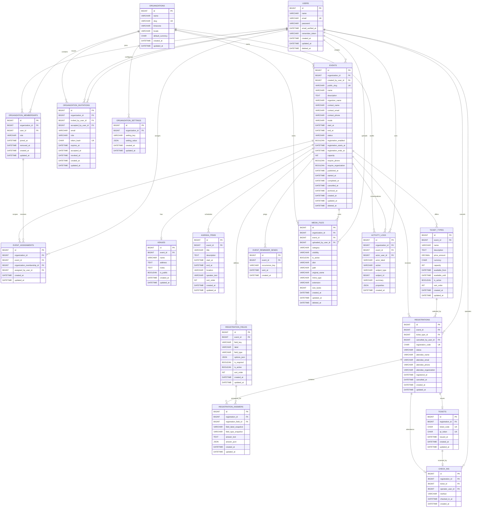

# EventFlow Management System — Database Design

**Document Path:** `docs/DATABASE.md`  
**Product:** EventFlow Management System  
**Document Type:** Database Architecture & Logical Schema Specification  
**Database Target:** MySQL 8.4.x LTS  
**Application Context:** Laravel 13.x target; actual installed versions remain subject to environment verification  
**Authoritative Sources:** `docs/PRD.md`, `docs/SRS.md`, `docs/SYSTEM_DESIGN.md`, `docs/BUSINESS_FLOW.md`  
**Document Version:** 1.0  
**Status:** Logical Design — No Migrations Created  

---

# 1. Database Design Principles

The EventFlow database shall follow these principles.

## 1.1 Relational First

MySQL is the authoritative transactional store.

Core event-management data shall use normalized relational tables rather than large JSON documents.

JSON is reserved for data that is genuinely flexible, such as:

- custom-field options,
- multi-value custom answers,
- extensible setting values,
- audit metadata.

## 1.2 Organization Is the Logical Tenant Boundary

EventFlow uses a shared database and shared schema.

`organizations` is the logical tenant boundary.

All event-domain data must be reachable from an organization through a deterministic relationship.

```text
Organization
    ↓
Event
    ↓
Registration / Ticket / Check-In / Reporting
```

The database shall not implement database-per-tenant or schema-per-tenant architecture for the MVP.

## 1.3 Internal IDs and Public Identifiers Are Different Concerns

Internal relational keys use conventional unsigned BIGINT primary keys.

Public-sensitive resources use non-sequential identifiers where required.

Examples:

- event public URL → `events.public_slug`
- registration reference → `registrations.registration_code`
- ticket reference → `tickets.ticket_code`
- QR validation → `tickets.qr_token`

Sequential internal IDs shall not be treated as public authorization secrets.

## 1.4 Prefer Database Constraints for Critical Invariants

Critical integrity shall not depend only on UI validation.

Use:

- foreign keys,
- unique constraints,
- CHECK constraints where appropriate,
- NOT NULL rules,
- transactions.

Application validation remains required because database errors alone do not provide good product UX.

## 1.5 Avoid Premature Denormalization

Do not store derived values such as:

- remaining event capacity,
- remaining ticket capacity,
- attendance percentage,
- event registration totals,
- checked-in totals.

These values shall be computed from authoritative records and optionally cached.

This prevents counter drift.

## 1.6 Use Explicit Lifecycle State

Event lifecycle and registration lifecycle are represented explicitly.

Do not infer event status only from dates.

Dates and status serve different purposes.

## 1.7 Preserve Historical Data

Normal lifecycle changes shall not physically delete:

- registrations,
- tickets,
- check-ins,
- activity logs.

Event `Archived` is a business status, not a database deletion.

## 1.8 Laravel-Friendly Naming

Use conventional snake_case plural table names and `{entity}_id` foreign keys.

Examples:

- `organization_memberships`
- `registration_fields`
- `registration_answers`
- `ticket_types`
- `check_ins`

## 1.9 MySQL Storage and Character Set

Recommended:

- Storage engine: `InnoDB`
- Character set: `utf8mb4`
- General textual collation: a modern MySQL 8 utf8mb4 collation
- Security-sensitive codes/tokens: case-sensitive/binary-compatible collation where appropriate

Exact collation shall be selected during migration design based on the verified MySQL environment.

## 1.10 Time Storage

Authoritative date/time values shall be stored in a consistent canonical timezone, preferably UTC.

Business display converts to the organization's configured timezone.

Use `DATETIME(6)` for business timestamps where practical so event dates are not constrained by the narrower traditional `TIMESTAMP` range.

---

# 2. Entity List

## 2.1 Core Business Tables

1. `users`
2. `organizations`
3. `organization_memberships`
4. `organization_invitations`
5. `organization_settings`
6. `events`
7. `event_assignments`
8. `venues`
9. `agenda_items`
10. `registration_fields`
11. `ticket_types`
12. `registrations`
13. `registration_answers`
14. `tickets`
15. `check_ins`
16. `event_reminder_sends`
17. `media_files`
18. `activity_logs`

## 2.2 Conditional Laravel Infrastructure Tables

These tables are required only when the corresponding Laravel-native database driver is selected:

19. `password_reset_tokens`
20. `sessions`
21. `jobs`
22. `failed_jobs`
23. `cache`
24. `cache_locks`
25. `migrations`

The exact framework-generated schema shall be taken from the verified installed Laravel version. The logical requirements are documented here, but migrations must not be handwritten from assumptions.

## 2.3 Explicitly Not Needed for MVP

The MVP does **not** require separate tables for:

- roles
- permissions
- role_permissions
- payments
- invoices
- refunds
- vendors
- sponsors
- inventory
- products
- webhook deliveries
- API tokens
- subscriptions
- plans
- SaaS usage metering
- data warehouse metrics
- report snapshots

Roles are intentionally represented as a controlled value on `organization_memberships`.

---

# 3. High-Level Table Descriptions

| Table | Purpose |
|---|---|
| `users` | Authenticated organizer-side user identities |
| `organizations` | Logical tenant/workspace and first-class organization settings |
| `organization_memberships` | Connect users to organizations and assign fixed MVP role |
| `organization_invitations` | Pending/accepted organization invite lifecycle |
| `organization_settings` | Extensible low-frequency organization configuration |
| `events` | Event lifecycle, public identity, registration configuration |
| `event_assignments` | Restrict non-global organization roles to assigned events |
| `venues` | One optional physical venue definition per event |
| `agenda_items` | Event schedule/session items |
| `registration_fields` | Custom registration form fields |
| `ticket_types` | Registration/ticket categories, price, availability, capacity |
| `registrations` | Authoritative attendee registration record |
| `registration_answers` | Custom-field answers with historical field snapshots |
| `tickets` | Unique ticket and QR identity for a registration |
| `check_ins` | One authoritative attendance record per registration |
| `event_reminder_sends` | Idempotent per-occurrence marker for event reminder emails |
| `media_files` | Metadata and ownership for organization/event uploaded assets |
| `activity_logs` | Immutable business audit trail |

---

# 4. Complete Mermaid ERD



### ERD Notes

1. `EVENT_ASSIGNMENTS.organization_id` is intentionally denormalized to support strong organization-scope validation and fast access checks.
2. `ACTIVITY_LOGS.subject_type` + `subject_id` is a generic audit reference and therefore cannot have a conventional foreign key to every possible subject table.
3. `MEDIA_FILES` carries both `organization_id` and optional `event_id`; the application must enforce that the event belongs to the same organization.
4. A check-in is linked to the event transitively through its registration.
5. Check-in state is not stored on `registrations`; it is derived from existence of a `check_ins` row.
6. Remaining capacity is not stored.
7. `EVENT_REMINDER_SENDS` records one marker per intended reminder occurrence (`(event_id, occurrence_key)` unique) so a scheduler double-run cannot duplicate the reminder.

---

# 5. Table: `users`

## 5.1 Purpose

Stores authenticated EventFlow user identities for:

- Owner
- Admin
- Event Manager
- Staff
- Viewer

Public attendees do not require a `users` row in the MVP.

## 5.2 Columns

| Column | Type | Null | Default | Description |
|---|---|---:|---|---|
| `id` | BIGINT UNSIGNED | No | Auto | Internal primary key |
| `name` | VARCHAR(150) | No | — | User display name |
| `email` | VARCHAR(254) | No | — | Authentication email |
| `password` | VARCHAR(255) | No | — | One-way password hash |
| `email_verified_at` | DATETIME(6) | Yes | NULL | Reserved for current/future email verification |
| `remember_token` | VARCHAR(100) | Yes | NULL | Laravel remember-token support if enabled |
| `created_at` | DATETIME(6) | No | App-managed | Creation timestamp |
| `updated_at` | DATETIME(6) | No | App-managed | Update timestamp |
| `deleted_at` | DATETIME(6) | Yes | NULL | Soft-delete marker |

## 5.3 Primary Key

- `PRIMARY KEY (id)`

## 5.4 Foreign Keys

None.

Other tables reference `users.id`.

## 5.5 Unique Constraints

- `UNIQUE (email)`

Email uniqueness should use a case-insensitive collation suitable for authentication.

## 5.6 Indexes

- unique index on `email`
- optional index on `deleted_at` only if soft-deleted user administration requires it

## 5.7 Relationships

- User has many organization memberships.
- User may invite organization members.
- User may create events.
- User may assign event members.
- User may cancel registrations.
- User may operate check-in.
- User may upload files.
- User may be an audit actor.

## 5.8 Constraints

- `name` must not be empty.
- `email` must be normalized consistently at application boundary.
- Hard deletion should be avoided when audit/history references exist.

---

# 6. Table: `organizations`

## 6.1 Purpose

Represents the logical customer/workspace/tenant boundary.

Stores first-class organization settings that are frequently queried and have clear semantics.

## 6.2 Columns

| Column | Type | Null | Default | Description |
|---|---|---:|---|---|
| `id` | BIGINT UNSIGNED | No | Auto | Primary key |
| `name` | VARCHAR(150) | No | — | Organization name |
| `slug` | VARCHAR(180) | No | — | Stable friendly workspace identifier |
| `timezone` | VARCHAR(64) | No | `UTC` | IANA timezone identifier |
| `locale` | VARCHAR(10) | No | App config | Default organization locale |
| `default_currency` | CHAR(3) | Yes | NULL | ISO-style currency code used as convenience default |
| `created_at` | DATETIME(6) | No | App-managed | Created timestamp |
| `updated_at` | DATETIME(6) | No | App-managed | Updated timestamp |

## 6.3 Primary Key

- `PRIMARY KEY (id)`

## 6.4 Unique Constraints

- `UNIQUE (slug)`

## 6.5 Indexes

- unique index on `slug`
- `INDEX (name)` only if organization search becomes necessary; not mandatory for MVP

## 6.6 Relationships

Organization has many:

- memberships
- invitations
- settings
- events
- media files
- activity logs

## 6.7 Constraints

- `timezone` must be a supported IANA timezone validated by application logic.
- `locale` must be supported by configured application locales.
- `default_currency`, if present, must be a three-character currency code.
- Active organization ownership invariant is enforced through `organization_memberships`.

## 6.8 Deletion Rule

Organization hard deletion is not a routine MVP operation.

Use `RESTRICT` semantics from child foreign keys so organization data cannot be accidentally cascaded away.

---

# 7. Table: `organization_memberships`

## 7.1 Purpose

Connects a user to an organization and stores the user's fixed MVP role.

This replaces a generic roles/permissions schema for the MVP.

## 7.2 Columns

| Column | Type | Null | Default | Description |
|---|---|---:|---|---|
| `id` | BIGINT UNSIGNED | No | Auto | Primary key |
| `organization_id` | BIGINT UNSIGNED | No | — | Owning organization |
| `user_id` | BIGINT UNSIGNED | No | — | Member user |
| `role` | VARCHAR(32) | No | — | `owner`, `admin`, `event_manager`, `staff`, `viewer` |
| `joined_at` | DATETIME(6) | No | App-managed | Membership activation time |
| `removed_at` | DATETIME(6) | Yes | NULL | Revocation timestamp; NULL means active |
| `created_at` | DATETIME(6) | No | App-managed | Record creation |
| `updated_at` | DATETIME(6) | No | App-managed | Last membership change |

## 7.3 Primary Key

- `PRIMARY KEY (id)`

## 7.4 Foreign Keys

- `organization_id → organizations.id` — `ON DELETE RESTRICT`
- `user_id → users.id` — `ON DELETE RESTRICT`

## 7.5 Unique Constraints

- `UNIQUE (organization_id, user_id)`

The same row may be reactivated later rather than creating duplicate historical membership rows.

## 7.6 CHECK Constraint

Conceptually:

```text
role IN ('owner', 'admin', 'event_manager', 'staff', 'viewer')
```

## 7.7 Indexes

- `UNIQUE (organization_id, user_id)`
- `INDEX (user_id, removed_at)`
- `INDEX (organization_id, role, removed_at)`

## 7.8 Relationships

- Membership belongs to one organization.
- Membership belongs to one user.
- Membership may have many event assignments.

## 7.9 Business Constraints

- At least one active Owner must remain in every active organization.
- Owner-count validation requires transaction-safe role/removal handling.
- `removed_at IS NULL` means membership is active.
- Removing membership does not delete historical audit references.

---

# 8. Table: `organization_invitations`

## 8.1 Purpose

Supports the organization invitation/onboarding workflow without requiring unrestricted public organizer registration.

## 8.2 Columns

| Column | Type | Null | Default | Description |
|---|---|---:|---|---|
| `id` | BIGINT UNSIGNED | No | Auto | Primary key |
| `organization_id` | BIGINT UNSIGNED | No | — | Target organization |
| `invited_by_user_id` | BIGINT UNSIGNED | No | — | Inviting user |
| `accepted_by_user_id` | BIGINT UNSIGNED | Yes | NULL | User who accepted |
| `email` | VARCHAR(254) | No | — | Invitee email |
| `role` | VARCHAR(32) | No | — | Role to apply on acceptance |
| `token_hash` | CHAR(64) | No | — | Hash of invitation secret |
| `expires_at` | DATETIME(6) | No | — | Expiration |
| `accepted_at` | DATETIME(6) | Yes | NULL | Acceptance time |
| `revoked_at` | DATETIME(6) | Yes | NULL | Revocation time |
| `created_at` | DATETIME(6) | No | App-managed | Created |
| `updated_at` | DATETIME(6) | No | App-managed | Updated |

## 8.3 Primary Key

- `PRIMARY KEY (id)`

## 8.4 Foreign Keys

- `organization_id → organizations.id` — `RESTRICT`
- `invited_by_user_id → users.id` — `RESTRICT`
- `accepted_by_user_id → users.id` — `SET NULL` on hard deletion if such deletion is ever allowed

## 8.5 Unique Constraints

- `UNIQUE (token_hash)`
- recommended `UNIQUE (organization_id, email)`

The organization/email row can be reissued by updating token/expiry after a prior revoked/expired invitation.

## 8.6 Indexes

- `UNIQUE (token_hash)`
- `UNIQUE (organization_id, email)`
- `INDEX (email)`
- `INDEX (organization_id, accepted_at, revoked_at)`

## 8.7 Constraints

Role values match `organization_memberships.role`.

Invitation status is derived:

- accepted → `accepted_at IS NOT NULL`
- revoked → `revoked_at IS NOT NULL`
- expired → current time > `expires_at`
- pending → none of the above

No separate status column is required.

---

# 9. Table: `organization_settings`

## 9.1 Purpose

Provides a controlled extension point for low-frequency organization configuration that does not justify a first-class column.

Core settings such as:

- name
- timezone
- locale
- default currency

belong directly on `organizations`.

This table must not become an unstructured dumping ground for critical business rules.

## 9.2 Columns

| Column | Type | Null | Default | Description |
|---|---|---:|---|---|
| `id` | BIGINT UNSIGNED | No | Auto | Primary key |
| `organization_id` | BIGINT UNSIGNED | No | — | Organization |
| `setting_key` | VARCHAR(120) | No | — | Stable namespaced key |
| `setting_value` | JSON | No | — | JSON-encoded value |
| `created_at` | DATETIME(6) | No | App-managed | Created |
| `updated_at` | DATETIME(6) | No | App-managed | Updated |

## 9.3 Primary Key

- `PRIMARY KEY (id)`

## 9.4 Foreign Key

- `organization_id → organizations.id` — `ON DELETE RESTRICT`

## 9.5 Unique Constraint

- `UNIQUE (organization_id, setting_key)`

## 9.6 Indexes

- `UNIQUE (organization_id, setting_key)`

## 9.7 Constraints

- Setting keys should use stable namespaced values such as `notifications.reminder_enabled`.
- Frequently filtered or security-critical settings should become explicit columns/tables rather than JSON values.

---

# 10. Table: `events`

## 10.1 Purpose

Stores the authoritative event lifecycle and core event configuration.

The event is the central aggregate for registration, ticketing, check-in, reporting, venue, agenda, and public event access.

## 10.2 Columns

| Column | Type | Null | Default | Description |
|---|---|---:|---|---|
| `id` | BIGINT UNSIGNED | No | Auto | Primary key |
| `organization_id` | BIGINT UNSIGNED | No | — | Logical tenant owner |
| `created_by_user_id` | BIGINT UNSIGNED | Yes | NULL | Creator; nullable for preserved history/system creation |
| `public_slug` | VARCHAR(180) | Yes | NULL | Globally unique public event slug; required before publish |
| `name` | VARCHAR(200) | No | — | Event name |
| `description` | TEXT | Yes | NULL | Public event description |
| `organizer_name` | VARCHAR(150) | Yes | NULL | Required by publish readiness |
| `contact_name` | VARCHAR(150) | Yes | NULL | Optional event contact |
| `contact_email` | VARCHAR(254) | Yes | NULL | Optional contact email |
| `contact_phone` | VARCHAR(50) | Yes | NULL | Optional contact phone |
| `mode` | VARCHAR(20) | Yes | NULL | `online`, `offline`, `hybrid` |
| `start_at` | DATETIME(6) | Yes | NULL | Event start; required before publish |
| `end_at` | DATETIME(6) | Yes | NULL | Event end; required before publish |
| `status` | VARCHAR(20) | No | `draft` | Event lifecycle state |
| `registration_enabled` | BOOLEAN | No | `FALSE` | Registration feature flag |
| `registration_starts_at` | DATETIME(6) | Yes | NULL | Registration opening time |
| `registration_ends_at` | DATETIME(6) | Yes | NULL | Registration closing time |
| `capacity` | INT UNSIGNED | Yes | NULL | Overall event capacity; NULL = unlimited |
| `require_phone` | BOOLEAN | No | `FALSE` | Phone required on default registration fields |
| `require_organization` | BOOLEAN | No | `FALSE` | Organization name required |
| `reminder_enabled` | BOOLEAN | No | `FALSE` | Event reminder feature flag |
| `reminder_hours_before` | INT UNSIGNED | Yes | NULL | Hours before `start_at` to send a single reminder; required when enabled |
| `published_at` | DATETIME(6) | Yes | NULL | First/latest publication timestamp per final business rule |
| `started_at` | DATETIME(6) | Yes | NULL | Ongoing transition timestamp |
| `completed_at` | DATETIME(6) | Yes | NULL | Completion timestamp |
| `cancelled_at` | DATETIME(6) | Yes | NULL | Cancellation timestamp |
| `archived_at` | DATETIME(6) | Yes | NULL | Archive timestamp |
| `created_at` | DATETIME(6) | No | App-managed | Created |
| `updated_at` | DATETIME(6) | No | App-managed | Updated |
| `deleted_at` | DATETIME(6) | Yes | NULL | Technical soft delete |

## 10.3 Primary Key

- `PRIMARY KEY (id)`

## 10.4 Foreign Keys

- `organization_id → organizations.id` — `RESTRICT`
- `created_by_user_id → users.id` — `SET NULL` on hard deletion if required

## 10.5 Unique Constraints

- `UNIQUE (public_slug)`

MySQL permits multiple NULL values, so Draft events may have no public slug.

## 10.6 CHECK Constraints

Conceptually:

```text
status IN (
  'draft',
  'published',
  'ongoing',
  'completed',
  'cancelled',
  'archived'
)
```

```text
mode IS NULL OR mode IN ('online', 'offline', 'hybrid')
```

```text
end_at IS NULL OR start_at IS NULL OR end_at >= start_at
```

```text
registration_ends_at IS NULL
OR registration_starts_at IS NULL
OR registration_ends_at >= registration_starts_at
```

## 10.7 Indexes

- `UNIQUE (public_slug)`
- `INDEX (organization_id, status, start_at)`
- `INDEX (organization_id, start_at)`
- `INDEX (organization_id, created_at)`
- `INDEX (status, start_at)` only if cross-organization operational queries exist
- `INDEX (deleted_at)` only if administrative deleted-event queries justify it

## 10.8 Composite Support Index

Because `event_assignments` may enforce organization consistency with composite foreign keys:

- `UNIQUE/INDEX (id, organization_id)` may be created as a supporting referenced key.

`id` remains the primary key.

## 10.9 Relationships

Event:

- belongs to one organization
- has zero/one venue
- has many agenda items
- has many registration fields
- has many ticket types
- has many registrations
- has many event assignments
- has many event media files
- has many audit entries

## 10.10 Constraints

- Publish readiness is an application business rule, not only a DB constraint.
- Draft fields such as dates and organizer may remain NULL.
- Before `published`, application must require the PRD-mandated publish fields.
- Soft delete is distinct from `status='archived'`.

---

# 11. Table: `event_assignments`

## 11.1 Purpose

Scopes Event Manager, Staff, and Viewer membership to specific events where assignment-based access is enabled.

Owner/Admin may access organization events without explicit assignment according to the permission model.

## 11.2 Columns

| Column | Type | Null | Default | Description |
|---|---|---:|---|---|
| `id` | BIGINT UNSIGNED | No | Auto | Primary key |
| `organization_id` | BIGINT UNSIGNED | No | — | Security scope |
| `event_id` | BIGINT UNSIGNED | No | — | Assigned event |
| `organization_membership_id` | BIGINT UNSIGNED | No | — | Assigned membership |
| `assigned_by_user_id` | BIGINT UNSIGNED | Yes | NULL | User who assigned |
| `created_at` | DATETIME(6) | No | App-managed | Assignment time |
| `updated_at` | DATETIME(6) | No | App-managed | Updated |

## 11.3 Primary Key

- `PRIMARY KEY (id)`

## 11.4 Foreign Keys

Basic:

- `organization_id → organizations.id`
- `event_id → events.id`
- `organization_membership_id → organization_memberships.id`
- `assigned_by_user_id → users.id`

Recommended stronger consistency:

- composite FK `(event_id, organization_id) → events(id, organization_id)`
- composite FK `(organization_membership_id, organization_id) → organization_memberships(id, organization_id)`

This requires supporting unique/index keys on referenced pairs.

## 11.5 Unique Constraint

- `UNIQUE (event_id, organization_membership_id)`

## 11.6 Indexes

- `UNIQUE (event_id, organization_membership_id)`
- `INDEX (organization_membership_id, event_id)`
- `INDEX (organization_id, event_id)`

## 11.7 Business Constraints

- Event and membership must belong to the same organization.
- Event assignment does not override a membership's role.
- Event assignment is a scope filter, not a permission-definition table.

---

# 12. Table: `venues`

## 12.1 Purpose

Stores the optional physical venue definition for an event.

The authoritative design currently supports zero or one venue record per event.

## 12.2 Columns

| Column | Type | Null | Default | Description |
|---|---|---:|---|---|
| `id` | BIGINT UNSIGNED | No | Auto | Primary key |
| `event_id` | BIGINT UNSIGNED | No | — | Event |
| `name` | VARCHAR(200) | No | — | Venue name |
| `address` | TEXT | Yes | NULL | Venue address |
| `notes` | TEXT | Yes | NULL | Venue notes |
| `is_public` | BOOLEAN | No | `TRUE` | Whether venue is visible publicly |
| `created_at` | DATETIME(6) | No | App-managed | Created |
| `updated_at` | DATETIME(6) | No | App-managed | Updated |

## 12.3 Primary Key

- `PRIMARY KEY (id)`

## 12.4 Foreign Key

- `event_id → events.id` — `ON DELETE RESTRICT`

## 12.5 Unique Constraint

- `UNIQUE (event_id)`

This enforces one venue row per event.

## 12.6 Indexes

- `UNIQUE (event_id)`

## 12.7 Constraints

- Online events may have no venue row.
- Venue public visibility is independent of event publication.

---

# 13. Table: `agenda_items`

## 13.1 Purpose

Stores event agenda/session items.

## 13.2 Columns

| Column | Type | Null | Default | Description |
|---|---|---:|---|---|
| `id` | BIGINT UNSIGNED | No | Auto | Primary key |
| `event_id` | BIGINT UNSIGNED | No | — | Event |
| `title` | VARCHAR(200) | No | — | Agenda title |
| `description` | TEXT | Yes | NULL | Agenda description |
| `start_at` | DATETIME(6) | No | — | Scheduled start |
| `end_at` | DATETIME(6) | Yes | NULL | Scheduled end |
| `location` | VARCHAR(200) | Yes | NULL | Session location |
| `speaker_text` | VARCHAR(255) | Yes | NULL | Simple speaker display text |
| `sort_order` | INT UNSIGNED | No | `0` | Manual tie/flexible ordering |
| `created_at` | DATETIME(6) | No | App-managed | Created |
| `updated_at` | DATETIME(6) | No | App-managed | Updated |

## 13.3 Primary Key

- `PRIMARY KEY (id)`

## 13.4 Foreign Key

- `event_id → events.id` — `RESTRICT`

## 13.5 Indexes

- `INDEX (event_id, start_at, sort_order)`
- `INDEX (event_id, sort_order)`

## 13.6 Constraints

```text
end_at IS NULL OR end_at >= start_at
```

Overlapping agenda items are allowed because the product explicitly supports flexible scheduling.

---

# 14. Table: `registration_fields`

## 14.1 Purpose

Defines event-specific custom registration questions.

Default attendee fields such as name/email are not duplicated here; they are first-class columns on `registrations`.

## 14.2 Columns

| Column | Type | Null | Default | Description |
|---|---|---:|---|---|
| `id` | BIGINT UNSIGNED | No | Auto | Primary key |
| `event_id` | BIGINT UNSIGNED | No | — | Event |
| `field_key` | VARCHAR(100) | No | — | Stable machine key |
| `label` | VARCHAR(200) | No | — | User-facing field label |
| `field_type` | VARCHAR(30) | No | — | Field type |
| `options_json` | JSON | Yes | NULL | Options for choice fields |
| `is_required` | BOOLEAN | No | `FALSE` | Required field |
| `is_active` | BOOLEAN | No | `TRUE` | Available on current form |
| `sort_order` | INT UNSIGNED | No | `0` | Form ordering |
| `created_at` | DATETIME(6) | No | App-managed | Created |
| `updated_at` | DATETIME(6) | No | App-managed | Updated |

## 14.3 Primary Key

- `PRIMARY KEY (id)`

## 14.4 Foreign Key

- `event_id → events.id` — `RESTRICT`

## 14.5 Unique Constraint

- `UNIQUE (event_id, field_key)`

## 14.6 CHECK Constraint

```text
field_type IN (
  'text',
  'textarea',
  'select',
  'radio',
  'checkbox',
  'date'
)
```

## 14.7 Indexes

- `UNIQUE (event_id, field_key)`
- `INDEX (event_id, is_active, sort_order)`

## 14.8 Constraints

- `options_json` is required at the application layer for choice-based fields when options are necessary.
- Fields used by historical answers should be deactivated with `is_active = FALSE` instead of physically deleted.
- Renaming a field is allowed; historical answers preserve label/type snapshots.

---

# 15. Table: `ticket_types`

## 15.1 Purpose

Defines attendee registration categories such as:

- General
- Free
- Early Bird
- VIP
- Student

It also stores optional informational price and capacity.

## 15.2 Columns

| Column | Type | Null | Default | Description |
|---|---|---:|---|---|
| `id` | BIGINT UNSIGNED | No | Auto | Primary key |
| `event_id` | BIGINT UNSIGNED | No | — | Event |
| `name` | VARCHAR(150) | No | — | Ticket type name |
| `description` | TEXT | Yes | NULL | Public description |
| `price_amount` | DECIMAL(12,2) | No | `0.00` | Informational price |
| `currency` | CHAR(3) | Yes | NULL | Required when price > 0 |
| `capacity` | INT UNSIGNED | Yes | NULL | NULL = unlimited |
| `available_from` | DATETIME(6) | Yes | NULL | Sales/availability start |
| `available_until` | DATETIME(6) | Yes | NULL | Sales/availability end |
| `is_active` | BOOLEAN | No | `TRUE` | Selectable on registration form |
| `sort_order` | INT UNSIGNED | No | `0` | Display order |
| `created_at` | DATETIME(6) | No | App-managed | Created |
| `updated_at` | DATETIME(6) | No | App-managed | Updated |

## 15.3 Primary Key

- `PRIMARY KEY (id)`

## 15.4 Foreign Key

- `event_id → events.id` — `RESTRICT`

## 15.5 Unique Constraint

Recommended:

- `UNIQUE (event_id, name)`

This prevents confusing duplicate ticket-type names inside the same event.

## 15.6 CHECK Constraints

```text
price_amount >= 0
```

```text
price_amount = 0 OR currency IS NOT NULL
```

```text
available_until IS NULL
OR available_from IS NULL
OR available_until >= available_from
```

## 15.7 Indexes

- `UNIQUE (event_id, name)`
- `INDEX (event_id, is_active, available_from, available_until)`

## 15.8 Capacity Rule

`capacity` is the maximum number of registrations that consume capacity for this ticket type.

Remaining capacity is **not stored**.

It is derived from registrations in capacity-consuming statuses.

The proposed MVP capacity-consuming status set is:

```text
confirmed
```

If product rules later decide cancelled registrations continue consuming capacity, only the business rule/query changes; the schema does not.

---

# 16. Table: `registrations`

## 16.1 Purpose

Stores the authoritative attendee registration record.

A registration is not a user account.

## 16.2 Columns

| Column | Type | Null | Default | Description |
|---|---|---:|---|---|
| `id` | BIGINT UNSIGNED | No | Auto | Primary key |
| `event_id` | BIGINT UNSIGNED | No | — | Event |
| `ticket_type_id` | BIGINT UNSIGNED | Yes | NULL | Selected ticket type |
| `cancelled_by_user_id` | BIGINT UNSIGNED | Yes | NULL | Authorized cancellation actor |
| `registration_code` | CHAR(26) | No | — | Non-sequential public registration reference, random 26-char hex |
| `status` | VARCHAR(20) | No | — | Derived MVP values: `confirmed`, `cancelled` |
| `attendee_name` | VARCHAR(150) | No | — | Attendee name |
| `attendee_email` | VARCHAR(254) | No | — | Attendee email |
| `attendee_phone` | VARCHAR(50) | Yes | NULL | Phone |
| `attendee_organization` | VARCHAR(180) | Yes | NULL | Attendee organization/company |
| `registered_at` | DATETIME(6) | No | — | Business registration timestamp |
| `cancelled_at` | DATETIME(6) | Yes | NULL | Cancellation timestamp |
| `created_at` | DATETIME(6) | No | App-managed | Persistence timestamp |
| `updated_at` | DATETIME(6) | No | App-managed | Last update |

## 16.3 Primary Key

- `PRIMARY KEY (id)`

## 16.4 Foreign Keys

- `event_id → events.id` — `RESTRICT`
- `ticket_type_id → ticket_types.id` — `RESTRICT`
- `cancelled_by_user_id → users.id` — `SET NULL` on hard deletion if ever required

## 16.5 Unique Constraints

- `UNIQUE (registration_code)`

There is intentionally **no unique constraint on `(event_id, attendee_email)`** because the PRD does not explicitly prohibit multiple registrations by the same email.

A duplicate-registration policy should be added later only if approved at product level.

## 16.6 CHECK Constraint

Derived MVP model:

```text
status IN ('confirmed', 'cancelled')
```

## 16.7 Indexes

Critical:

- `UNIQUE (registration_code)`
- `INDEX (event_id, status)`
- `INDEX (event_id, attendee_email)`
- `INDEX (event_id, attendee_name)`
- `INDEX (event_id, ticket_type_id, status)`
- `INDEX (ticket_type_id, status)`
- `INDEX (event_id, registered_at)`

Optional after query profiling:

- prefix/full-text strategy for name search if required

## 16.8 Relationships

Registration:

- belongs to event
- optionally belongs to ticket type
- has many custom answers
- has zero/one ticket
- has zero/one check-in

## 16.9 Constraints

- `ticket_type_id`, when present, must belong to the same event.
- Application transaction must verify this cross-table invariant.
- Cancelled registration is not check-in eligible.
- Registration is not soft deleted for ordinary cancellation.

## 16.10 Capacity Semantics

Capacity is calculated using registration rows with statuses that consume capacity.

Recommended MVP:

```text
capacity_consuming = status = 'confirmed'
```

This naturally releases capacity when a registration becomes cancelled if that business rule is approved.

---

# 17. Table: `registration_answers`

## 17.1 Purpose

Stores custom registration-field answers while preserving enough field context to interpret historical responses even if a field label/type later changes.

## 17.2 Columns

| Column | Type | Null | Default | Description |
|---|---|---:|---|---|
| `id` | BIGINT UNSIGNED | No | Auto | Primary key |
| `registration_id` | BIGINT UNSIGNED | No | — | Registration |
| `registration_field_id` | BIGINT UNSIGNED | No | — | Field definition |
| `field_label_snapshot` | VARCHAR(200) | No | — | Label at submission time |
| `field_type_snapshot` | VARCHAR(30) | No | — | Type at submission time |
| `answer_text` | TEXT | Yes | NULL | Scalar/text answer |
| `answer_json` | JSON | Yes | NULL | Multi-value/structured answer |
| `created_at` | DATETIME(6) | No | App-managed | Created |
| `updated_at` | DATETIME(6) | No | App-managed | Corrected/updated if allowed |

## 17.3 Primary Key

- `PRIMARY KEY (id)`

## 17.4 Foreign Keys

- `registration_id → registrations.id` — `RESTRICT`
- `registration_field_id → registration_fields.id` — `RESTRICT`

## 17.5 Unique Constraint

- `UNIQUE (registration_id, registration_field_id)`

One registration has at most one answer record per field.

## 17.6 Indexes

- `UNIQUE (registration_id, registration_field_id)`
- `INDEX (registration_field_id)`

## 17.7 Constraints

At least one answer representation should be populated when a row exists.

Conceptually:

```text
answer_text IS NOT NULL OR answer_json IS NOT NULL
```

Examples:

- text/textarea/select/radio/date → `answer_text`
- multi-checkbox → `answer_json`

## 17.8 Historical Integrity

Do not physically delete a `registration_fields` row that has answers.

Use `registration_fields.is_active = FALSE`.

Snapshot columns prevent label/type edits from rewriting historical interpretation.

---

# 18. Table: `tickets`

## 18.1 Purpose

Stores one unique event ticket for a registration.

The ticket contains:

- human/system ticket code,
- high-entropy QR token.

Ticket eligibility is derived from its registration and event state rather than a duplicated ticket status.

## 18.2 Columns

| Column | Type | Null | Default | Description |
|---|---|---:|---|---|
| `id` | BIGINT UNSIGNED | No | Auto | Primary key |
| `registration_id` | BIGINT UNSIGNED | No | — | Owning registration |
| `ticket_code` | CHAR(26) | No | — | Non-sequential ticket identifier |
| `qr_token` | CHAR(64) | No | — | High-entropy QR lookup token |
| `issued_at` | DATETIME(6) | No | — | Ticket issuance time |
| `created_at` | DATETIME(6) | No | App-managed | Created |
| `updated_at` | DATETIME(6) | No | App-managed | Updated |

## 18.3 Primary Key

- `PRIMARY KEY (id)`

## 18.4 Foreign Key

- `registration_id → registrations.id` — `RESTRICT`

## 18.5 Unique Constraints

- `UNIQUE (registration_id)`
- `UNIQUE (ticket_code)`
- `UNIQUE (qr_token)`

## 18.6 Indexes

All three unique constraints create efficient lookup paths.

Security-sensitive token/code columns should use case-sensitive comparison semantics.

## 18.7 Constraints

- One ticket per registration in MVP.
- Ticket QR token must be generated from cryptographically strong random data.
- Ticket eligibility must check registration status at use time.
- QR token must not be logged in full in technical logs.

---

# 19. Table: `check_ins`

## 19.1 Purpose

Stores the authoritative attendance record.

Check-in state is derived from existence of this row.

There is no duplicated `checked_in` boolean on `registrations`.

## 19.2 Columns

| Column | Type | Null | Default | Description |
|---|---|---:|---|---|
| `id` | BIGINT UNSIGNED | No | Auto | Primary key |
| `registration_id` | BIGINT UNSIGNED | No | — | Checked-in registration |
| `ticket_id` | BIGINT UNSIGNED | Yes | NULL | Ticket used; NULL for ticket-less manual check-in |
| `operator_user_id` | BIGINT UNSIGNED | No | — | Staff/manager who performed check-in |
| `method` | VARCHAR(16) | No | — | `qr` or `manual` |
| `checked_in_at` | DATETIME(6) | No | — | Business attendance timestamp |
| `created_at` | DATETIME(6) | No | App-managed | Persistence timestamp |

No `updated_at` is required because ordinary check-in is append-once and immutable in the MVP.

## 19.3 Primary Key

- `PRIMARY KEY (id)`

## 19.4 Foreign Keys

- `registration_id → registrations.id` — `RESTRICT`
- `ticket_id → tickets.id` — `RESTRICT`
- `operator_user_id → users.id` — `RESTRICT`

## 19.5 Unique Constraints

- `UNIQUE (registration_id)`

This is the primary database enforcement against silent duplicate attendance.

Optional:

- `UNIQUE (ticket_id)` when `ticket_id` is non-null and every ticket may only produce one check-in; registration uniqueness already provides the core invariant.

## 19.6 CHECK Constraint

```text
method IN ('qr', 'manual')
```

Application rule:

```text
method = 'qr'  => ticket_id IS NOT NULL
```

## 19.7 Indexes

- `UNIQUE (registration_id)`
- `INDEX (ticket_id)`
- `INDEX (operator_user_id, checked_in_at)`
- `INDEX (checked_in_at)`

Event-level reporting uses join through `registrations.event_id`; an `event_id` column is intentionally not duplicated.

## 19.8 Constraints

- Registration must be `confirmed`.
- Ticket, if present, must belong to the registration.
- Duplicate insert races are rejected by the unique registration constraint.
- Reversal is not included until product rules explicitly support it.

---

# 20. Table: `media_files`

## 20.1 Purpose

Stores metadata and ownership for uploaded organization/event assets while actual file bytes remain in Laravel-configured filesystem storage.

Supported categories include:

- organization logo
- event banner
- event supporting image

## 20.2 Columns

| Column | Type | Null | Default | Description |
|---|---|---:|---|---|
| `id` | BIGINT UNSIGNED | No | Auto | Primary key |
| `organization_id` | BIGINT UNSIGNED | No | — | Owning organization |
| `event_id` | BIGINT UNSIGNED | Yes | NULL | Related event for event assets |
| `uploaded_by_user_id` | BIGINT UNSIGNED | Yes | NULL | Uploader |
| `category` | VARCHAR(32) | No | — | Asset category |
| `visibility` | VARCHAR(16) | No | `public` | `public` or `private` |
| `is_active` | BOOLEAN | No | `TRUE` | Whether this asset is current/usable |
| `disk` | VARCHAR(64) | No | — | Laravel filesystem disk name |
| `path` | VARCHAR(500) | No | — | Stored path/key |
| `original_name` | VARCHAR(255) | No | — | Original client filename |
| `mime_type` | VARCHAR(120) | No | — | Validated MIME type |
| `extension` | VARCHAR(20) | Yes | NULL | Extension for operational use |
| `size_bytes` | BIGINT UNSIGNED | No | — | File size |
| `created_at` | DATETIME(6) | No | App-managed | Created |
| `updated_at` | DATETIME(6) | No | App-managed | Updated |
| `deleted_at` | DATETIME(6) | Yes | NULL | Soft-deletion marker |

## 20.3 Primary Key

- `PRIMARY KEY (id)`

## 20.4 Foreign Keys

- `organization_id → organizations.id` — `RESTRICT`
- `event_id → events.id` — `RESTRICT`
- `uploaded_by_user_id → users.id` — `SET NULL` on hard deletion if required

## 20.5 Unique Constraints

- `UNIQUE (disk, path)`

## 20.6 CHECK Constraints

Conceptually:

```text
category IN (
  'organization_logo',
  'event_banner',
  'event_supporting'
)
```

```text
visibility IN ('public', 'private')
```

```text
(
  category = 'organization_logo' AND event_id IS NULL
)
OR
(
  category IN ('event_banner', 'event_supporting')
  AND event_id IS NOT NULL
)
```

## 20.7 Indexes

- `UNIQUE (disk, path)`
- `INDEX (organization_id, category, is_active)`
- `INDEX (event_id, category, is_active)`
- `INDEX (uploaded_by_user_id)`

## 20.8 Constraints

- Event must belong to `organization_id`; enforce in application action and tests.
- Only one active organization logo and one active event banner should exist per owner at a time.
- That “single active asset” rule is best handled transactionally at application level because supporting images may legitimately have multiple active rows.
- Replacing an asset should deactivate the prior current row rather than overwrite historical metadata immediately.

---

# 21. Table: `activity_logs`

## 21.1 Purpose

Stores immutable business audit events required by the PRD.

This table is separate from technical application logs.

## 21.2 Columns

| Column | Type | Null | Default | Description |
|---|---|---:|---|---|
| `id` | BIGINT UNSIGNED | No | Auto | Primary key |
| `organization_id` | BIGINT UNSIGNED | No | — | Audit tenant scope |
| `event_id` | BIGINT UNSIGNED | Yes | NULL | Event context where applicable |
| `actor_user_id` | BIGINT UNSIGNED | Yes | NULL | Acting user; NULL for System |
| `actor_label` | VARCHAR(200) | Yes | NULL | Actor identity snapshot |
| `action` | VARCHAR(100) | No | — | Stable machine action code |
| `subject_type` | VARCHAR(100) | No | — | Logical subject type |
| `subject_id` | BIGINT UNSIGNED | Yes | NULL | Subject identifier |
| `summary` | VARCHAR(500) | Yes | NULL | Human-readable action summary |
| `properties` | JSON | Yes | NULL | Safe metadata / changed values |
| `created_at` | DATETIME(6) | No | App-managed | Audit timestamp |

There is intentionally no `updated_at` and no `deleted_at`.

## 21.3 Primary Key

- `PRIMARY KEY (id)`

## 21.4 Foreign Keys

- `organization_id → organizations.id` — `RESTRICT`
- `event_id → events.id` — `RESTRICT`
- `actor_user_id → users.id` — preferably `SET NULL` only if hard deletion is ever allowed

`subject_id` has no generic FK because subject type varies.

## 21.5 Unique Constraints

None required.

Multiple identical actions may legitimately occur at different times.

## 21.6 Indexes

- `INDEX (organization_id, created_at)`
- `INDEX (event_id, created_at)`
- `INDEX (actor_user_id, created_at)`
- `INDEX (subject_type, subject_id, created_at)`
- `INDEX (organization_id, action, created_at)`

## 21.7 Constraints

- Normal users cannot update/delete audit rows.
- `actor_label` preserves a human-readable actor snapshot even if membership later changes.
- `properties` must not store passwords, raw reset tokens, session cookies, or full private QR secrets.
- Audit writes for critical business transactions should occur inside the same DB transaction where practical.

---

# 22. Table: `event_reminder_sends`

## 22.1 Purpose

Idempotency ledger for scheduler-driven event reminders.

One row is inserted per intended reminder occurrence before any reminder job is dispatched, so a scheduler double-run (or overlapping run) cannot duplicate the same intended reminder to the same event.

The row guarantees FR-NOT-004 / BUSINESS_FLOW §20: no duplicate intended occurrence on repeated scheduler execution.

## 22.2 Columns

| Column | Type | Null | Default | Description |
|---|---|---|---:|---|
| `id` | BIGINT UNSIGNED | No | Auto | Primary key |
| `event_id` | BIGINT UNSIGNED | No | — | Event the reminder belongs to |
| `occurrence_key` | VARCHAR(255) | No | — | Stable per-occurrence key (`reminder:{start_at unix}`) |
| `sent_at` | DATETIME(6) | No | — | When the occurrence was processed |
| `created_at` | DATETIME(6) | No | App-managed | Persistence timestamp |

No `updated_at` is required because a marker is append-once.

## 22.3 Primary Key

- `PRIMARY KEY (id)`

## 22.4 Foreign Keys

- `event_id → events.id` — `RESTRICT`

## 22.5 Unique Constraints

- `UNIQUE (event_id, occurrence_key)`

This is the database-level guard against duplicate intended occurrences.

## 22.6 Indexes

- `INDEX (occurrence_key)`

## 22.7 Constraints

- Reminder dispatch selects only registrations with status `confirmed` and `cancelled_at IS NULL` on eligible events.
- Events in `draft`, `completed`, `cancelled`, or `archived` status are not eligible.
- A reminder is only sent inside its due window: `start_at - reminder_hours_before <= now < start_at`.
- The event row is locked (`FOR UPDATE`) inside the marker transaction so two overlapping scheduler runs cannot both dispatch.

---

# 23. Primary Key Strategy

## 23.1 Business Tables

Use:

```text
BIGINT UNSIGNED AUTO_INCREMENT
```

for internal primary keys.

Benefits:

- simple Eloquent compatibility,
- efficient clustered index behavior,
- compact foreign keys,
- predictable migration behavior.

## 23.2 Why Not UUID Everywhere

UUID/ULID primary keys are not necessary for all internal records.

Public secrecy is handled with specific public identifiers instead.

This keeps joins and indexes efficient.

## 23.3 Public IDs

Recommended:

- `registration_code CHAR(26)` cryptographically random, 26-char hex (104-bit)
- `ticket_code CHAR(26)` cryptographically random, 26-char hex (104-bit)
- `qr_token CHAR(64)` high-entropy token
- `public_slug VARCHAR(180)` for event pages

These public values are unique but are not primary keys.

---

# 24. Foreign Key Strategy

## 24.1 General Rule

Use foreign keys for stable relational ownership.

## 24.2 Delete Rules

Default approach:

- `RESTRICT` for business-history relationships
- `SET NULL` only for optional actor/uploader references
- avoid broad `CASCADE DELETE` across event history

This prevents an accidental organization/event deletion from destroying registrations and attendance.

## 24.3 Cross-Table Same-Event/Same-Organization Rules

Some invariants cannot be expressed with one normal FK.

Examples:

- registration ticket type must belong to same event
- media event must belong to media organization
- ticket used in check-in must belong to checked registration

These must be enforced in business actions and covered by tests.

For security-sensitive `event_assignments`, composite organization-aware FKs are recommended.

---

# 25. Unique Constraints

Required uniqueness:

| Table | Constraint |
|---|---|
| `users` | `email` |
| `organizations` | `slug` |
| `organization_memberships` | `(organization_id, user_id)` |
| `organization_invitations` | `token_hash` |
| `organization_invitations` | `(organization_id, email)` recommended |
| `organization_settings` | `(organization_id, setting_key)` |
| `events` | `public_slug` |
| `event_assignments` | `(event_id, organization_membership_id)` |
| `venues` | `event_id` |
| `registration_fields` | `(event_id, field_key)` |
| `ticket_types` | `(event_id, name)` |
| `registrations` | `registration_code` |
| `registration_answers` | `(registration_id, registration_field_id)` |
| `tickets` | `registration_id` |
| `tickets` | `ticket_code` |
| `tickets` | `qr_token` |
| `check_ins` | `registration_id` |
| `event_reminder_sends` | `(event_id, occurrence_key)` |
| `media_files` | `(disk, path)` |
| `organization_settings` | `(organization_id, setting_key)` |

---

# 26. Nullable Rules

## 26.1 Nullable by Draft/Optional Nature

Examples:

- event publish fields may be NULL while Draft:
  - `public_slug`
  - `organizer_name`
  - `start_at`
  - `end_at`
- event contact fields
- registration window boundaries
- event/ticket capacity
- attendee phone/organization
- ticket type currency for zero-price ticket
- cancellation actor/time until cancellation occurs
- `check_ins.ticket_id` for manual ticket-less check-in
- activity event context
- media event context for organization logo

## 26.2 NOT NULL for Invariants

Examples:

- organization ownership
- event name
- event status
- registration code
- attendee name/email
- registration status
- ticket code/token
- check-in operator/method/time
- activity organization/action/type/time

## 26.3 Rule

NULL means “not provided/not applicable”, not an implicit business state where a dedicated status should exist.

---

# 27. Default Values

Recommended business-safe defaults:

| Field | Default |
|---|---|
| `organizations.timezone` | `UTC` |
| `events.status` | `draft` |
| `events.registration_enabled` | `FALSE` |
| `events.require_phone` | `FALSE` |
| `events.require_organization` | `FALSE` |
| `venues.is_public` | `TRUE` |
| `agenda_items.sort_order` | `0` |
| `registration_fields.is_required` | `FALSE` |
| `registration_fields.is_active` | `TRUE` |
| `registration_fields.sort_order` | `0` |
| `ticket_types.price_amount` | `0.00` |
| `ticket_types.is_active` | `TRUE` |
| `ticket_types.sort_order` | `0` |
| `media_files.visibility` | `public` |
| `media_files.is_active` | `TRUE` |

## 27.1 Deliberately No Default

`registrations.status` should be explicitly assigned by the registration business action.

Although the proposed successful state is `confirmed`, requiring explicit assignment reduces the chance of ad-hoc inserts becoming valid registrations unintentionally.

---

# 28. Index Strategy

Indexes shall follow actual access patterns.

## 28.1 Tenant/Organization First

High-frequency authenticated queries should lead with organization/event scope.

Examples:

```text
events(organization_id, status, start_at)
activity_logs(organization_id, created_at)
event_assignments(organization_id, event_id)
```

## 28.2 Event Registration Queries

Critical:

```text
registrations(event_id, status)
registrations(event_id, ticket_type_id, status)
registrations(event_id, attendee_email)
registrations(event_id, registered_at)
```

These support:

- capacity checks,
- attendee lists,
- reports,
- search.

## 28.3 Ticket/Check-In Lookup

Critical unique indexes:

```text
tickets(qr_token)
tickets(ticket_code)
check_ins(registration_id)
```

## 28.4 Avoid Over-Indexing

Every extra index increases:

- write cost,
- storage,
- migration cost.

Do not add speculative indexes to every status/date column.

Use production query profiling before adding secondary indexes beyond those listed.

---

# 29. Composite Indexes

Recommended composite indexes:

| Table | Composite Index | Purpose |
|---|---|---|
| `organization_memberships` | `(organization_id, role, removed_at)` | Active role lookup |
| `organization_memberships` | `(user_id, removed_at)` | User workspace selection |
| `events` | `(organization_id, status, start_at)` | Event dashboard/list |
| `events` | `(organization_id, created_at)` | Recent events |
| `event_assignments` | `(organization_membership_id, event_id)` | Assigned event lookup |
| `agenda_items` | `(event_id, start_at, sort_order)` | Chronological agenda |
| `registration_fields` | `(event_id, is_active, sort_order)` | Registration form rendering |
| `ticket_types` | `(event_id, is_active, available_from, available_until)` | Available ticket types |
| `registrations` | `(event_id, status)` | Event totals/capacity |
| `registrations` | `(event_id, ticket_type_id, status)` | Ticket capacity/report |
| `registrations` | `(event_id, attendee_email)` | Attendee search |
| `registrations` | `(event_id, registered_at)` | Date filters/report |
| `media_files` | `(event_id, category, is_active)` | Event media |
| `activity_logs` | `(organization_id, created_at)` | Organization audit |
| `activity_logs` | `(event_id, created_at)` | Event audit |
| `activity_logs` | `(subject_type, subject_id, created_at)` | Entity history |

---

# 30. Referential Integrity

## 30.1 Strong Relationships

Must use FKs:

- membership → user/organization
- event → organization
- venue → event
- agenda → event
- registration field → event
- ticket type → event
- registration → event/ticket type
- answer → registration/field
- ticket → registration
- check-in → registration/ticket/operator
- event reminder send → event
- media → organization/event/uploader
- activity → organization/event/actor

## 30.2 No Automatic Historical Cascade

Do not use broad cascade deletion from:

```text
organization → event → registration → ticket → check-in
```

This would make accidental deletion catastrophic.

## 30.3 Application-Level Referential Rules

The application must validate:

1. ticket type belongs to registration event.
2. event assignment membership belongs to assignment organization.
3. event assignment event belongs to assignment organization.
4. media event belongs to media organization.
5. check-in ticket belongs to check-in registration.
6. registration custom field belongs to registration event.

Tests must cover these invariants.

---

# 31. Soft Delete Strategy

Soft deletion shall be selective.

## 31.1 Use Soft Delete

### `users`

Reason:

- preserve foreign references and audit context,
- support administrative deactivation/recovery.

### `events`

Reason:

- event deletion is destructive,
- PRD distinguishes archive from delete,
- soft delete provides operational recovery.

### `media_files`

Reason:

- avoid immediate loss during asset replacement/cleanup,
- support delayed physical file cleanup.

## 31.2 Do Not Soft Delete

### `organization_memberships`

Use `removed_at` because membership revocation is a domain state, and the same unique membership row can later be reactivated.

### `registrations`

Use business status such as `cancelled`.

Privacy deletion/anonymization must be an explicit data-retention workflow rather than a hidden soft delete.

### `tickets`

Eligibility derives from registration/event state.

### `check_ins`

Attendance is an immutable operational record in MVP.

### `event_reminder_sends`

Marker is append-only and never soft-deleted.

### `activity_logs`

Audit history must be immutable.

### `registration_fields`

Use `is_active = FALSE` to preserve historical answers.

### `ticket_types`

Use `is_active = FALSE` to preserve references from historical registrations.

## 31.3 Archive vs Soft Delete

`events.status = 'archived'`:

- normal business lifecycle,
- still visible in archive/reporting.

`events.deleted_at IS NOT NULL`:

- technical destructive-delete protection,
- excluded by normal Eloquent soft-delete behavior.

These are intentionally different.

---

# 32. Audit Timestamps

## 32.1 Standard Tables

Most mutable business tables use:

- `created_at`
- `updated_at`

## 32.2 Domain-Specific Timestamps

Use explicit timestamps where business meaning matters:

### Events

- `published_at`
- `started_at`
- `completed_at`
- `cancelled_at`
- `archived_at`

### Memberships

- `joined_at`
- `removed_at`

### Invitations

- `expires_at`
- `accepted_at`
- `revoked_at`

### Registrations

- `registered_at`
- `cancelled_at`

### Tickets

- `issued_at`

### Check-Ins

- `checked_in_at`

## 32.3 Audit Log

`activity_logs` only requires `created_at`.

It is not an editable business record.

---

# 33. Status Fields

## 33.1 Event Status

Column:

```text
events.status VARCHAR(20)
```

Allowed:

- `draft`
- `published`
- `ongoing`
- `completed`
- `cancelled`
- `archived`

Valid transitions are defined by `docs/BUSINESS_FLOW.md`.

## 33.2 Registration Status

Column:

```text
registrations.status VARCHAR(20)
```

Derived MVP proposal:

- `confirmed`
- `cancelled`

This remains a product-derived rule because the PRD did not enumerate the full registration-status vocabulary.

The schema intentionally allows the list to be expanded later through a controlled migration/check-constraint change.

## 33.3 Check-In Status

No status column.

Derived:

```text
check_ins row exists => Checked In
no check_ins row      => Not Checked In
```

## 33.4 Invitation Status

No status column.

Derived from:

- accepted_at
- revoked_at
- expires_at

## 33.5 Why VARCHAR + CHECK Instead of MySQL ENUM

Recommended:

- string columns
- application/PHP enums
- MySQL CHECK constraints

Advantages:

- easier future lifecycle changes,
- clearer Laravel casting,
- less coupling to MySQL ENUM alteration behavior.

---

# 34. Money / Decimal Handling

Online payment is out of MVP, but ticket types may display informational price.

## 34.1 Price Storage

```text
DECIMAL(12,2)
```

Do not use:

- FLOAT
- DOUBLE

for money.

## 34.2 Currency

Use:

```text
CHAR(3)
```

A positive price requires a currency.

`organizations.default_currency` may provide a UI default but `ticket_types.currency` is the authoritative currency for that stored price.

## 34.3 No Payment State

Do not add:

- paid amount,
- payment status,
- transaction ID,
- refund amount,

until payment is formally added to product scope.

---

# 35. File Reference Handling

## 35.1 Database Stores Metadata, Not File Bytes

Do not store uploaded images as BLOBs in MySQL for the MVP.

Store:

- disk
- path/key
- original filename
- MIME type
- size
- ownership/context

Actual bytes remain in:

- local persistent VPS storage initially, or
- S3-compatible storage later.

## 35.2 Organization/Event Ownership

Every file has `organization_id`.

Event-specific assets also have `event_id`.

This supports authorization before file delivery.

## 35.3 Replacement

For organization logo/event banner:

1. store new physical file,
2. validate successful storage,
3. begin DB transaction,
4. deactivate old active row,
5. create/activate new metadata row,
6. commit,
7. delete obsolete physical file later if retention policy allows.

If DB activation fails, newly uploaded orphan file should be cleaned up.

## 35.4 Private Files

If private files are introduced:

- `visibility = 'private'`
- do not expose raw predictable public URLs
- deliver through authorized/signed access.

---

# 36. Settings Architecture

Settings are divided by importance.

## 36.1 First-Class Columns

Use real columns for stable, frequently used settings:

`organizations`:

- timezone
- locale
- default currency

`events`:

- registration enabled
- registration window
- event capacity
- required default registration fields

These are queryable business behavior and should not be hidden in JSON.

## 36.2 Extensible Settings Table

Use `organization_settings` only for low-frequency optional configuration.

Example future keys:

```text
notifications.default_reminder_hours
branding.footer_text
reports.default_export_timezone
```

## 36.3 Do Not Store Security-Critical Rules in Arbitrary JSON

Examples that should not become generic JSON without formal design:

- organization role permissions
- event ownership
- ticket capacity
- registration status
- tenant isolation rules.

---

# 37. Activity Logging

The activity log is a product feature.

## 37.1 Required Events

At minimum:

- event created
- event updated
- event published
- event cancelled
- event archived
- organization settings changed
- member role changed
- member removed
- registration status manually changed
- manual check-in
- QR check-in
- check-in reversal if later supported
- critical ticket/attendee state changed

## 37.2 Action Naming

Use stable machine-readable action names.

Examples:

```text
event.created
event.updated
event.published
event.cancelled
event.archived
organization.settings_changed
organization.member.role_changed
organization.member.removed
registration.status_changed
checkin.manual
checkin.qr
```

## 37.3 Properties

`properties` JSON may include safe before/after summaries.

Example:

```json
{
  "from": "published",
  "to": "cancelled"
}
```

Do not place sensitive secrets in audit JSON.

## 37.4 Retention

Activity logs shall have a separate retention policy from normal application logs and transient queue data.

---

# 38. Transaction Boundaries

Transaction boundaries are critical to EventFlow correctness.

---

## 38.1 Registration Creation Transaction

### Trigger

Public attendee submits valid registration.

### Transaction Boundary

```text
BEGIN

1. Lock event row
2. Validate event is registration-eligible
3. Lock selected ticket_type row if applicable
4. Re-check ticket availability window
5. Count capacity-consuming registrations
6. Reject if event/ticket capacity exhausted
7. Insert registration
8. Insert registration answers
9. Insert ticket if required
10. Insert critical audit record if product requires one

COMMIT

11. Dispatch notification after commit
12. Invalidate cache
```

### Required Index Support

- `registrations(event_id, status)`
- `registrations(event_id, ticket_type_id, status)`

### Why Parent-Row Locking

The event/ticket-type row becomes the serialization point for concurrent registration capacity checks.

This avoids storing a separate `remaining_capacity` counter.

---

## 38.2 Registration Cancellation Transaction

Derived workflow:

```text
BEGIN

1. Lock registration
2. Verify current status = confirmed
3. Verify cancellation is permitted
4. Verify no conflicting check-in according to product rule
5. Set status = cancelled
6. Set cancelled_at / cancelled_by_user_id
7. Write audit record

COMMIT

8. Invalidate capacity/dashboard cache
9. Optional notification after commit
```

Capacity is released automatically if capacity queries only count `confirmed`.

---

## 38.3 Check-In Transaction

```text
BEGIN

1. Resolve/lock registration
2. Validate status = confirmed
3. Resolve ticket if QR
4. Validate ticket belongs to registration
5. Check existing check_ins row
6. Insert check_ins row
7. Write audit record

COMMIT

8. Invalidate attendance/dashboard cache
```

The unique constraint on `check_ins.registration_id` provides a final database race-condition guard.

If two check-in requests race, one insert succeeds and the other receives a uniqueness conflict that the application converts into an “already checked in” business response.

---

## 38.4 Owner Role Change / Removal Transaction

```text
BEGIN

1. Lock target membership
2. Lock/count active Owner memberships for organization
3. Validate at least one Owner will remain
4. Update role or removed_at
5. Write audit record

COMMIT
```

This protects the invariant:

```text
active organization must always have >= 1 active Owner
```

---

## 38.5 Event Status Transition Transaction

For:

- publish
- start
- complete
- cancel
- archive

```text
BEGIN

1. Lock event
2. Validate current status
3. Validate requested transition
4. Validate transition-specific rules
5. Update status and lifecycle timestamp
6. Write audit log

COMMIT

7. Invalidate cache
8. Dispatch optional notification after commit
```

---

## 38.6 File Replacement Boundary

Filesystem operations cannot participate in a MySQL transaction.

Use a compensating flow:

```text
1. Validate upload
2. Store new file
3. BEGIN DB TRANSACTION
4. Deactivate old current asset
5. Insert/activate new media metadata
6. COMMIT
7. Schedule old physical file cleanup
```

If DB transaction fails:

- delete new orphan file where safe,
- preserve previous active asset.

---

# 39. Capacity Design

## 39.1 No Stored Remaining Capacity

Do not create:

```text
events.remaining_capacity
ticket_types.remaining_capacity
```

## 39.2 Event Capacity

When `events.capacity IS NULL`:

```text
unlimited
```

When populated:

```text
confirmed capacity-consuming registrations < capacity
```

## 39.3 Ticket Type Capacity

When `ticket_types.capacity IS NULL`:

```text
unlimited within event-level capacity
```

Otherwise:

```text
capacity-consuming registrations for ticket_type < capacity
```

## 39.4 Double Capacity Check

A registration may need to satisfy both:

```text
event overall capacity
AND
selected ticket type capacity
```

## 39.5 Cancellation Policy Compatibility

The schema supports either policy:

### Policy A — Cancelled releases capacity

Count only:

```text
status = confirmed
```

### Policy B — Cancelled still consumes capacity

Count:

```text
status IN (confirmed, cancelled)
```

The Business Flow recommends Policy A when attendee has not checked in, but this remains a product rule to finalize.

No schema change is needed between these policies.

---

# 40. Data Retention and Deletion Implications

## 40.1 Event Completion

No data deletion occurs.

Registrations/check-ins remain reportable.

## 40.2 Archive

No data deletion occurs.

## 40.3 Event Soft Delete

Normal application queries exclude event and associated operational navigation, but child historical records remain physically present.

## 40.4 Attendee Privacy Deletion

The PRD requires deletion/anonymization to be authorized but does not define exact policy.

Therefore:

- no automatic TTL deletion is implemented at schema level,
- no hidden cascade deletion is defined,
- future privacy workflow may anonymize attendee identity while preserving aggregate/report integrity.

This requires separate product/legal policy before implementation.

---

# 41. Search Support

## 41.1 Event Search

Supported by:

```text
events(organization_id, status, start_at)
events.public_slug
```

Event-name substring search may use normal indexed/prefix behavior initially.

No external search engine is required.

## 41.2 Attendee Search

Supported by:

```text
registrations(event_id, attendee_email)
registrations(event_id, attendee_name)
registrations.registration_code
tickets.ticket_code
tickets.qr_token
```

For the PRD target of 10,000 attendees per event, MySQL indexed search is sufficient as the first architecture.

## 41.3 Custom Answer Search

Not an MVP requirement.

Do not add generated indexes to arbitrary JSON custom-field answers until a real query requirement exists.

---

# 42. Reporting Support

Reports are read models over authoritative operational tables.

## 42.1 Registration Count

Source:

```text
registrations
```

Filter by:

- event
- status
- ticket type
- registration date

## 42.2 Attendance

Source:

```text
registrations
LEFT JOIN check_ins
```

## 42.3 Attendance Percentage

Denominator:

- eligible confirmed registrations according to PRD/report rules.

Numerator:

- eligible registrations with a check-in.

## 42.4 Ticket-Type Report

Source:

```text
ticket_types
LEFT JOIN registrations
```

## 42.5 No Reporting Snapshot Table

MVP does not require:

- daily fact tables,
- analytics snapshots,
- materialized metrics tables.

Cache may hold short-lived computed values but MySQL operational records remain authoritative.

---

# 43. Data Type Summary

| Data Category | Preferred Type |
|---|---|
| Internal PK/FK | BIGINT UNSIGNED |
| Name/label | VARCHAR(150–200) |
| Email | VARCHAR(254) |
| Slug | VARCHAR(180) |
| Long description | TEXT |
| State/role/method | VARCHAR + CHECK |
| Money | DECIMAL(12,2) |
| Currency | CHAR(3) |
| Non-sequential random public code (26-char hex) | CHAR(26) |
| High-entropy token | CHAR(64) |
| Boolean | BOOLEAN / TINYINT(1) |
| Capacity/count | INT UNSIGNED |
| File size | BIGINT UNSIGNED |
| Business timestamp | DATETIME(6) |
| Flexible structured data | JSON |

---

# 44. Database Constraints Summary

Critical constraints:

1. User email unique.
2. Organization slug unique.
3. Membership `(organization_id, user_id)` unique.
4. Event public slug unique.
5. Event has one organization.
6. Venue has one event and event has max one venue row.
7. Registration field key unique per event.
8. Ticket type name unique per event.
9. Registration code unique.
10. One custom answer per registration/field.
11. One ticket per registration.
12. Ticket code unique.
13. QR token unique.
14. One check-in per registration.
15. Media disk/path unique.
16. Settings key unique per organization.
17. Event status limited to valid values.
18. Registration status limited to approved values.
19. Check-in method limited to manual/QR.
20. Ticket/event availability date ranges must be valid.

---

# 45. Database Anti-Patterns to Avoid

Do not:

- create a `roles` + `permissions` package schema before product need exists,
- store all event data in JSON,
- store QR images as BLOBs,
- store `remaining_capacity`,
- duplicate `checked_in` booleans and check-in rows,
- use floating-point money,
- cascade-delete organization/event history,
- create separate tenant databases for MVP,
- add Elasticsearch-specific mirror tables,
- create payment tables before payment is in scope,
- create generic `meta` tables for every domain object,
- use polymorphic relationships where a real FK can be used,
- physically delete registration fields referenced by historical answers,
- use email as a ticket identifier,
- expose primary keys as security tokens.

---

# 46. Schema Evolution Strategy

The schema is deliberately designed for expansion without forcing premature modules.

## 46.1 Future Payment

Add new tables later:

```text
orders
payments
refunds
invoices
```

Do not overload `registrations` with payment-gateway fields now.

## 46.2 Future Speakers

Add:

```text
speakers
agenda_item_speakers
```

Current `agenda_items.speaker_text` remains suitable for MVP and can later coexist/migrate.

## 46.3 Future Certificates

Add:

```text
certificate_templates
certificates
```

linked to registrations.

## 46.4 Future Survey

Add:

```text
surveys
survey_questions
survey_responses
```

## 46.5 Future SaaS

Potential new tables:

```text
plans
subscriptions
usage_records
tenant_domains
feature_entitlements
```

Existing organization ownership remains usable as logical tenant identity.

## 46.6 Future Dynamic Permissions

Only when commercial demand validates it:

```text
permissions
role_permissions
membership_permission_overrides
```

The fixed membership role column can be migrated deliberately.

---

# 47. Migration Design Guidance for the Next Phase

No migrations are created by this document.

When migrations are later written:

1. verify actual Laravel and MySQL versions,
2. create parent tables before child tables,
3. create indexes and constraints explicitly,
4. use InnoDB,
5. use utf8mb4,
6. use named foreign keys/constraints where maintainability benefits,
7. ensure rollback order is safe,
8. seed no production business data in schema migrations,
9. keep framework operational tables from verified Laravel generators,
10. test migrations on an empty database and on upgrade scenarios.

Recommended dependency order:

```text
users
    ↓
organizations
    ↓
organization_memberships
organization_invitations
organization_settings
    ↓
events
    ↓
event_assignments
venues
agenda_items
registration_fields
ticket_types
media_files
    ↓
registrations
    ↓
registration_answers
tickets
    ↓
check_ins
    ↓
event_reminder_sends
    ↓
activity_logs
```

`activity_logs` may technically be created earlier, but placing it after core entities simplifies initial schema assembly.

---

# 48. Final Database Architecture Summary

EventFlow uses a simple relational architecture:

```text
USERS
  │
  └── ORGANIZATION_MEMBERSHIPS
             │
             ▼
       ORGANIZATIONS
             │
             ▼
           EVENTS
      ┌──────┼─────────────┬──────────────┐
      ▼      ▼             ▼              ▼
   VENUE   AGENDA    REGISTRATION      TICKET TYPES
                          │                  │
                          └──────┬───────────┘
                                 ▼
                          REGISTRATIONS
                         ┌───────┼─────────┐
                         ▼       ▼         ▼
                    ANSWERS   TICKETS   CHECK-INS

ORGANIZATION / EVENT
        │
        ├── MEDIA FILES
        └── ACTIVITY LOGS
```

The most important database guarantees are:

> **Organization ownership is explicit, registration capacity is transaction-safe, tickets are uniquely identifiable, duplicate attendance is blocked by the database, and historical operational data is preserved.**

The design intentionally avoids:

- microservice persistence,
- database-per-tenant,
- generic permission engines,
- payment schema,
- stored aggregate counters,
- external search data copies,
- unnecessary polymorphic domain models.

This keeps the EventFlow MVP commercially reusable, Laravel-friendly, maintainable, and ready for later expansion.

---

# 49. Laravel Infrastructure Tables

These tables support Laravel-native functionality but are not business-domain entities.

Exact migrations must come from the verified project/framework version.

---

## 49.1 `password_reset_tokens`

### Purpose

Supports time-limited password reset.

### Logical Columns

| Column | Logical Type | Notes |
|---|---|---|
| `email` | VARCHAR | Lookup identity; typically indexed/primary |
| `token` | VARCHAR | Hashed reset token |
| `created_at` | DATETIME/TIMESTAMP | Used for expiry |

### Constraints

- token must not be stored as plaintext if the framework's verified implementation hashes it.
- expired/used reset tokens must not remain valid.

---

## 49.2 `sessions`

### Purpose

Supports database-backed production session management.

### Logical Columns

Typical Laravel-generated session schema includes:

- session `id`
- nullable `user_id`
- IP address
- user agent
- serialized/encrypted session payload
- last activity timestamp/integer

### Indexes

At minimum:

- primary/unique session ID
- user ID index
- last activity index

### Rule

Use the generated Laravel schema from the installed version.

---

## 49.3 `jobs`

### Purpose

Stores pending queue jobs when database queue driver is selected.

### Logical Fields

Typically includes:

- queue name
- serialized payload
- attempts
- reservation timestamp
- availability timestamp
- creation timestamp

### Index

- queue lookup index

### Rule

Business transactions shall dispatch queue jobs only after commit when the job depends on newly committed records.

---

## 49.4 `failed_jobs`

### Purpose

Stores exhausted/failed queued jobs for operational visibility.

### Logical Fields

Typically includes:

- UUID
- connection
- queue
- payload
- exception
- failure timestamp

### Unique Constraint

- job UUID unique

---

## 49.5 `cache`

### Purpose

Used only if Laravel database cache driver is selected.

Cache is never authoritative EventFlow business data.

### Logical Fields

- cache key
- cached value
- expiration

### Constraint

- key unique/primary

---

## 49.6 `cache_locks`

### Purpose

Supports database-backed cache locks if selected.

### Logical Fields

- lock key
- owner
- expiration

### Constraint

- key unique/primary

---

## 49.7 `migrations`

### Purpose

Laravel schema migration history.

### Rule

This table is framework infrastructure and should use Laravel-generated schema.

---

**End of Document**
